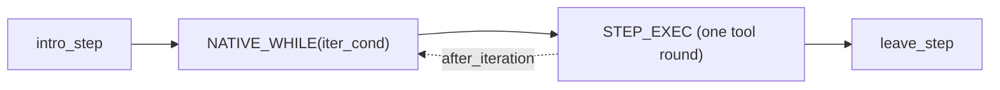

# The Step Loop

The built-in `ReActAgentStrategy` runs as a **node-driven Step loop**: the LLM
decides the plan, the framework walks it, and everything is observable and
interruptible.

## Enabling the Step Loop

The Step loop is **opt-in** — the default `ChatObject` workflow is simple chat
(one LLM call, no decomposition). Enable it by passing the step-loop workflow
explicitly:

```python
from amrita_core.chatmanager import _step_workflow_rendered

chat = agent.get_chatobject(
    "Plan and run the migration", workflow=_step_workflow_rendered
)
```

or use the full pre-composed pipeline:

```python
from amrita_core.builtins.workflows import SIMPLE_STEP_REACT

chat = agent.get_chatobject("Plan and run the migration", workflow=SIMPLE_STEP_REACT)
```

> `Agent.get_chatobject(user_input, **kwargs)` forwards `workflow` (and any
> other `ChatObject` option) straight through. The `update_step` tool and the
> `step_*` metadata events only exist while the step-loop workflow is active.

## Anatomy of a Step



| Phase          | What happens                                                                                                                               |
| -------------- | ------------------------------------------------------------------------------------------------------------------------------------------ |
| **decompose**  | First `intro_step`: LLM decides simple vs DAG `{needs_decomposition, dag, reason}`                                                         |
| **intro_step** | Pick the next ready DAG node (topological order via `graphlib.TopologicalSorter`); drain peer messages; emit `step_intro` event + metadata |
| **STEP_EXEC**  | One `single_execute()` round: model → tools → results; `after_iteration()` runs stall detection _inside_ the loop                          |
| **leave_step** | Summarize (subject-predicate), complete the node, compress history; emit `step_leave` event + metadata                                     |

## Semantic State: `AgentRunState`

All step-level state lives in `AgentRunState` (bridged between
`AgentLoopState.run_state` and `strategy.run_state` — **one instance**):

| Field                               | Meaning                                            |
| ----------------------------------- | -------------------------------------------------- |
| `step_index`                        | Global step counter                                |
| `current_phase` / `current_step_id` | The active DAG node                                |
| `plan` / `completed_step_ids`       | The task DAG + progress                            |
| `step_tool_signatures`              | Tool signatures in the current Step (stall window) |
| `stall_injected`                    | Give-up prompt injected (once per Step)            |
| `last_summary`                      | Subject-predicate summary of the previous Step     |
| `tokens`                            | Real API token accounting (compression trigger)    |
| `exec_finished`                     | Strategy done calling tools → iteration loop ends  |

## Stall Protection

1. **`_should_cancel_tool_call`** — before executing, the N-th identical
   signature is cancelled and returns `"Cancelled: Reach the max limit of
repeatly calling tool."`
2. **`after_iteration`** — per-iteration hook (inside the loop!) injects the
   give-up prompt when the window repeats; sets `stall_injected`/`exec_finished`
   so `iter_cond` stops the loop immediately — no more tokens burned.

> Historical lesson: stall detection must run **inside** the loop
> (`after_iteration`), not at `leave_step` (outside) — otherwise a stuck agent
> never reaches the detector.

## Lifecycle Events

| Event                  | When                  | Mutable                             |
| ---------------------- | --------------------- | ----------------------------------- |
| `agent.step_intro`     | Step starts           | `override_phase`                    |
| `agent.step_leave`     | Step ends             | `override_verb` / `override_object` |
| `agent.step_iteration` | Each tool round       | `end_step`                          |
| `agent.tool_call`      | Before a regular tool | `arguments` / `cancel`              |
| `agent.tool_return`    | After a regular tool  | `result` / `skip_append`            |

Matchers may mutate events or raise `StepAbortError` (control flow). Built-in
tools (REASONING / UPDATE_STEP / STOP) do not fire events.

## Between-Step Compression

When `llm.memory_abstract_threshold` is set and the real API prompt-token
count exceeds it at a Step boundary, `leave_step` folds the oldest history
into one summary message: the LLM summarizes the dropped prefix (with the
`ABSTRACT_INSTRUCTION` prompt), the summary replaces it, and the token
baseline resets. Folding keeps `assistant(tool_calls)` + `ToolResult` pairs
together, so the remaining context stays well-formed. A failed/empty summary
keeps the history untouched (baseline still resets, no retry loop). The
`compress` metadata carries the triggering token count and threshold.

## Step Metadata

Emitted as `MessageWithMetadata` (`type="step"`):

| `extra_type` | Content                                          |
| ------------ | ------------------------------------------------ |
| `decompose`  | decision, DAG ids + descriptions, reason         |
| `intro`      | phase, step_index, simple_mode, node description |
| `leave`      | phase, stall flag, summary verb/object           |
| `stall`      | the repeated signatures, injected flag           |
| `compress`   | prompt tokens, threshold                         |

## The `update_step` Tool

The agent can revise the plan mid-run: `replan` (replace DAG), `mark_done`,
`add_step`, `remove_step`. Each revision bumps `plan_revision`; execution stays
linear (the DAG is a semantic layer, not a parallel graph).

## Peer Messages

`intro_step` drains the reverse stream (`send_to_producer`) and appends
`[peer message]` user messages — see [Suspend & Resume](suspend.md).

## Next

[Workflow Debugging](workflow-debugging.md) — step through the interpreter.
