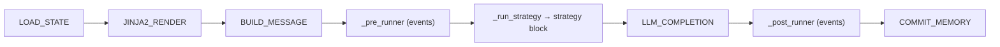
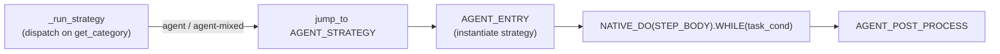

# Workflow Engine

## The Pipeline

Every `ChatObject` runs a pre-compiled workflow. The **default** pipeline is
the simple chat one (one LLM call, no decomposition); the step-driven variant
is opted into by passing `workflow=_step_workflow_rendered` (or
`SIMPLE_STEP_REACT`). Both share the same outer shell:



The **strategy block** is what changes by mode. Simple chat skips it entirely;
the step-driven loop runs:



```python
# STEP_BODY — one task-loop iteration = one Step
STEP_BODY = NODE_INTRO >> NATIVE_WHILE(iter_cond).ACTION(STEP_EXEC) >> NODE_LEAVE
```

## DI Contexts as the State Layer

Workflow nodes are **stateless functions**; all state lives in DI contexts
injected by parameter type (see [Data Layer](../concepts/data.md)). This is
what makes the same nodes reusable across pipelines.

## Pre-Composed Pipelines

`amrita_core.builtins.workflows` ships ready graphs:

| Pipeline                | Composition                                                                                               |
| ----------------------- | --------------------------------------------------------------------------------------------------------- |
| `STEP_REACT_BLOCK`      | `STRATEGY_INIT >> AGENT_ENTRY >> NATIVE_DO(STEP_BODY).WHILE(task_cond) >> AGENT_POST_PROCESS`             |
| `SIMPLE_STEP_REACT`     | `LOAD_STATE >> JINJA2_RENDER >> BUILD_MESSAGE >> STEP_REACT_BLOCK >> LLM_COMPLETION >> COMMIT_MEMORY`     |
| `REACT_BLOCK` (legacy)  | `STRATEGY_INIT >> AGENT_ENTRY >> WHILE(SINGLE_STRATEGY_CALL).ACTION(REACT_COUNTER) >> AGENT_POST_PROCESS` |
| `SIMPLE_REACT` (legacy) | `LOAD_STATE >> ... >> REACT_BLOCK >> LLM_COMPLETION >> COMMIT_MEMORY`                                     |
| `SIMPLE_CHAT`           | `LOAD_STATE >> JINJA2_RENDER >> BUILD_MESSAGE >> LLM_COMPLETION >> COMMIT_MEMORY`                         |

`ChatObject(workflow=...)` accepts any rendered graph; `workflow` and
`archived_nodes` are mutually exclusive. The default `workflow=None` resolves
to the simple chat pipeline — pass `_step_workflow_rendered` (from
`amrita_core.chatmanager`) for the step-driven loop, or use `SIMPLE_STEP_REACT`
for the full pipeline in one object.

## The Loop Conditions

| Condition   | Stops when                                                                    |
| ----------- | ----------------------------------------------------------------------------- |
| `task_cond` | Call limit hit, `_suggested_stop`, stall injected, or all DAG nodes done      |
| `iter_cond` | Call limit, stall, token budget exhausted, `exec_finished`, or stop suggested |

Both live in `amrita_core.components.react` and read `loop.run_state` — the
semantic state bridged between the loop and the strategy.

## Next

[Suspend & Resume](suspend.md) — pausing the workflow mid-flight.
