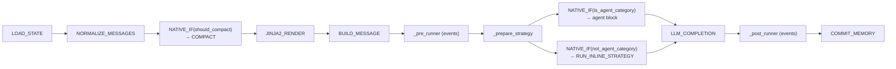
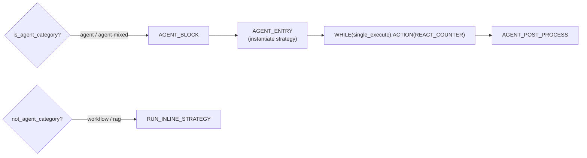

# Workflow Engine

## The Pipeline

Every `ChatObject` runs a pre-compiled workflow. The **default** pipeline is
the simple chat one (one LLM call, no decomposition); the step-driven variant
is opted into by passing `workflow=_step_workflow_rendered` (or
`SIMPLE_STEP_REACT`). Both share the same outer shell:


```mermaid
flowchart LR
    A["LOAD_STATE"] --> N["NORMALIZE_MESSAGES"]
    N --> Q["NATIVE_IF(should_compact)<br/>→ COMPACT"]
    Q --> B["JINJA2_RENDER"]
    B --> C["BUILD_MESSAGE"]
    C --> D["_pre_runner (events)"]
    D --> P["_prepare_strategy"]
    P --> E["NATIVE_IF(is_agent_category)<br/>→ agent block"]
    P --> E2["NATIVE_IF(not_agent_category)<br/>→ RUN_INLINE_STRATEGY"]
    E --> F["LLM_COMPLETION"]
    E2 --> F
    F --> G["_post_runner (events)"]
    G --> H["COMMIT_MEMORY"]
```

Two of those steps exist to keep history inside the window, and their order is
load-bearing: `NORMALIZE_MESSAGES` flattens content blocks first, so the
summarizer reads text rather than raw blocks; `COMPACT` runs before
`JINJA2_RENDER`, so the summary it produces reaches the system instruction of
the very request it was computed for. Both are described in
[Data & Memory](../concepts/data-memory.md).

The **agent block** is what changes by mode. The inline runner is not a
special case bolted onto the side: dispatch is two guarded branches, each of
which is skipped when its predicate is false.


```mermaid
flowchart LR
    G1{"is_agent_category?"} -->|agent / agent-mixed| AB["AGENT_BLOCK"]
    G2{"not_agent_category?"} -->|workflow / rag| IN["RUN_INLINE_STRATEGY"]
    AB --> K["AGENT_ENTRY<br/>(instantiate strategy)"]
    K --> L["WHILE(single_execute).ACTION(REACT_COUNTER)"]
    L --> M["AGENT_POST_PROCESS"]
```

The step-driven variant swaps only the middle link:

```python
# AGENT_BLOCK — one single_execute per iteration
AGENT_BLOCK = AGENT_ENTRY >> WHILE(single_execute).ACTION(REACT_COUNTER) >> AGENT_POST_PROCESS

# STEP_AGENT_BLOCK — one task iteration is one Step
STEP_AGENT_BLOCK = AGENT_ENTRY >> NATIVE_DO(STEP_BODY).WHILE(task_cond) >> AGENT_POST_PROCESS
```

```python
# STEP_BODY — one task-loop iteration = one Step
STEP_BODY = NODE_INTRO >> NATIVE_WHILE(iter_cond).ACTION(STEP_EXEC) >> NODE_LEAVE
```

## DI Contexts as the State Layer

Workflow nodes are **stateless functions**; all state lives in DI contexts
injected by parameter type (see [Data Layer](../concepts/data.md)). This is
what makes the same nodes reusable across pipelines.

## Pre-Composed Pipelines

`amrita_core.builtins.workflows` ships ready graphs. Two families, one choice
per family:

| Pipeline                | Composition                                                                                                                                    |
| ----------------------- | ---------------------------------------------------------------------------------------------------------------------------------------------- |
| `COMPACT_HISTORY`       | `NATIVE_IF(should_compact, COMPACT)`                                                                                                           |
| `STEP_REACT_BLOCK`      | `STRATEGY_INIT >> AGENT_ENTRY >> NATIVE_DO(STEP_BODY).WHILE(task_cond) >> AGENT_POST_PROCESS`                                                  |
| `SIMPLE_STEP_REACT`     | `LOAD_STATE >> NORMALIZE_MESSAGES >> COMPACT_HISTORY >> JINJA2_RENDER >> BUILD_MESSAGE >> STEP_REACT_BLOCK >> LLM_COMPLETION >> COMMIT_MEMORY` |
| `STEP_REACT_ONLY`       | `LOAD_STATE >> NORMALIZE_MESSAGES >> COMPACT_HISTORY >> JINJA2_RENDER >> BUILD_MESSAGE >> STEP_REACT_BLOCK`                                    |
| `REACT_BLOCK` (legacy)  | `STRATEGY_INIT >> AGENT_ENTRY >> WHILE(SINGLE_STRATEGY_CALL).ACTION(REACT_COUNTER) >> AGENT_POST_PROCESS`                                      |
| `SIMPLE_REACT` (legacy) | `LOAD_STATE >> NORMALIZE_MESSAGES >> COMPACT_HISTORY >> JINJA2_RENDER >> BUILD_MESSAGE >> REACT_BLOCK >> LLM_COMPLETION >> COMMIT_MEMORY`      |
| `REACT_ONLY` (legacy)   | `LOAD_STATE >> NORMALIZE_MESSAGES >> COMPACT_HISTORY >> JINJA2_RENDER >> BUILD_MESSAGE >> REACT_BLOCK`                                         |
| `SIMPLE_CHAT`           | `LOAD_STATE >> NORMALIZE_MESSAGES >> COMPACT_HISTORY >> JINJA2_RENDER >> BUILD_MESSAGE >> LLM_COMPLETION >> COMMIT_MEMORY`                     |

**How to choose**:

- `SIMPLE_CHAT` — plain single-turn chat, no agent loop. This is the default
  (`workflow=None` resolves here).
- `*_ONLY` variants stop after the agent block: no final `LLM_COMPLETION`
  flush, no memory commit. Use them when you compose the tail yourself.
- `SIMPLE_*` variants are the full pipeline (prelude + block + completion +
  commit) in one object — pass the object directly to
  `get_chatobject(workflow=...)`.
- `STEP_REACT_BLOCK` / `SIMPLE_STEP_REACT` / `STEP_REACT_ONLY` run the
  **step-driven** loop (the opt-in ReAct mode; see
  [The Step Loop](step-loop.md)).
- `REACT_BLOCK` / `SIMPLE_REACT` / `REACT_ONLY` are the legacy single-call
  loop — kept for compatibility, prefer the step-driven family.

> The blocks in this table carry their own `STRATEGY_INIT`, because they are
> meant to be composed by hand. The pipeline `ChatObject` runs by default does
> the same job with its local `_prepare_strategy` node instead, which is why
> `AGENT_BLOCK` / `STEP_AGENT_BLOCK` do not include it.

`ChatObject(workflow=...)` accepts any rendered graph; `workflow` and
`archived_nodes` are mutually exclusive. The default `workflow=None` resolves
to the simple chat pipeline — pass `_step_workflow_rendered` (from
`amrita_core.chatmanager`) for the step-driven loop, or use `SIMPLE_STEP_REACT`
for the full pipeline in one object.

## The Loop Conditions

| Condition   | Stops when                                                                    |
| ----------- | ----------------------------------------------------------------------------- |
| `task_cond` | Call limit hit, `_suggested_stop`, stall injected, or all DAG nodes done      |
| `iter_cond` | Call limit, stall, token budget exhausted, `exec_finished`, or stop suggested |

Both live in `amrita_core.components.react` and read `loop.run_state` — the
semantic state bridged between the loop and the strategy.

## Next

[Suspend & Resume](suspend.md) — pausing the workflow mid-flight.
