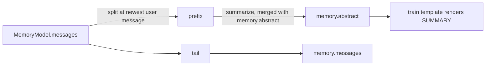

# ContextCompactor

The compaction policy object: where the trigger sits relative to a model's attention window, how a history prefix is summarized, and how the fold is applied.

## Description

`ContextCompactor` is a dataclass built **per use site** from the live config, preset and run ledger, so the trigger always reflects the model actually being called. It is the single place that knows how to fold history; the workflow node and the agent loop both drive this same object, which is why one model is described by one threshold.

Two things consume it:

| Call site                          | When it runs                               |
| ---------------------------------- | ------------------------------------------ |
| `COMPACT` node                     | Between turns, before the request is built |
| `ReActAgentStrategy` between Steps | At a Step boundary inside the agent loop   |

The summary is stored on [`MemoryModel.abstract`](MemoryModel.md) and rendered back into the system instruction by the train template. Nothing is injected into the message list, so provider message-ordering rules stay untouched.



## Fields

- `config` ([AmritaConfig](AmritaConfig.md)): Required. Supplies `enable_compaction`, `compaction_trigger_ratio` and `memory_length_limit`
- `preset` ([ModelPreset](ModelPreset.md) | None): The model whose window drives the threshold. `None` falls back to `LLMConfig.session_tokens_windows`
- `usage` (SessionUsageProxy | None): The run ledger, so the summarization call itself is billed like any other request
- `instruction` (str): System prompt handed to the summarizer. Defaults to `ABSTRACT_INSTRUCTION`

## Properties

### `enabled -> bool`

Whether the user asked for compaction at all (`config.llm.enable_compaction`).

### `budget -> int`

Input-token budget: the preset's `max_context` via `resolve_max_context`, else `config.llm.session_tokens_windows`.

### `threshold -> int`

`int(budget * config.llm.compaction_trigger_ratio)`. Derived from the attention window so the trigger follows the model instead of a hand-maintained global number.

### `message_limit -> int`

`config.llm.memory_length_limit`. The token trigger needs the provider to report usage; this fallback covers gateways that report none, and very large windows.

## Methods

### `should_compact(memory: MemoryModel | None) -> bool`

Whether `memory` should be folded before the next request. Fires on whichever trigger comes first:

- the prompt size the provider reported for the previous request (`memory.usage.prompt_tokens`) reaches `threshold`
- the history reaches `message_limit` messages

Returns `False` when compaction is disabled, `memory` is `None`, or there is no prefix that could be folded.

### `async summarize(prefix, previous: str = "") -> str`

Summarize `prefix`, merging it into `previous` inside an `<EXISTING_SUMMARY>` block when one is given. Returns the stripped summary, or an empty string when the model produced nothing usable.

### `async fold(messages, previous: str = "") -> CompactionResult | None`

Summarize the foldable prefix and return the surviving history.

**Atomic**: the summary is produced first and nothing is returned until a non-empty one exists, so a failed summarization leaves the caller's history exactly as it was. Returns `None` when there is nothing to fold or the model returned no summary.

### `async compact(memory: MemoryModel) -> bool`

Fold `memory` in place. On success the prefix is dropped, `abstract` is replaced, and the measured usage is cleared so the next request measures itself again. Returns whether the fold happened.

## `split_history(messages) -> tuple[list, list]`

Module-level helper that splits history into the compactable prefix and the retained tail. The cut lands on the **newest `user` message**, so the tail always starts a clean turn and no assistant tool call is ever separated from its tool results. Returns `([], messages)` when there is nothing to fold.

This is what makes folding safe at a Step boundary: the cut never lands mid tool-call/result pair.

## `CompactionResult`

```python
@dataclass
class CompactionResult:
    messages: (
        CONTENT_LIST_TYPE  # history that survives, starting at a clean turn boundary
    )
    summary: str  # the summary that replaces the folded prefix
```

## Related

- [MemoryModel](MemoryModel.md) — where `abstract` and `usage` live
- [LLMConfig](LLMConfig.md) — the `enable_compaction` / `compaction_trigger_ratio` / `memory_length_limit` switches
- [ModelPreset](ModelPreset.md) — `max_context`, the window the threshold derives from
