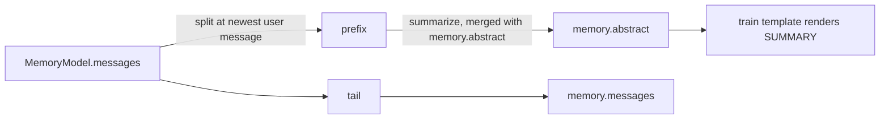
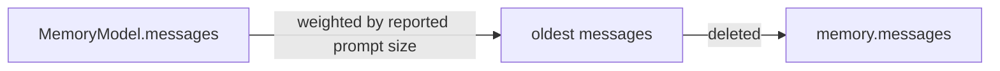

# ContextCompactor

The history-management policy object: where the trigger sits relative to a model's attention window, which policy runs once it fires, and how the trimmed history is applied.

## Description

`ContextCompactor` is a dataclass built **per use site** from the live config, preset and run ledger, so the trigger always reflects the model actually being called. It is the single place that knows how to trim history; the workflow node and the agent loop both drive this same object, which is why one model is described by one threshold.

Two things consume it:

| Call site                          | When it runs                               |
| ---------------------------------- | ------------------------------------------ |
| `MANAGE_CONTEXT` node              | Between turns, before the request is built |
| `ReActAgentStrategy` between Steps | At a Step boundary inside the agent loop   |

`config.llm.context_strategy` picks the policy:

| Value       | Effect                                                                                             |
| ----------- | -------------------------------------------------------------------------------------------------- |
| `"compact"` | Folds the oldest prefix into an LLM summary stored on [`MemoryModel.abstract`](MemoryModel.md)       |
| `"slide"`   | Drops the oldest messages outright, down to `slide_target_ratio` × `budget`                         |
| `"none"`    | No management at all — history grows until the provider rejects the request                         |

Under `"compact"` the summary is rendered back into the system instruction by the train template. Nothing is injected into the message list, so provider message-ordering rules stay untouched.





## Fields

- `config` ([AmritaConfig](AmritaConfig.md)): Required. Supplies `context_strategy`, `compaction_trigger_ratio`, `slide_target_ratio` and `memory_length_limit`
- `preset` ([ModelPreset](ModelPreset.md) | None): The model whose window drives the threshold. `None` falls back to `LLMConfig.session_tokens_windows`
- `usage` (SessionUsageProxy | None): The run ledger, so the summarization call itself is billed like any other request
- `instruction` (str): System prompt handed to the summarizer. Defaults to `ABSTRACT_INSTRUCTION`

## Properties

### `strategy -> Literal["compact", "slide", "none"]`

`config.llm.context_strategy`, read straight through.

### `enabled -> bool`

Whether any policy is active at all — `strategy != "none"`.

### `budget -> int`

Input-token budget: the preset's `max_context` via `resolve_max_context`, else `config.llm.session_tokens_windows`.

### `threshold -> int`

`int(budget * config.llm.compaction_trigger_ratio)`. Derived from the attention window so the trigger follows the model instead of a hand-maintained global number.

### `slide_target -> int`

`int(budget * config.llm.slide_target_ratio)`. Must stay below `threshold`, otherwise a trim would land back on the trigger and re-run on every request.

### `message_limit -> int`

`config.llm.memory_length_limit`. The token trigger needs the provider to report usage; this fallback covers gateways that report none, and very large windows.

## Methods

### `needs_management(memory: MemoryModel | None) -> bool`

Whether `memory` has outgrown the budget and the configured policy should run. Fires on whichever trigger comes first:

- the prompt size the provider reported for the previous request (`memory.usage.prompt_tokens`) reaches `threshold`
- the history reaches `message_limit` messages

Returns `False` when `strategy` is `"none"`, `memory` is `None`, or there is nothing the policy could act on.

### `should_compact(memory: MemoryModel | None) -> bool`

`needs_management(memory)` narrowed to the `"compact"` policy — a `"slide"` trim must never trigger a summary call.

### `async summarize(prefix, previous: str = "") -> str`

Summarize `prefix`, merging it into `previous` inside an `<EXISTING_SUMMARY>` block when one is given. Returns the stripped summary, or an empty string when the model produced nothing usable.

### `async fold(messages, previous: str = "") -> CompactionResult | None`

Summarize the foldable prefix and return the surviving history.

**Atomic**: the summary is produced first and nothing is returned until a non-empty one exists, so a failed summarization leaves the caller's history exactly as it was. Returns `None` when there is nothing to fold or the model returned no summary.

### `async compact(memory: MemoryModel) -> bool`

Fold `memory` in place. On success the prefix is dropped, `abstract` is replaced, and the measured usage is cleared so the next request measures itself again. Returns whether the fold happened.

### `slide(messages, reported: int) -> int`

Drop the oldest messages until the estimate falls to `slide_target`. Mutates `messages` in place and returns how many were dropped (`0` when nothing moved).

`reported` is the prompt size the provider measured for the payload these messages produced. No tokenizer is involved: each message's share of `reported` is estimated by normalizing its rendered-text length, so the weights sum back to the measurement.

## `split_history(messages) -> tuple[list, list]`

Module-level helper that splits history into the compactable prefix and the retained tail. The cut lands on the **newest `user` message**, so the tail always starts a clean turn and no assistant tool call is ever separated from its tool results. Returns `([], messages)` when there is nothing to fold.

This is what makes folding safe at a Step boundary: the cut never lands mid tool-call/result pair.

## `CompactionResult`

```python
@dataclass
class CompactionResult:
    messages: (
        CONTENT_LIST_TYPE  # history that survives, starting at a clean turn boundary
    )
    summary: str  # the summary that replaces the folded prefix
```

## Related

- [MemoryModel](MemoryModel.md) — where `abstract` and `usage` live
- [LLMConfig](LLMConfig.md) — the `context_strategy` / `compaction_trigger_ratio` / `slide_target_ratio` / `memory_length_limit` switches
- [ModelPreset](ModelPreset.md) — `max_context`, the window the threshold derives from
