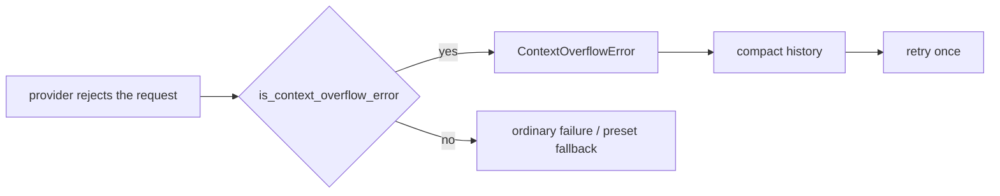

# ContextOverflowError

Raised when a provider rejects a request for exceeding its context window.

## Description

`ContextOverflowError` is a `RuntimeError` subclass that distinguishes "the conversation no longer fits" from every other provider failure. The distinction matters because the two demand opposite responses:

- An **overflow** is worth reacting to: compact the history and retry, since resending the same request would fail identically.
- An **ordinary failure** is transient: fall back to the next preset, as usual.

`libchat.call_completion` checks each failure and re-raises an overflow as `ContextOverflowError` _before_ the preset-fallback loop, so an oversized request never burns through the fallback chain.

## `is_context_overflow_error(error: BaseException) -> bool`

Whether an error looks like a provider context-window rejection.

Providers report this in prose rather than a machine-readable code, so the check is a pattern match over the message. **Deliberately conservative**: mistaking a transient failure for an overflow would throw away history for nothing, so only well-known phrasings match:

- `maximum context length`
- `context_length_exceeded` / `context length exceeded`
- `context window exceed`
- `exceed(s) the (maximum) (model's) context`
- `prompt is too long`
- `input is too long`
- `input length and max_tokens exceed`
- `too many tokens`
- `reduce the length of the messages`
- `maximum number of tokens`

Matching is case-insensitive.

## Recovery

Recovery is opt-in via `LLMConfig.enable_overflow_recovery` (default `True`). When enabled, `LLM_COMPLETION` catches the error, folds the history through [`ContextCompactor`](ContextCompactor.md), and retries **once**. If the retry also overflows, the error propagates.



## Usage

```python
from amrita_core.exceptions import ContextOverflowError, is_context_overflow_error

try:
    response = await call_completion(messages, config=config)
except ContextOverflowError:
    # history no longer fits even after compaction
    ...
```

## Related

- [ContextCompactor](ContextCompactor.md) — what performs the fold
- [LLMConfig](LLMConfig.md) — the `enable_overflow_recovery` switch
