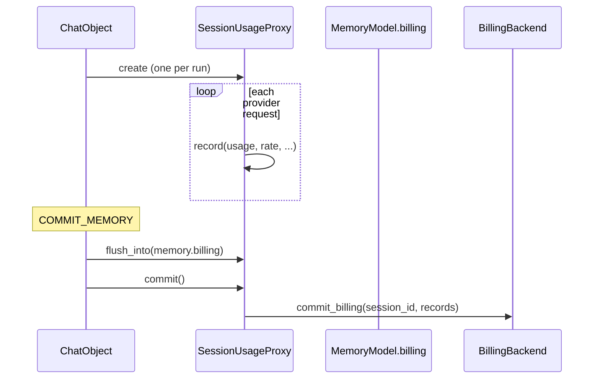

# SessionUsageProxy

Run-scoped billing ledger with an optional external sink.

## Description

Every provider request that reports usage appends one [`BillingRecord`](BillingRecord.md) to the run's ledger. The ledger lives in process memory for the duration of the run so hot-path reads (totals, step windows) stay synchronous, and is handed to a [`BillingBackend`](BillingBackend.md) once, at the run boundary.

The same records also travel inside `MemoryModel.billing`, which is the default persistence path; the backend exists only for consumers that need to mirror the data into an external cost store.

One instance is created per run by `ChatObject`, which stores it on `RespState.usage` and hands it to the compactor so summarization calls are billed like any other request.

## Constructor

```python
SessionUsageProxy(
    session_id: str,
    stream_id: str,
    backend: BillingBackend | None = None,
    records: list[BillingRecord] | None = None,
)
```

**Parameters**:

- `session_id` (str): Session the run belongs to
- `stream_id` (str): Unique id of this run
- `backend` ([BillingBackend](BillingBackend.md) | None, optional): External sink that receives the records. When `None`, `commit()` is a no-op
- `records` (list[[BillingRecord](BillingRecord.md)] | None, optional): Pre-existing list to append to

## Methods

### `record(usage, *, model=None, preset_name=None, rate=None, request_id=None) -> None`

Append one provider usage sample to the run ledger. A no-op when `usage` is `None`, so callers do not need to check.

`model`, `preset_name` and `rate` are filled in by the caller: the adapters pass `preset.rate` so each record carries the pricing that applied at request time.

### `flush_into(target: list[BillingRecord]) -> None`

Append records not yet flushed to `target`.

**Idempotent**: calling it twice only appends the newly recorded samples, so a retried commit node cannot duplicate the conversation ledger. This is what `COMMIT_MEMORY` calls to move the run's records into `MemoryModel.billing`.

### `async commit() -> None`

Hand the run's records to the external sink, if one is bound. A no-op otherwise.

## Properties

### `records -> list[BillingRecord]`

**Copy** of the run's records, so callers cannot mutate the ledger.

### `extra_total -> UniResponseUsage[int]`

Derived sum over every record in the run (prompt / completion / total tokens).

### `prompt_since(since_ts: float) -> int`

Prompt tokens recorded at or after `since_ts`. Used as the Step-window prompt count for budget checks and for the between-Step compression threshold.

## Lifetime



## Related

- [BillingRecord](BillingRecord.md) — the record shape
- [BillingBackend](BillingBackend.md) — the optional external sink
- [BackendSlots](BackendSlots.md) — where the backend is bound
