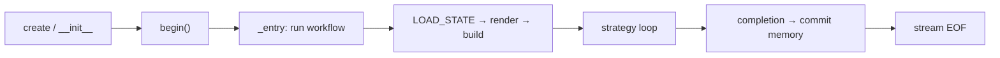

# ChatObject — The Lifecycle Manager

## Core Positioning

**`ChatObject` is the core of AmritaCore — the basic unit of a dialogue.**
It is a _lifecycle manager_: it owns the workflow graph, the interpreter, the
bidirectional stream, and every piece of runtime state (DI contexts) for one
conversation.

```
ChatObject
├── _workflow / _interpreter   ← the AmritaSense instruction sequence
├── io_stream                  ← SuspendObjectStream (bidirectional)
├── _di_* contexts             ← typed DI state shared with workflow nodes
│   ├── _di_session            ← SessionMetadata (ids, timestamps)
│   ├── _di_memory             ← MemoryContext
│   ├── _di_ability            ← AbilityState (config, preset, backend slots)
│   ├── _di_input              ← GeneralInput (user input, template)
│   ├── _di_working            ← WorkingState (message wrap)
│   ├── _di_resp               ← RespState (response + usage)
│   ├── _di_loop               ← AgentLoopState (strategy, call count, run_state)
│   └── _di_agent              ← StrategyPayload (strategy factory)
└── state                      ← StateContext (backward-compat accessor)
```

## Lifecycle



- **`begin()`** runs the workflow once; `_is_done` prevents re-entry.
- On exit, `set_queue_done()` closes the response channel; the session is
  cleaned up via `ChatManager`.
- **Middleware** (`middleware=...`) can wrap the whole workflow.

## Workflow Selection

You can swap the execution pipeline entirely:

```python
from amrita_core.chatmanager import _step_workflow_rendered
from amrita_core.builtins.workflows import SIMPLE_REACT, SIMPLE_CHAT

# Default: step-driven ReAct (used when workflow=None)
chat = ChatObject(train=..., user_input=..., session_id="s1")

# Explicit: built-in pre-composed pipelines
chat = ChatObject(..., workflow=SIMPLE_CHAT)  # no agent, plain chat
chat = ChatObject(..., workflow=SIMPLE_REACT)  # legacy ReAct loop
```

> `workflow` and `archived_nodes` are mutually exclusive.

## Why "Lifecycle Manager" Matters

Strategies and hooks **never own the lifecycle** — they receive resources via
DI fields (see [Agent Strategy](agent-strategy.md)). `ChatObject` is the single
place that wires everything together: that is why it is the unit of a dialogue
rather than a thin wrapper.

## Next

[Configuration](configuration.md) — how the runtime is configured.
