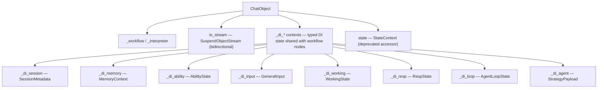
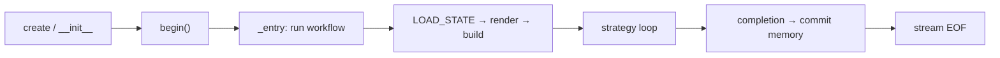

# ChatObject — The Lifecycle Manager

## Core Positioning

**`ChatObject` is the core of AmritaCore — the basic unit of a dialogue.**
It is a _lifecycle manager_: it owns the workflow graph, the interpreter, the
bidirectional stream, and every piece of runtime state (DI contexts) for one
conversation.



## Lifecycle



- **`begin()`** runs the workflow once; `_is_done` prevents re-entry.
- On exit, `set_queue_done()` closes the response channel; the session is
  cleaned up via `ChatManager`.
- **Middleware** (`middleware=...`) can wrap the whole workflow.

## Workflow Selection

`ChatObject` runs a pre-compiled workflow. The **default** (used when
`workflow=None`) is the simple chat pipeline (`_workflow_rendered`) — one LLM
call, one answer, no decomposition. For the built-in **step-driven ReAct
loop** (decompose → Step → summarize, `update_step` plan revision), pass the
step-loop workflow explicitly:

```python
from amrita_core.chatmanager import _step_workflow_rendered
from amrita_core.builtins.workflows import SIMPLE_STEP_REACT, SIMPLE_CHAT

# Default: simple chat, one call (used when workflow=None)
chat = ChatObject(train=..., user_input=..., session_id="s1")

# Explicit: the step-driven ReAct loop (decompose → Step → summarize)
chat = ChatObject(..., workflow=_step_workflow_rendered)

# Explicit: built-in pre-composed pipelines
chat = ChatObject(..., workflow=SIMPLE_CHAT)  # no agent, plain chat
chat = ChatObject(..., workflow=SIMPLE_STEP_REACT)  # full step-loop pipeline
```

> `workflow` and `archived_nodes` are mutually exclusive. The step-loop
> workflow is what enables the `step` metadata events (`decompose` / `intro` /
> `leave`) and the `update_step` tool — see [The Step Loop](../advanced/step-loop.md).

## Why "Lifecycle Manager" Matters

Strategies and hooks **never own the lifecycle** — they receive resources via
DI fields (see [Agent Strategy](agent-strategy.md)). `ChatObject` is the single
place that wires everything together: that is why it is the unit of a dialogue
rather than a thin wrapper.

## Next

[Configuration](configuration.md) — how the runtime is configured.
