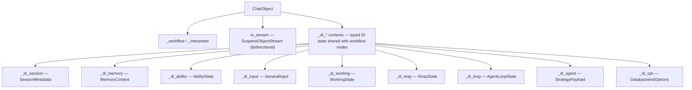
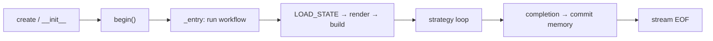

# ChatObject — The Lifecycle Manager

## Core Positioning

**`ChatObject` is the core of AmritaCore — the basic unit of a dialogue.**
It is a _lifecycle manager_: it owns the workflow graph, the interpreter, the
bidirectional stream, and every piece of runtime state (DI contexts) for one
conversation.


```mermaid
flowchart TD
    CO["ChatObject"] --> WF["_workflow / _interpreter"]
    CO --> IO["io_stream — SuspendObjectStream (bidirectional)"]
    CO --> DI["_di_* contexts — typed DI state shared with workflow nodes"]
    DI --> S1["_di_session — SessionMetadata"]
    DI --> S2["_di_memory — MemoryContext"]
    DI --> S3["_di_ability — AbilityState"]
    DI --> S4["_di_input — GeneralInput"]
    DI --> S5["_di_working — WorkingState"]
    DI --> S6["_di_resp — RespState"]
    DI --> S7["_di_loop — AgentLoopState"]
    DI --> S8["_di_agent — StrategyPayload"]
    DI --> S9["_di_opt — DatabackendOptions"]
```

## Lifecycle


```mermaid
flowchart LR
    A["create / __init__"] --> B["begin()"]
    B --> C["_entry: run workflow"]
    C --> D["LOAD_STATE → render → build"]
    D --> E["strategy loop"]
    E --> F["completion → commit memory"]
    F --> G["stream EOF"]
```

- **`begin()`** schedules `_entry()` as a task, but only the first time — the
  guard is `hasattr(self, "_task")`. `_entry()` itself re-checks `_is_running` /
  `_is_done` and raises `RuntimeError` if the object is already running or done.
- On exit `_is_done` is set, `set_queue_done()` writes an EOF to the response
  channel, `end_at` is stamped, the object is dropped from
  `ChatManager.running_chat_object_id2map`, and `ChatManager.clean_obj()`
  enforces a hard cap on retained objects per session.
- **Middleware** (`middleware=...`) can wrap the whole workflow; when set, the
  interpreter is bypassed and the middleware is awaited instead.

## Workflow Selection

`ChatObject` runs a pre-compiled workflow. The **default** (used when
`workflow=None`) is `_workflow_rendered`, the full shell:

`LOAD_STATE → NORMALIZE_MESSAGES → (COMPACT) → JINJA2_RENDER → BUILD_MESSAGE →
_pre_runner → _prepare_strategy → agent branch → LLM_COMPLETION → _post_runner →
COMMIT_MEMORY`

Its **agent branch is the legacy single-call loop** (`AGENT_BLOCK`: one
`single_execute` per iteration, no DAG decomposition). Strategies that are not
agent-category take the `RUN_INLINE_STRATEGY` branch instead. Both
`_pre_runner` (which fires the `PRECOMPLE` breakpoint and the pre-completion
matchers) and `_post_runner` are part of this default shell.

For the built-in **step-driven ReAct loop** (decompose → Step → summarize, with
`update_step` plan revision), pass `_step_workflow_rendered` — the same shell
with `STEP_AGENT_BLOCK` in place of `AGENT_BLOCK`:

```python
from amrita_core.chatmanager import _step_workflow_rendered
from amrita_core.builtins.workflows import SIMPLE_STEP_REACT, SIMPLE_CHAT

# Default: full shell + legacy single-call agent loop
chat = ChatObject(train=..., user_input=..., session_id="s1")

# Native step loop: same shell, STEP_AGENT_BLOCK
chat = ChatObject(..., workflow=_step_workflow_rendered)

# Pre-composed pipelines from amrita_core.builtins.workflows
chat = ChatObject(..., workflow=SIMPLE_CHAT)  # no agent branch: one LLM call
chat = ChatObject(..., workflow=SIMPLE_STEP_REACT)  # step loop, component nodes only
```

> The `amrita_core.builtins.workflows` pipelines are assembled from component
> nodes only — they have **no** `_pre_runner` / `_prepare_strategy` /
> `_post_runner`. With `SIMPLE_CHAT` the pre-completion matchers never fire, so
> the `PRECOMPLE` breakpoint is unreachable.

> `workflow` and `archived_nodes` are mutually exclusive — passing both raises
> `ValueError`. The step-loop workflow is what enables the `step` metadata
> events (`decompose` / `intro` / `leave`) and the `update_step` tool — see
> [The Step Loop](../advanced/step-loop.md).

## Why "Lifecycle Manager" Matters

Strategies and hooks **never own the lifecycle** — they receive resources via
DI fields (see [Agent Strategy](agent-strategy.md)). `ChatObject` is the single
place that wires everything together: that is why it is the unit of a dialogue
rather than a thin wrapper.

## Next

[Configuration](configuration.md) — how the runtime is configured.
