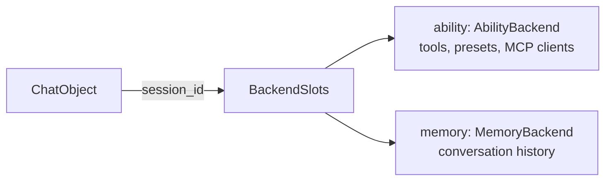

# Data Backend — Persisting Abilities and Memory

## What a Backend Is

AmritaCore itself does **not** store anything. It defines two interfaces and
hands them the `session_id`; **your backend implementation** decides where data
lives — in-process, a database, Redis, files, ...



## The Interfaces

```python
from amrita_core.base.backend import AbilityBackend, MemoryBackend


class AbilityBackend:  # abstract
    async def load_ability_all(self, session_id: str) -> AbilityContext: ...
    async def load_mcp_clients(self, session_id: str) -> MultiClientManager: ...
    async def load_tools(self, session_id: str) -> MultiToolsManager: ...
    async def load_presets(self, session_id: str) -> MultiPresetManager: ...


class MemoryBackend:  # abstract
    async def load_memory(self, session_id: str) -> MemoryModel: ...
    async def commit_memory(self, session_id: str, memory: MemoryModel) -> None: ...
```

> `AbilityContext` bundles tools / presets / MCP clients; `MemoryModel` holds
> `messages: list[Message | ToolResult]` (see [Memory Model](data-memory.md)).

## The Built-in `LegacyBackend`

The default implementation keeps everything **in-process**:

- Ability lives in a **global** container (`glb`) — the same tools and presets
  for every session
- Memory lives in a per-session `StateContext` (deprecated, removed in
  **v0.14.0** — see [StateContext](data-memory.md#statecontext-legacy-accessor))
  — history survives only as long as the process, and only for ids this
  process has seen

```python
from amrita_core.builtins.backends import LegacyBackend

backend = LegacyBackend()  # per-session in-process memory
```

> **Consequence**: two `ChatObject`s with the same `session_id` "share" history
> _only_ because `LegacyBackend` stores by id. A different backend decides
> differently — sharing is a backend property, not a framework feature.

## Writing Your Own Backend

Implement one or both interfaces and wrap them in `BackendSlots`:

```python
import json
from pathlib import Path

from amrita_core.base.backend import BackendSlots, AbilityBackend, MemoryBackend
from amrita_core.contexts import AbilityContext
from amrita_core.types.memory import MemoryModel


class FileMemoryBackend(MemoryBackend):
    """Store conversation history as JSON files, one per session."""

    def __init__(self, directory: Path):
        self.directory = directory
        directory.mkdir(parents=True, exist_ok=True)

    def _path(self, session_id: str) -> Path:
        # session_id is user-controlled — sanitize it before touching the FS
        safe = "".join(c for c in session_id if c.isalnum() or c in "-_")
        return self.directory / f"{safe}.json"

    async def load_memory(self, session_id: str) -> MemoryModel:
        path = self._path(session_id)
        if not path.exists():
            return MemoryModel()
        with path.open() as f:
            return MemoryModel.model_validate(json.load(f))

    async def commit_memory(self, session_id: str, memory: MemoryModel) -> None:
        with self._path(session_id).open("w") as f:
            json.dump(memory.model_dump(), f)


class StaticAbilityBackend(AbilityBackend):
    """Return the same global ability for every session (like LegacyBackend)."""

    def __init__(self, ability: AbilityContext):
        self.ability = ability

    async def load_ability_all(self, session_id: str) -> AbilityContext:
        return self.ability

    async def load_mcp_clients(self, session_id):
        return self.ability.mcp

    async def load_tools(self, session_id):
        return self.ability.tools

    async def load_presets(self, session_id):
        return self.ability.presets


my_backend = BackendSlots(
    ability=StaticAbilityBackend(AbilityContext()),
    memory=FileMemoryBackend(Path("./sessions")),
)
```

## Attaching a Backend

```python
# Direct ChatObject construction
chat = ChatObject(
    train=...,
    user_input=...,
    session_id="abc123",
    backend=my_backend,
)

# Through an Agent factory (it forwards to ChatObject)
chat = agent.get_chatobject(
    "Hello!",
    session_id="abc123",
    backend=my_backend,
)
```

From then on, every conversation loads its history from `load_memory` at start
and saves it via `commit_memory` at the end — your files now survive restarts.

## Fine-Grained Control: `DatabackendOptions`

`backend_options=DatabackendOptions(...)` skips parts of the load/commit cycle:

| Flag                         | Skips                                             |
| ---------------------------- | ------------------------------------------------- |
| `skip_memory_fetch`          | `load_memory` — start with an empty `MemoryModel` |
| `skip_tools_fetch`           | `load_tools`                                      |
| `skip_mcp_fetch`             | `load_mcp_clients`                                |
| `skip_presets_fetch`         | `load_presets`                                    |
| `skip_ability_extra_setting` | the whole `load_ability_all`                      |
| `skip_memory_commit`         | `commit_memory` at the end                        |

```python
from amrita_core.contexts import DatabackendOptions

chat = ChatObject(
    train=...,
    user_input=...,
    session_id="abc123",
    backend=my_backend,
    backend_options=DatabackendOptions(skip_memory_commit=True),  # read-only
)
```

## Next

[Memory Model](data-memory.md) — what `MemoryModel` carries and how the
load/commit lifecycle works.
