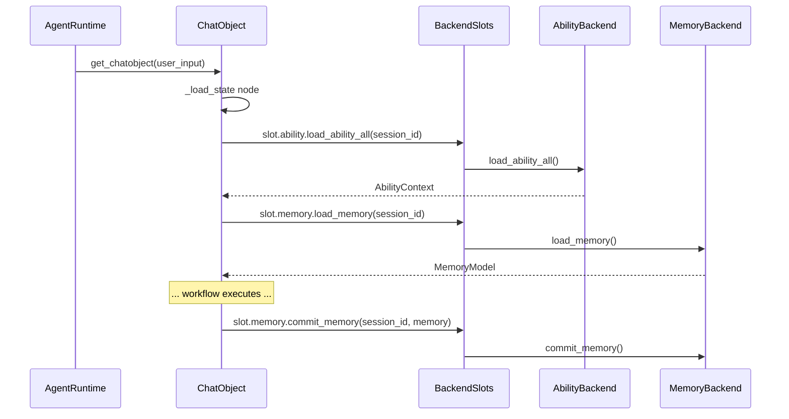

# Data Backend

The **data backend** mechanism decouples memory and ability management from `ChatObject`, enabling pluggable storage backends (in-memory global containers, databases, distributed caches, etc.) without changing the core execution logic.

---

## BackendSlots

[`BackendSlots`](../api-reference/classes/BackendSlots.md) is a simple dataclass that holds two backend references:

```python
from amrita_core.base.backend import BackendSlots

@dataclass
class BackendSlots:
    ability: AbilityBackend
    memory: MemoryBackend
```

`ChatObject` receives a `BackendSlots` instance and delegates all data I/O to it via the workflow nodes `_load_state` and `_commit_memory`.

---

## AbilityBackend (Abstract)

[`AbilityBackend`](../api-reference/classes/AbilityBackend.md) defines the interface for loading session abilities:

```python
from amrita_core.base.backend import AbilityBackend

class AbilityBackend:
    @abstractmethod
    async def load_ability_all(self, session_id: str) -> AbilityContext: ...

    @abstractmethod
    async def load_mcp_clients(self, session_id: str) -> MultiClientManager: ...

    @abstractmethod
    async def load_tools(self, session_id: str) -> MultiToolsManager: ...

    @abstractmethod
    async def load_presets(self, session_id: str) -> MultiPresetManager: ...
```

- `load_ability_all()`: returns a fully populated `AbilityContext`
- `load_mcp_clients()` / `load_tools()` / `load_presets()`: granular loading, used when `DatabackendOptions` skip flags are set

---

## MemoryBackend (Abstract)

[`MemoryBackend`](../api-reference/classes/MemoryBackend.md) defines the interface for loading and persisting conversation memory:

```python
from amrita_core.base.backend import MemoryBackend

class MemoryBackend:
    @abstractmethod
    async def load_memory(self, session_id: str) -> MemoryModel: ...

    @abstractmethod
    async def commit_memory(self, session_id: str, memory: MemoryModel) -> None: ...
```

- `load_memory()`: called at the start of each `ChatObject` execution
- `commit_memory()`: called after completion to persist changes

---

## LegacyBackend — Built-in Global Container

[`LegacyBackend`](../api-reference/classes/LegacyBackend.md) implements both `AbilityBackend` and `MemoryBackend` using in-process global containers. It is the **default** backend when none is provided:

```python
from amrita_core.builtins.backends import LegacyBackend

# LegacyBackend uses a class-level global AbilityContext
LegacyBackend.glb  # ClassVar[AbilityContext] — shared across all sessions
```

**Key behaviors**:

| Method               | Behavior                                                          |
| -------------------- | ----------------------------------------------------------------- |
| `load_ability_all()` | Returns the class-level `glb` (global singleton)                  |
| `load_memory()`      | Creates/returns a per-session `StateContext` stored in `self.ctx` |
| `commit_memory()`    | Writes `memory` into `self.ctx.memory` (in-process store)         |

```python
from amrita_core.base.backend import BackendSlots
from amrita_core.builtins.backends import LegacyBackend

# Both slots share the same LegacyBackend instance
backend = BackendSlots(ability=LegacyBackend(), memory=LegacyBackend())
```

> **Note**: `LegacyBackend` stores data **in memory only**. Restart the process and all data is lost. For persistence, implement a custom backend.

---

## DatabackendOptions — Fine-Grained Control

[`DatabackendOptions`](../api-reference/classes/DatabackendOptions.md) controls which backend operations are skipped during a `ChatObject` run:

```python
from amrita_core.chatmanager.chat_object import DatabackendOptions

options = DatabackendOptions(
    skip_memory_fetch=False,        # Skip loading memory?
    skip_tools_fetch=False,         # Skip loading tools?
    skip_mcp_fetch=False,           # Skip loading MCP clients?
    skip_presets_fetch=False,       # Skip loading presets?
    skip_ability_extra_setting=False, # Skip the whole ability block?
    skip_memory_commit=False,       # Skip committing memory after completion?
)
```

Pass options to `ChatObject` via the `backend_options` parameter, or to `AgentRuntime.get_chatobject()` via `**kwargs`.

---

## Custom Backend Example

Implement a custom backend that persists memory to a JSON file:

```python
import json
from pathlib import Path
from amrita_core.base.backend import MemoryBackend
from amrita_core.types import MemoryModel

class JSONFileBackend(MemoryBackend):
    """Persist each session's memory as a JSON file."""

    def __init__(self, base_dir: str = "./session_data"):
        self.base_dir = Path(base_dir)
        self.base_dir.mkdir(parents=True, exist_ok=True)

    def _path(self, session_id: str) -> Path:
        return self.base_dir / f"{session_id}.json"

    async def load_memory(self, session_id: str) -> MemoryModel:
        path = self._path(session_id)
        if path.exists():
            return MemoryModel.model_validate(json.loads(path.read_text()))
        return MemoryModel()

    async def commit_memory(self, session_id: str, memory: MemoryModel) -> None:
        self._path(session_id).write_text(
            json.dumps(memory.model_dump(), ensure_ascii=False)
        )
```

Use it with `AgentRuntime`:

```python
from amrita_core.agent.functions import AgentRuntime
from amrita_core.base.backend import BackendSlots
from amrita_core.builtins.backends import LegacyBackend

runtime = AgentRuntime(
    config=...,
    preset=...,
    train=...,
    backend=BackendSlots(
        ability=LegacyBackend(),       # Keep global abilities
        memory=JSONFileBackend(),       # Custom persistence for memory
    ),
)
```

---

## Data Flow Summary


