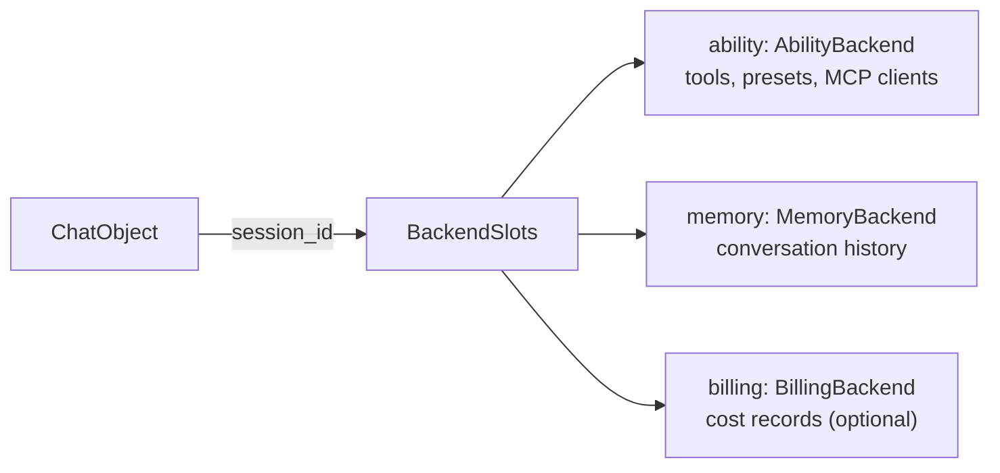
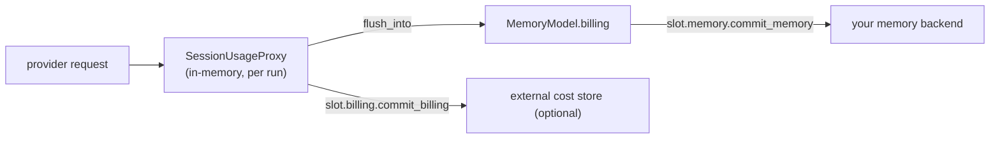

# Data Backend — Persisting Abilities, Memory and Billing

## What a Backend Is

AmritaCore itself does **not** store anything. It defines three interfaces and
hands them the `session_id`; **your backend implementation** decides where data
lives — in-process, a database, Redis, files, ...


```mermaid
flowchart LR
    CO["ChatObject"] -->|session_id| BS["BackendSlots"]
    BS --> AB["ability: AbilityBackend<br/>tools, presets, MCP clients"]
    BS --> MB["memory: MemoryBackend<br/>conversation history"]
    BS --> BB["billing: BillingBackend<br/>cost records (optional)"]
```

## The Interfaces

```python
from amrita_core.base.backend import (
    AbilityBackend,
    BillingBackend,
    MemoryBackend,
)
from amrita_core.types.billing import BillingRecord


class AbilityBackend:  # abstract
    async def load_ability_all(self, session_id: str) -> AbilityContext: ...
    async def load_mcp_clients(self, session_id: str) -> MultiClientManager: ...
    async def load_tools(self, session_id: str) -> MultiToolsManager: ...
    async def load_presets(self, session_id: str) -> MultiPresetManager: ...


class MemoryBackend:  # abstract
    async def load_memory(self, session_id: str) -> MemoryModel: ...
    async def commit_memory(self, session_id: str, memory: MemoryModel) -> None: ...


class BillingBackend:  # abstract, optional
    async def commit_billing(
        self, session_id: str, records: list[BillingRecord]
    ) -> None: ...
    async def load_billing(self, session_id: str) -> list[BillingRecord]: ...
```

> `AbilityContext` bundles tools / presets / MCP clients; `MemoryModel` holds
> `messages: list[Message | ToolResult]` (see [Memory Model](data-memory.md)).

## The Three Slots, and Why Billing Is Different

`BackendSlots` carries all three. The first two are **required**; billing has a
default, because the default persistence path for cost data is not a backend at
all:

```python
from amrita_core.base.backend import BackendSlots
from amrita_core.builtins.backends import LegacyBackend

backend = LegacyBackend()
slot = BackendSlots(ability=backend, memory=backend, billing=backend)
```

Every provider request that reports usage appends a [`BillingRecord`](../api-reference/classes/BillingRecord.md)
to the run's in-memory ledger. At the end of the run, `COMMIT_MEMORY` performs
three steps in order:

1. Move the run's records into `MemoryModel.billing` (`SessionUsageProxy.flush_into`)
2. Commit memory through `slot.memory`
3. Hand the same records to `slot.billing`

Because step 1 happens **before** step 2, a memory backend that persists the
whole `MemoryModel` — the `FileMemoryBackend` below, for instance — already
stores the billing history. `BillingBackend` exists only for consumers that need
the records to _also_ reach somewhere else: a cost database, a metrics pipeline,
a quota enforcer.


```mermaid
flowchart LR
    R["provider request"] --> L["SessionUsageProxy<br/>(in-memory, per run)"]
    L -->|"flush_into"| M["MemoryModel.billing"]
    M -->|"slot.memory.commit_memory"| DB["your memory backend"]
    L -->|"slot.billing.commit_billing"| EX["external cost store (optional)"]
```

> **Consequence**: leaving `billing` out of a hand-built `BackendSlots` is safe —
> the records still survive through memory. You lose only the external mirror.

## The Built-in `LegacyBackend`

The default implementation keeps everything **in-process**:

- Ability lives in a **global** container (`glb`) — the same tools and presets
  for every session
- Memory lives in a per-instance `MemoryModel` field — history survives only
  as long as the process, and only for ids this process has seen
- Billing records accumulate in a per-session in-process store, guarded by a
  lock so concurrent runs cannot interleave a partial append

```python
from amrita_core.builtins.backends import LegacyBackend

backend = LegacyBackend()  # per-session in-process memory
```

> **Consequence**: two `ChatObject`s with the same `session_id` "share" history
> _only_ because `LegacyBackend` stores by id. A different backend decides
> differently — sharing is a backend property, not a framework feature.

## Writing Your Own Backend

Implement one or both interfaces and wrap them in `BackendSlots`:

```python
import json
from pathlib import Path

from amrita_core.base.backend import BackendSlots, AbilityBackend, MemoryBackend
from amrita_core.contexts import AbilityContext
from amrita_core.types.memory import MemoryModel


class FileMemoryBackend(MemoryBackend):
    """Store conversation history as JSON files, one per session."""

    def __init__(self, directory: Path):
        self.directory = directory
        directory.mkdir(parents=True, exist_ok=True)

    def _path(self, session_id: str) -> Path:
        # session_id is user-controlled — sanitize it before touching the FS
        safe = "".join(c for c in session_id if c.isalnum() or c in "-_")
        return self.directory / f"{safe}.json"

    async def load_memory(self, session_id: str) -> MemoryModel:
        path = self._path(session_id)
        if not path.exists():
            return MemoryModel()
        with path.open() as f:
            return MemoryModel.model_validate(json.load(f))

    async def commit_memory(self, session_id: str, memory: MemoryModel) -> None:
        with self._path(session_id).open("w") as f:
            # mode="json" is required: rate prices are Decimal, which plain
            # model_dump() would hand to json.dump as non-serializable objects.
            json.dump(memory.model_dump(mode="json"), f)


class StaticAbilityBackend(AbilityBackend):
    """Return the same global ability for every session (like LegacyBackend)."""

    def __init__(self, ability: AbilityContext):
        self.ability = ability

    async def load_ability_all(self, session_id: str) -> AbilityContext:
        return self.ability

    async def load_mcp_clients(self, session_id):
        return self.ability.mcp

    async def load_tools(self, session_id):
        return self.ability.tools

    async def load_presets(self, session_id):
        return self.ability.presets


my_backend = BackendSlots(
    ability=StaticAbilityBackend(AbilityContext()),
    memory=FileMemoryBackend(Path("./sessions")),
)
```

### Adding an External Billing Sink

Only needed when the records must reach a store _other than_ the one your
memory backend writes to:

```python
from amrita_core import BillingBackend, BillingRecord


class CostDatabaseSink(BillingBackend):
    async def commit_billing(
        self, session_id: str, records: list[BillingRecord]
    ) -> None:
        await cost_db.insert_many(session_id, records)

    async def load_billing(self, session_id: str) -> list[BillingRecord]:
        return await cost_db.fetch(session_id)


my_backend = BackendSlots(
    ability=StaticAbilityBackend(AbilityContext()),
    memory=FileMemoryBackend(Path("./sessions")),
    billing=CostDatabaseSink(),
)
```

If you want the opposite — records deliberately going nowhere — pass
[`NullBillingBackend`](../api-reference/classes/NullBillingBackend.md) instead.

AmritaCore does not compute currency amounts. It stores the rate and the token
counts (see [RateConfig](../api-reference/classes/RateConfig.md)) so consumers
derive cost themselves, which keeps a later price change from rewriting
history.

## Attaching a Backend

```python
# Direct ChatObject construction
chat = ChatObject(
    train=...,
    user_input=...,
    session_id="abc123",
    backend=my_backend,
)

# Through an Agent factory (it forwards to ChatObject)
chat = agent.get_chatobject(
    "Hello!",
    session_id="abc123",
    backend=my_backend,
)
```

From then on, every conversation loads its history from `load_memory` at start
and saves it via `commit_memory` at the end — your files now survive restarts.

## Fine-Grained Control: `DatabackendOptions`

`backend_options=DatabackendOptions(...)` skips parts of the load/commit cycle:

| Flag                         | Skips                                                                            |
| ---------------------------- | -------------------------------------------------------------------------------- |
| `skip_memory_fetch`          | `load_memory` — start with an empty `MemoryModel`                                |
| `skip_tools_fetch`           | `load_tools`                                                                     |
| `skip_mcp_fetch`             | `load_mcp_clients`                                                               |
| `skip_presets_fetch`         | `load_presets`                                                                   |
| `skip_ability_extra_setting` | the whole `load_ability_all`                                                     |
| `skip_memory_commit`         | `commit_memory` at the end                                                       |
| `skip_billing_commit`        | `slot.billing.commit_billing` only — `memory.billing` still receives the records |

```python
from amrita_core.contexts import DatabackendOptions

chat = ChatObject(
    train=...,
    user_input=...,
    session_id="abc123",
    backend=my_backend,
    backend_options=DatabackendOptions(skip_memory_commit=True),  # read-only
)
```

## Next

[Memory Model](data-memory.md) — what `MemoryModel` carries and how the
load/commit lifecycle works.
