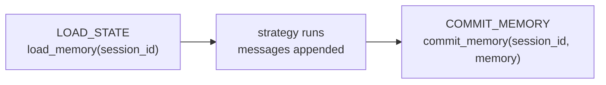

# Memory Model — What Gets Persisted

## `MemoryModel`

The unit of persistence is `MemoryModel` — a Pydantic model holding the
conversation history of one session:

```python
from amrita_core.types.memory import MemoryModel

memory = MemoryModel()            # empty history
memory.messages                   # list[Message | ToolResult]
```

- `messages` — the conversation: `Message` entries (user / assistant) and
  `ToolResult` entries paired with their tool calls.
- Being a Pydantic model, it serializes with `model_dump()` and validates with
  `model_validate()` — exactly what a file/DB backend needs
  (see [Data Backend](data-backend.md)).

## The Lifecycle



1. **Load** — the workflow's `LOAD_STATE` node calls
   `memory.load_memory(session_id)` and stores the result in `MemoryContext`
   (`chat._di_memory.memory`).
2. **Mutate** — strategies append to `SendMessageWrap`; at the end
   (`_post_runner`) the assistant response is appended too, and the final list
   is written back into `mem_ctx.memory.messages`.
3. **Commit** — the `COMMIT_MEMORY` node calls
   `memory.commit_memory(session_id, memory)`.

So the _same_ `session_id` + backend combination determines what the next
conversation loads — the framework only orchestrates the calls.

## `MemoryContext` (DI)

The runtime memory lives in the `MemoryContext` DI slot:

```python
chat._di_memory.memory   # MemoryModel | None — set after LOAD_STATE
```

Workflow nodes and strategies access it via type-matched injection
(`mem: MemoryContext`).

## Memory Summarization

`LLMConfig.enable_memory_abstract` + `memory_abstract_threshold` trigger
summarization: when the prompt token count exceeds the threshold, older turns
are replaced by a summary before the request is sent (see
[Tutorial 5 — Memory](../tutorials/memory.md)). The built-in step strategy
additionally compresses history between Steps
(see [Step Loop](../advanced/step-loop.md)).

## `StateContext` (Legacy Accessor)

`StateContext` (session_id + memory + ability) still exists as a
backward-compatible accessor: `chat.state` synthesizes one from the DI
contexts, and `LegacyBackend` uses it as its in-process storage. New code
should use the DI contexts (`_di_memory`, `_di_ability`, `_di_session`)
directly.

## Next

[Data Management](data.md) — back to the overview, or continue to
[Extensions & Integration](../extensions-integration/index.md).
