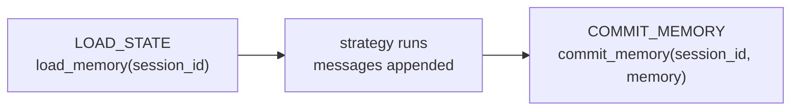

# Memory Model — What Gets Persisted

## `MemoryModel`

The unit of persistence is `MemoryModel` — a Pydantic model holding the
conversation history of one session:

```python
from amrita_core.types.memory import MemoryModel

memory = MemoryModel()  # empty history
memory.messages  # list[Message | ToolResult]
```

| Field      | Holds                                                                                                               |
| ---------- | ------------------------------------------------------------------------------------------------------------------- |
| `messages` | The conversation: `Message` entries (user / assistant) and `ToolResult` entries paired with their tool calls        |
| `abstract` | The summary produced by compaction. Rendered into the system instruction by the train template                      |
| `usage`    | The usage the provider reported for the most recent request. Drives the compaction trigger; cleared after each fold |
| `billing`  | Per-request `BillingRecord` entries accumulated for this session — the default persistence path for cost data       |
| `time`     | Timestamp                                                                                                           |

Being a Pydantic model, it serializes with `model_dump()` and validates with
`model_validate()` — exactly what a file/DB backend needs
(see [Data Backend](data-backend.md)). Because `billing` may hold `Decimal`
prices, use `model_dump(mode="json")` when writing JSON.

## The Lifecycle


```mermaid
flowchart LR
    A["LOAD_STATE<br/>load_memory(session_id)"] --> B["strategy runs<br/>messages appended"]
    B --> C["COMMIT_MEMORY<br/>commit_memory(session_id, memory)"]
```

1. **Load** — the workflow's `LOAD_STATE` node calls
   `memory.load_memory(session_id)` and stores the result in `MemoryContext`
   (`chat._di_memory.memory`).
2. **Mutate** — strategies append to `SendMessageWrap`; at the end
   (`_post_runner`) the assistant response is appended too, and the final list
   is written back into `mem_ctx.memory.messages`.
3. **Commit** — the `COMMIT_MEMORY` node calls
   `memory.commit_memory(session_id, memory)`.

So the _same_ `session_id` + backend combination determines what the next
conversation loads — the framework only orchestrates the calls.

## `MemoryContext` (DI)

The runtime memory lives in the `MemoryContext` DI slot:

```python
chat._di_memory.memory  # MemoryModel | None — set after LOAD_STATE
```

Workflow nodes and strategies access it via type-matched injection
(`mem: MemoryContext`).

## Keeping History Inside the Model's Limits

Three separate mechanisms run before a request is built. They are deliberately
independent — each can be enabled alone, and they solve different problems:

| Mechanism             | Solves                                       | Runs when                           |
| --------------------- | -------------------------------------------- | ----------------------------------- |
| Content normalization | History carries blocks the model cannot read | `llm.enable_multi_modal` is **off** |
| History management    | History is too long                          | A trigger threshold is reached      |
| Overflow recovery     | The provider already rejected the request    | A `ContextOverflowError` is raised  |

The default pipeline order is
`LOAD_STATE >> NORMALIZE_MESSAGES >> MANAGE_CONTEXT >> JINJA2_RENDER >> BUILD_MESSAGE`
(see [Workflow Engine](../advanced/workflow-engine.md)).

### 1. Content Normalization

Some providers accept only plain text. A conversation carrying content blocks
(images, files) therefore has to be flattened before the request is built, or
the adapter sends blocks the model cannot read.

The `NORMALIZE_MESSAGES` node does this, gated by
`LLMConfig.enable_multi_modal` (default `True`):

- `enable_multi_modal=True` — the node is a no-op; blocks pass through
- `enable_multi_modal=False` — every **user** message whose `content` is a list
  of blocks is rewritten to its concatenated text

Only user messages are rewritten. Assistant turns keep their structure, because
tool-call pairing depends on it.

This is deliberately separate from compaction: normalization is **lossless**
flattening of what is already there, while compaction throws history away.
Keeping them apart means either can run alone.

#### Sending Images

An `ImageContent` block carries a URL, and the two accepted forms are:

```python
from amrita_core.types.content import ImageContent, ImageUrl, TextContent

#  External http(s) URL — the provider downloads it itself
ImageContent(type="image_url", image_url=ImageUrl(url="https://example.com/cat.png"))

#  Inline data URI — the image travels inside the request body
ImageContent(
    type="image_url",
    image_url=ImageUrl(url="data:image/png;base64,iVBORw0KGgo..."),
)
```

Both work on every built-in adapter. The OpenAI wire format already uses
`image_url`, so that adapter passes blocks through untouched. The Anthropic
adapter translates the block and picks the `source` variant from the URL: an
inline `data:` URI becomes a `base64` source, anything else a `url` source.

That split is not cosmetic — the Anthropic-compatible endpoint answers
`400 invalid url` when a data URI is sent as a `url` source, so an inline image
would be lost if the block were forwarded verbatim.

A `data:` URI that cannot be expressed as a `base64` source raises `ValueError`
instead of being dropped: a missing media type, a non-base64 payload and an
empty body all fail loudly rather than sending a request the model answers about
a picture it never received.

### 2. History Management

`LLMConfig.context_strategy` picks what happens when history outgrows the budget.
A [`ContextCompactor`](../api-reference/classes/ContextCompactor.md) reads the
attention window from the active preset (`max_context`, falling back to
`LLMConfig.session_tokens_windows`) and acts once the last measured prompt
reaches `compaction_trigger_ratio` of it.

It fires on whichever trigger comes first:

- **Token trigger** — the prompt size the provider reported for the previous
  request reaches the threshold. No local tokenizer is involved; the
  provider's own usage report is the measurement
- **Message-count fallback** — history reaches `LLMConfig.memory_length_limit`
  (default `200`). This exists because the token trigger needs the provider to
  report usage; a gateway that reports none would otherwise let history grow
  without bound

What runs once a trigger fires:

| `context_strategy` | Effect                                                                                                       |
| ------------------ | ------------------------------------------------------------------------------------------------------------ |
| `"compact"`        | Folds the oldest prefix into an LLM summary stored on `MemoryModel.abstract`                                   |
| `"slide"`          | Drops the oldest messages outright, down to `slide_target_ratio` × the window, with no extra model call        |
| `"none"`           | Nothing — history grows until the provider rejects the request                                                 |

Both active policies cut at a **`user` message**, so the surviving tail starts a
clean turn and no assistant tool call is ever separated from its tool results.
Under `"compact"` the summary is rendered back into the system instruction by
the train template, so nothing is injected into the message list and provider
message-ordering rules stay untouched.

See [Tutorial 5 — Memory](../tutorials/memory.md) for a hands-on setup, and
[Step Loop](../advanced/step-loop.md) for the between-Step variant the built-in
step strategy additionally performs.

### 3. Overflow Recovery

Sometimes the estimate is simply wrong — the provider rejects the request
outright. `libchat` detects this and raises
[`ContextOverflowError`](../api-reference/classes/ContextOverflowError.md)
_before_ the preset-fallback loop, so an oversized request never burns through
the fallback chain.

With `LLMConfig.enable_overflow_recovery` (default `True`), `LLM_COMPLETION`
catches the error, folds the history through the same `ContextCompactor`, and
retries **once**. If the retry also overflows, the error propagates.

Detection is a deliberately conservative pattern match over the provider's
message: mistaking a transient failure for an overflow would throw away history
for nothing.

## Next

[Data Management](data.md) — back to the overview, or continue to
[Extensions & Integration](../extensions-integration/index.md).
