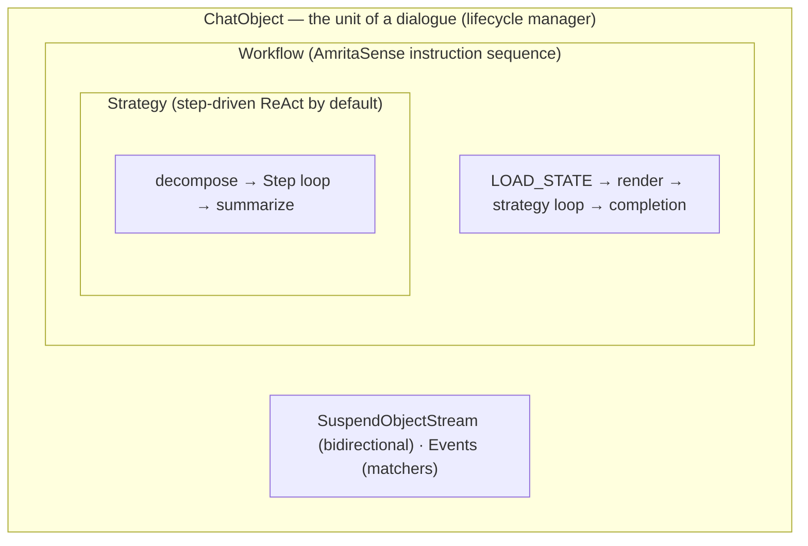

# Core Concepts

This section explains how AmritaCore works _under the hood_ — the components,
their responsibilities, and how they fit together. It assumes you have finished
the [Tutorials](../tutorials/index.md).

## Mental Model

## Concepts

| Concept                             | What it covers                                                                          |
| ----------------------------------- | --------------------------------------------------------------------------------------- |
| [ChatObject](chat-object.md)        | The lifecycle manager: workflow, DI contexts, stream                                    |
| [Configuration](configuration.md)   | `AmritaConfig`, `FunctionConfig`, `LLMConfig`, presets                                  |
| [Event System](event.md)            | Pipeline events + the matcher hook system                                               |
| [Tool System](tool.md)              | Tool registration, validation, execution                                                |
| [Agent Strategy](agent-strategy.md) | Strategy pattern; the step-driven ReAct loop                                            |
| [Data Management](data.md)          | Messages, DI contexts, [backend](data-backend.md) + [memory](data-memory.md) deep-dives |

## Where to Go Next

- Extend it → [Extensions & Integration](../extensions-integration/index.md)
- Tune it → [Agent Engineering](../agent-engineering/index.md)
- Go deeper → [Advanced](../advanced/index.md)
