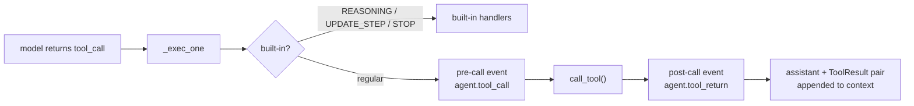

# Tool System

> **Concept page.** For hands-on usage see
> [Tutorial 2 — Add Tools](../tutorials/tools.md) and
> [Custom Tools — Advanced Patterns](../extensions-integration/tools.md).

## What Is a Tool

A tool is a **function with a JSON Schema**. The model never executes your
function — it generates a call request; the framework validates the arguments,
runs the function, and feeds the result back.

## Registration

Three ways to register a tool:

| Method                               | Schema source                       | Scope                |
| ------------------------------------ | ----------------------------------- | -------------------- |
| `@simple_tool`                       | Type hints + docstring              | Global (module load) |
| `@on_tools(schema)`                  | Explicit `FunctionDefinitionSchema` | Global (module load) |
| `ToolsManager` / `MultiToolsManager` | Manual                              | Per-session, runtime |

Handlers receive validated arguments as `dict` and return `str` (the result the
model sees).

## Schemas and Validation

`FunctionPropertySchema` supports full JSON Schema constraints — `minimum`,
`pattern`, `enum`, `items`, `required`, `default` ... — validated automatically
when the LLM produces a tool call. Bad arguments never reach your function.

## Execution Path

- **Built-in tools** (`STOP_TOOL`, `REASONING_TOOL`, `UPDATE_STEP_TOOL`,
  `PROCESS_MESSAGE`) bypass events — see [Built-ins](../builtins.md).
- **Stall guard**: if the same signature repeats `loop_reasoning_trigger`
  times, the call is cancelled _before_ execution and returns
  `"Cancelled: Reach the max limit of repeatly calling tool."`
- **Lifecycle events** let matchers rewrite arguments, cancel, rewrite results,
  or skip appending.

## Advanced: `custom_run` and `ToolContext`

Tools that need framework access use `custom_run` mode: the handler receives a
`ToolContext` with `.data` (arguments) and `.ctx` (the `StrategyContext`) —
useful for streaming progress or reading session state.

## Next

[Agent Strategy](agent-strategy.md) — who drives the tool loop.
