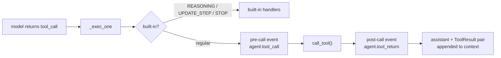

# Tool System

> **Concept page.** For hands-on usage see
> [Tutorial 2 — Add Tools](../tutorials/tools.md) and
> [Custom Tools — Advanced Patterns](../extensions-integration/tools.md).

## What Is a Tool

A tool is a **function with a JSON Schema**. The model never executes your
function — it generates a call request; the framework validates the arguments,
runs the function, and feeds the result back.

## Registration

Three ways to register a tool:

| Method                               | Schema source                       | Scope                |
| ------------------------------------ | ----------------------------------- | -------------------- |
| `@simple_tool`                       | Type hints + docstring              | Global (module load) |
| `@on_tools(schema)`                  | Explicit `FunctionDefinitionSchema` | Global (module load) |
| `ToolsManager` / `MultiToolsManager` | Manual                              | Per-session, runtime |

Handlers receive validated arguments as `dict` and return `str` (the result the
model sees).

## Schemas and Validation

`FunctionPropertySchema` carries the JSON Schema constraints AmritaCore
forwards to the provider: `minimum` / `maximum` (plus `exclusiveMinimum` /
`exclusiveMaximum` / `multipleOf`), `minLength` / `maxLength`, `pattern`,
`enum`, `const`, `items` / `minItems` / `maxItems`, `default`, ... `required`
lives on the enclosing `FunctionParametersSchema`.

`amrita_core.tools.schema` treats that schema as an intermediate
representation with two orthogonal directions:

| Direction   | Entry points                                                              | Purpose                      |
| ----------- | ------------------------------------------------------------------------- | ---------------------------- |
| Projection  | `function_definition_from_pydantic`, `function_definition_from_signature` | Python types to a schema     |
| Compilation | `compile_parameters_model`                                                | A schema back to a validator |

The schema is what the **model** reads; the compiled Pydantic model is what
checks the **call**. Because compilation starts from the schema alone it covers
every source — a hand-written schema, `@simple_tool` type hints, and MCP
servers alike.

`call_tool()` runs the compiled validator before the handler, so a call that
violates the declared types or constraints raises `ValidationError` instead of
reaching your function with bad data. The agent loop turns that into an
`ERR: ...` tool result, so the model reads the field-level message and can fix
the call itself.

Two details worth knowing:

- Arguments the model omitted stay omitted, so a Python default on your
  handler still applies — validation never injects a `None` in their place.
- Set `function_config.validate_tool_arguments = False` to pass arguments
  through untouched.

### Describing a tool with one Pydantic model

`function_definition_from_pydantic` projects a model's fields, docstring,
constraints and defaults into a definition, so one declaration does both jobs:

```python
from pydantic import BaseModel, Field

from amrita_core.tools.manager import on_tools
from amrita_core.tools.schema import function_definition_from_pydantic


class LookupArgs(BaseModel):
    """Look a user up by id."""

    user_id: int = Field(description="Numeric user id", ge=1)
    verbose: bool = Field(default=False, description="Include history")


@on_tools(function_definition_from_pydantic(LookupArgs, name="lookup"))
async def lookup(args: dict) -> str:
    return f"user {args['user_id']}"
```

`ge=1` becomes `minimum: 1` in the schema the model sees, and the same bound is
enforced when the call comes back.

## Execution Path


```mermaid
flowchart LR
    A["model returns tool_call"] --> B["_exec_one"]
    B --> C{"built-in?"}
    C -->|REASONING / UPDATE_STEP / STOP| D["built-in handlers"]
    C -->|regular| E["pre-call event<br/>agent.tool_call"]
    E --> F["call_tool()"]
    F --> G["post-call event<br/>agent.tool_return"]
    G --> H["assistant + ToolResult pair<br/>appended to context"]
```

- **Inline-handled tools** — `REASONING_TOOL` (`think_and_reason`),
  `UPDATE_STEP_TOOL` and `STOP_TOOL` (`agent_stop`) are dispatched inside
  `_exec_one` and therefore **bypass** the `agent.tool_call` /
  `agent.tool_return` events. `PROCESS_MESSAGE` (`processing_message`) is _not_
  one of them: it is a regular `custom_run` tool, gated by
  `function_config.agent_middle_message`, so it does go through the events.
  `REFLECTION_TOOL` is only ever used internally by the reflection pass. See
  [Built-ins](../builtins.md).
- **Stall guard**: if the same signature repeats `loop_reasoning_trigger`
  times, the call is cancelled _before_ execution and returns
  `"Cancelled: Reach the max limit of repeatly calling tool."`
- **Lifecycle events** let matchers rewrite arguments, cancel, rewrite results,
  or skip appending.

## Advanced: `custom_run` and `ToolContext`

Tools that need framework access use `custom_run` mode: the handler receives a
`ToolContext` with `.data` (arguments) and `.ctx` (the `StrategyContext`) —
useful for streaming progress or reading session state.

## Next

[Agent Strategy](agent-strategy.md) — who drives the tool loop.
