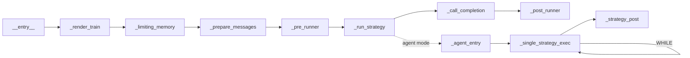

# Workflow Engine

> Starting from AmritaCore v0.9.0rc1, ChatObject is driven by [AmritaSense](https://sense.amritabot.com)'s composable workflow engine.

## Overview

ChatObject's execution pipeline is decomposed into discrete **Nodes**, executed by AmritaSense's `WorkflowInterpreter`. AmritaCore does not implement its own workflow engine — it uses AmritaSense's directly.

The workflow engine's core types (`Node`, `NodeComposeRendered`, `WorkflowInterpreter`) and control-flow instructions (`IF`/`WHILE`/`JUMP`/`TRY`/`CALL`/`ALIAS`) are all provided by AmritaSense.

**Full Documentation:**

| Topic                            | AmritaSense Docs                                                                        |
| -------------------------------- | --------------------------------------------------------------------------------------- |
| Workflow Composition & Execute   | [Compose & Execute](https://sense.amritabot.com/guide/concepts/compose_and_exec)        |
| @Node Decorator & Custom Nodes   | [Custom Nodes](https://sense.amritabot.com/guide/advanced/custom_node)                  |
| Control Flow (IF/WHILE/JUMP/TRY) | [Control Flow](https://sense.amritabot.com/guide/concepts/flow_control)                 |
| ALIAS / Subprogram Calls         | [Control Flow](https://sense.amritabot.com/guide/concepts/flow_control)                 |
| Dependency Injection             | [Dependency Injection](https://sense.amritabot.com/guide/advanced/dependency_injection) |
| Event System                     | [Event System](https://sense.amritabot.com/guide/advanced/event_system)                 |
| Execution & Interrupt            | [Execution & Interrupt](https://sense.amritabot.com/guide/concepts/exec_and_interrupt)  |

## ChatObject Node Chain



The `_run_strategy` node branches into an agent sub-workflow when using `"agent"` or `"agent-mixed"` strategy categories. The sub-workflow uses a `WHILE` loop with a counter factory to iterate over tool calls.

| Node                    | SuspendEnum Tag     | Description                                       |
| ----------------------- | ------------------- | ------------------------------------------------- |
| `_render_train`         | `TRAIN_RENDER`      | Renders the Jinja2 system prompt template         |
| `_limiting_memory`      | `MEMORY`            | Applies memory length and token limits            |
| `_prepare_messages`     | `MESSAGES_PREPARED` | Prepares the final message list for the LLM       |
| `_pre_runner`           | `PRECOMPLE`         | Triggers pre-completion matcher events            |
| `_run_strategy`         | `STRATEGY_START`    | Executes strategy; branches to agent sub-workflow |
| `_agent_entry`          | —                   | Initializes agent strategy instance               |
| `_single_strategy_exec` | `SINGLE_TOOL`       | Executes one tool call iteration                  |
| `_strategy_post`        | —                   | Post-processes strategy after all tool calls      |
| `_call_completion`      | `LLM_CALL`          | Calls the LLM via the adapter                     |
| `_post_runner`          | `COMPLE`            | Triggers post-completion matcher events           |

### Control Flow Instructions

The agent sub-workflow uses AmritaSense v0.3.0+ control flow instructions:

- **`GOTO(BuiltinName.STRATEGY_EOF)`** — Skips the agent sub-workflow when using non-agent strategies
- **`ALIAS(_agent_entry, BuiltinName.AGENT_STRATEGY)`** — Registers the agent entry point as a subprogram target
- **`WHILE(_single_strategy_exec).ACTION(_counter_factory())`** — Loops tool call execution with a counter to enforce call limits
- **`ALIAS(NOP, BuiltinName.STRATEGY_EOF)`** — Marks the end of the agent sub-workflow

### SuspendEnum Tags

Since v0.9.1, additional suspend tags are available:

- `SuspendEnum.ADVANCE_COUNTER` — Before advancing the tool call counter
- `SuspendEnum.STRATEGY_EOF` — At the end of the agent strategy sub-workflow

## AmritaCore-Specific Concepts

### WorkflowInterpreter Integration

ChatObject assembles the workflow in `__init__` and executes it:

- `_middleware` parameter can wrap the entire workflow
- `archived_nodes` parameter appends custom nodes after the standard pipeline
- `BuiltinName.AGENT_STRATEGY` alias enables subprogram calls

### BuiltinName

```python
from amrita_core.chatmanager import BuiltinName
BuiltinName.AGENT_STRATEGY  # "ChatObject::__agent_main__"
```

### Middleware

```python
async def my_middleware(chat_obj: ChatObject) -> None:
    """Middleware that wraps the entire ChatObject workflow."""
    logger.info("Workflow starting...")
    try:
        await chat_obj._interpreter.run()
    finally:
        logger.info("Workflow finished.")

chat = ChatObject(
    ...,
    middleware=my_middleware,
)
```

### Extending with archived_nodes

```python
from amrita_sense import Node
from amrita_sense.instructions import ARCHIVED_NODES

custom_nodes = ARCHIVED_NODES()

@Node("custom_logging")
async def log_completion(self):
    logger.info(f"Response: {self.response.content}")

custom_nodes._nodes += (log_completion,)

chat = ChatObject(..., archived_nodes=custom_nodes)
```

## Migration from v0.8.x

| Old Approach                            | New Approach                               |
| --------------------------------------- | ------------------------------------------ |
| Override `_run()`                       | `@Node` decorator + `archived_nodes`       |
| `from amrita_core.protocol import ...`  | `from amrita_core.base.adapter import ...` |
| `from amrita_core.streaming import ...` | `from amrita_sense.streaming import ...`   |
| `from amrita_core.logging import ...`   | `from amrita_sense.logging import ...`     |
