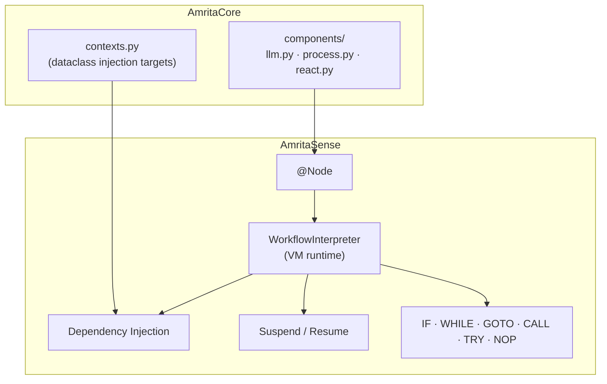
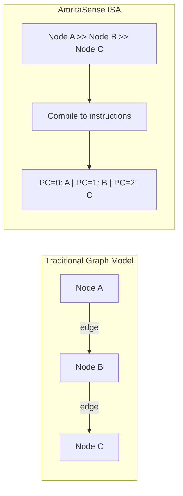
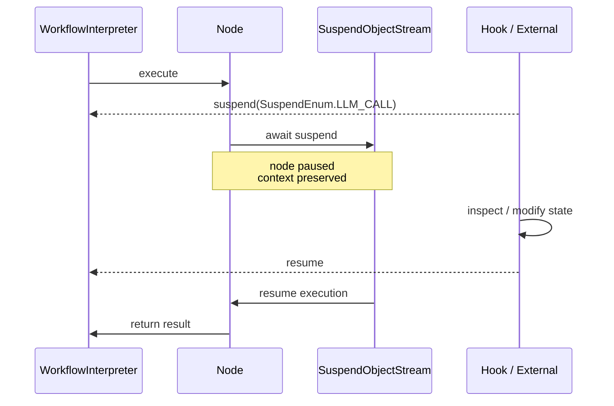
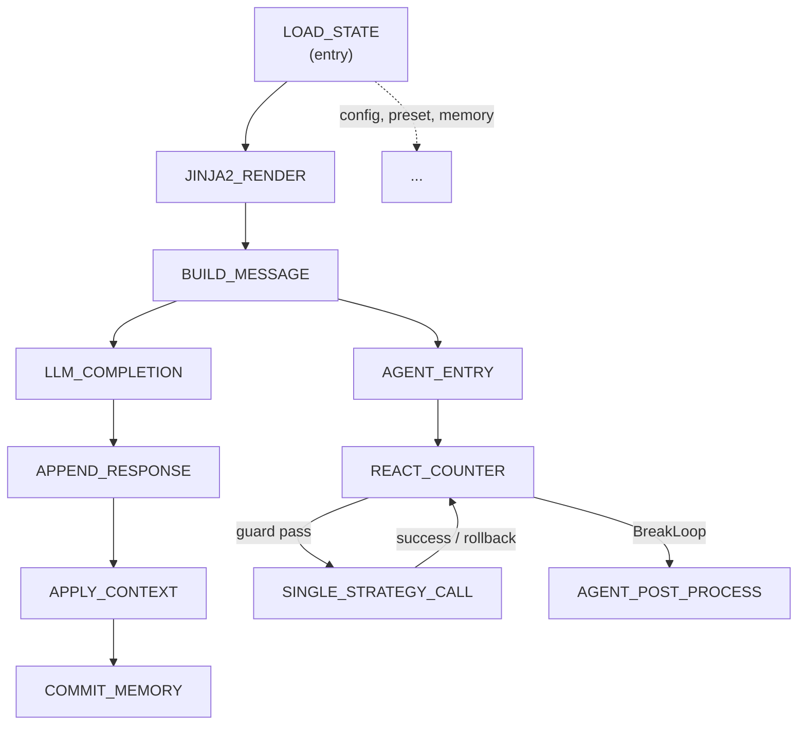

<div v-pre>

# AmritaSense Integration

## Overview

[AmritaSense](https://sense.amritabot.com) is a **general-purpose workflow orchestration engine** that AmritaCore uses to drive its processing pipeline. Instead of traditional node-edge graphs, Sense compiles workflows into a **linear instruction sequence** executed by a lightweight virtual machine — much like a CPU runs machine code.



## Instruction Set Architecture vs Graph Model

Traditional engines define explicit nodes and edges. Sense compiles them into instructions driven by a **program counter** (`PointerVector`) and a **call stack**.



| Feature      | Graph Model                        | AmritaSense                          |
| ------------ | ---------------------------------- | ------------------------------------ |
| Scheduling   | Graph traversal + topological sort | Program counter increment / jump     |
| Control flow | Simulated via routing edges        | Native `IF`, `WHILE`, `GOTO`, `TRY`  |
| Debugging    | Requires graph visualization       | Step-by-step via `run_step_by()`     |
| Interrupt    | Extra state management             | Native `Future`-based suspend/resume |
| Compile perf | O(V+E) traversal                   | ~200 ms for 100,000 nodes            |

## @Node Decorator

`@Node` converts a regular Python function into a workflow node. Sense captures the call frame at decoration time and stores all required metadata.

```python
from amrita_sense import Node

@Node(
    tag="my_node",          # readable id (default: function name)
    wrap_to_async=True,     # auto-wrap sync → async
    address_able=True,      # addressable by GOTO / CALL
)
async def my_node(param1: int, param2: str) -> str:
    return f"{param1}: {param2}"
```

| Parameter       | Type          | Default       | Description                                        |
| --------------- | ------------- | ------------- | -------------------------------------------------- |
| `tag`           | `str \| None` | function name | Node identifier; maps to `SuspendEnum` and `ALIAS` |
| `wrap_to_async` | `bool`        | `True`        | Wrap synchronous functions for async execution     |
| `address_able`  | `bool`        | `True`        | Allow `GOTO` / `CALL` to target this node by alias |

## WorkflowInterpreter — Virtual Machine

`WorkflowInterpreter` receives a compiled graph and drives execution via its program counter:

```python
from amrita_sense import Node, NOP, WorkflowInterpreter

@Node()
async def step_one() -> None:
    print("[1] Load state")

@Node()
async def step_two() -> None:
    print("[2] Process")

# >> chains nodes; NOP is the terminal sentinel
composition = step_one >> step_two >> NOP
rendered = composition.render()

interpreter = WorkflowInterpreter(rendered)
await interpreter.run()              # full run
# or
async for result in interpreter.run_step_by():  # step debug
    print(f"→ {result}")
```

It manages a **call stack** (`Stack`) for `CALL` / `GOTO` / `INTERRUPT`, handles exceptions at every node boundary, and resolves dependencies before calling each node function.

## Dependency Injection

Nodes declare dependencies via **function signatures**. At runtime, the interpreter matches parameter types against a pool of registered `@dataclass` instances.

```mermaid
flowchart TD
    N["Node function(opt: DatabackendOptions, ability: AbilityState, ...)"] --> M{parameter type?}
    M -->|known dataclass| T[type-matched injection]
    M -->|str / int / bool| K[name-matched via extra_kwargs]
    M -->|Depends(wrapped)| D[special runtime object]
    M -->|other| P[position-matched via extra_args]
    T --> I[dependency resolved]
    K --> I
    D --> I
    P --> I
```

AmritaCore's entry node demonstrates this clearly:

```python
@Node(SuspendEnum.LOAD_STATE)
async def LOAD_STATE(
    opt: DatabackendOptions,   # injected by type
    ability: AbilityState,      # injected by type
    meta: SessionMetadata,     # injected by type
    mem: MemoryContext,         # injected by type
    rt_payload: WorkingState,  # injected by type
    ip: GeneralInput,           # injected by type
):
    ...
```

All context objects live in `contexts.py` as `@dataclass` definitions. No manual wiring is needed — Sense resolves them automatically.

## Suspend / Resume

Sense supports bidirectional pause-and-resume via `Future` callbacks. When an external hook signals a suspend at a `SuspendEnum` point, the current node awaits and its full context is preserved until the hook signals resume.



AmritaCore's `SuspendEnum` maps each node to an intercept point:

| SuspendEnum         | Node                 | Intercepted at                |
| ------------------- | -------------------- | ----------------------------- |
| `LOAD_STATE`        | LOAD_STATE           | after backend state loaded    |
| `TRAIN_RENDER`      | JINJA2_RENDER        | after Jinja2 rendering        |
| `MESSAGES_PREPARED` | BUILD_MESSAGE        | after SendMessageWrap built   |
| `LLM_CALL`          | LLM_COMPLETION       | during LLM API call           |
| `MEMORY`            | APPEND_RESPONSE      | after response appended       |
| `SINGLE_TOOL`       | SINGLE_STRATEGY_CALL | during tool execution         |
| `ADVANCE_COUNTER`   | REACT_COUNTER        | after counter increment       |
| `APPLY_CONTEXT`     | APPLY_CONTEXT        | before writing back to memory |
| `COMMIT_MEMORY`     | COMMIT_MEMORY        | before persistence            |

## Control Flow Instructions

All control flow compiles into linear instruction sequences. These are the available instructions:

| Instruction                   | Equivalent             | Purpose                               |
| ----------------------------- | ---------------------- | ------------------------------------- |
| `IF(cond, then, else_)`       | if / else              | Conditional branch                    |
| `WHILE(cond, body)`           | while loop             | Pre-test loop                         |
| `DO(body, cond)`              | do-while               | Post-test loop                        |
| `TRY(body, catch, then, fin)` | try / except / finally | Exception handling                    |
| `GOTO(target)`                | goto                   | Unconditional jump (PC manipulation)  |
| `CALL(target)`                | function call          | Subroutine call (push return address) |
| `NOP`                         | pass                   | Sentinel / terminator                 |
| `INTERRUPT`                   | —                      | Explicit interrupt signal             |
| `TRIGGER_EVENT`               | —                      | Fire `MatcherFactory` event           |

A minimal branching example:

```python
from amrita_sense import Node, IF, NOP

@Node()
def is_greeting(msg: str) -> bool:
    return msg.lower().startswith("hello")

@Node()
def greet(): print("Hi!")

@Node()
def echo(msg: str): print(f"Echo: {msg}")

flow = IF(is_greeting, greet, echo) >> NOP
```

## How AmritaCore Uses AmritaSense

### Complete Node Graph

AmritaCore defines 11 `@Node` functions across three modules:



### Module Breakdown

| Module       | Nodes                                                                              | Responsibility                     |
| ------------ | ---------------------------------------------------------------------------------- | ---------------------------------- |
| `llm.py`     | `JINJA2_RENDER`, `LLM_COMPLETION`                                                  | Template rendering & LLM API calls |
| `process.py` | `LOAD_STATE`, `BUILD_MESSAGE`, `APPEND_RESPONSE`, `APPLY_CONTEXT`, `COMMIT_MEMORY` | State lifecycle & persistence      |
| `react.py`   | `AGENT_ENTRY`, `REACT_COUNTER`, `SINGLE_STRATEGY_CALL`, `AGENT_POST_PROCESS`       | Agent tool-call loop               |

### Context Dataclasses

All contexts are `@dataclass` definitions in `contexts.py`, resolved by Sense's DI:

| Dataclass            | Purpose                              | Consumers                                                                                        |
| -------------------- | ------------------------------------ | ------------------------------------------------------------------------------------------------ |
| `AbilityState`       | Config, backend slots, active preset | Most nodes                                                                                       |
| `MemoryContext`      | Session message history              | LOAD_STATE, BUILD_MESSAGE, JINJA2_RENDER, APPLY_CONTEXT, COMMIT_MEMORY                           |
| `WorkingState`       | Message context wrapper              | BUILD_MESSAGE, LLM_COMPLETION, APPEND_RESPONSE, APPLY_CONTEXT, AGENT_ENTRY, SINGLE_STRATEGY_CALL |
| `GeneralInput`       | User input, template, render vars    | LOAD_STATE, BUILD_MESSAGE, JINJA2_RENDER                                                         |
| `RespState`          | Final LLM response                   | LLM_COMPLETION, APPEND_RESPONSE                                                                  |
| `DatabackendOptions` | Load / commit flags                  | LOAD_STATE, COMMIT_MEMORY                                                                        |
| `SessionMetadata`    | Session ID & timestamp               | LOAD_STATE, COMMIT_MEMORY                                                                        |
| `AgentLoopState`     | Strategy, backup, counter            | AGENT_ENTRY, REACT_COUNTER, SINGLE_STRATEGY_CALL, AGENT_POST_PROCESS                             |
| `StrategyPayload`    | Strategy factory                     | AGENT_ENTRY                                                                                      |

## Practical Examples

### Adding a Content Filter Node

```python
from amrita_sense import Node

@Node(tag="ContentFilter", wrap_to_async=False)
def content_filter(ip: GeneralInput, ab: AbilityState) -> None:
    blocked = ab.config.llm.extra_config.get("blocked_words", [])
    for word in blocked:
        ip.user_input = ip.user_input.replace(word, "***")
```

Insert into the pipeline: `LOAD_STATE >> content_filter >> JINJA2_RENDER >> ...`

### Conditional Monitoring with IF

```python
from amrita_sense import Node, IF, NOP
import time

@Node()
def should_monitor(ab: AbilityState) -> bool:
    return ab.config.llm.extra_config.get("enable_monitoring", False)

@Node()
def record_start(wok: WorkingState) -> None:
    wok.context_wrap._meta = {"start": time.monotonic()}

monitor_chain = IF(should_monitor, record_start, NOP)
```

### Further Reading

- [AmritaSense source](https://github.com/AmritaBot/AmritaSense)
- [AmritaCore components](https://github.com/AmritaBot/AmritaCore/tree/main/src/amrita_core/components)
- [Component node reference (docstrings)](https://github.com/AmritaBot/AmritaCore/tree/main/src/amrita_core/components)

</div>
