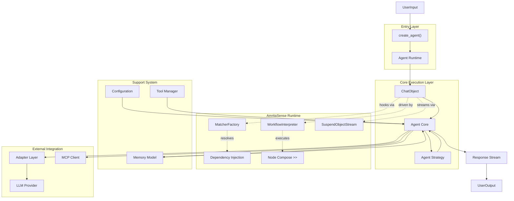
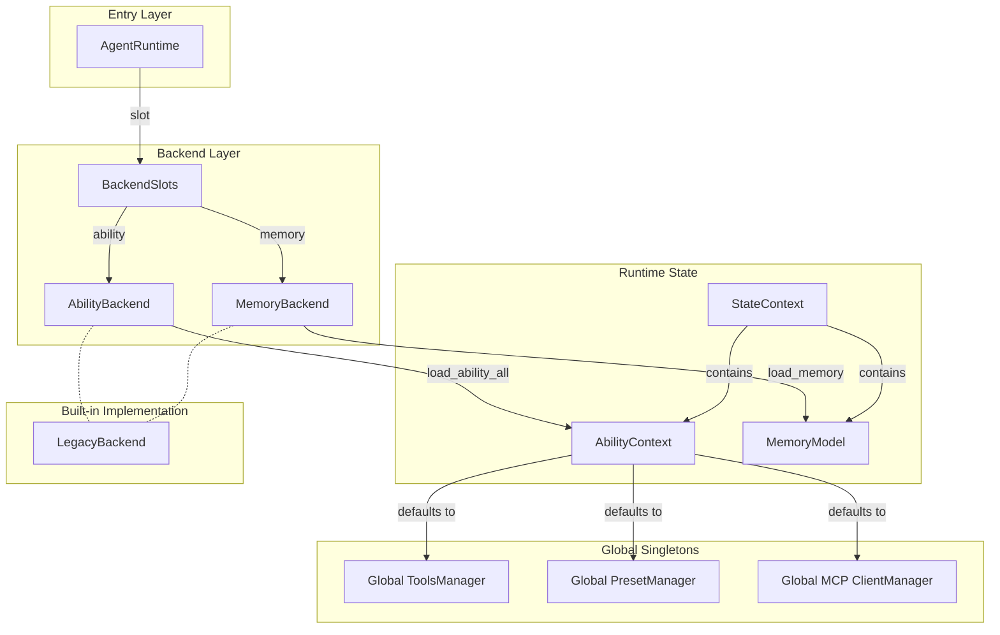
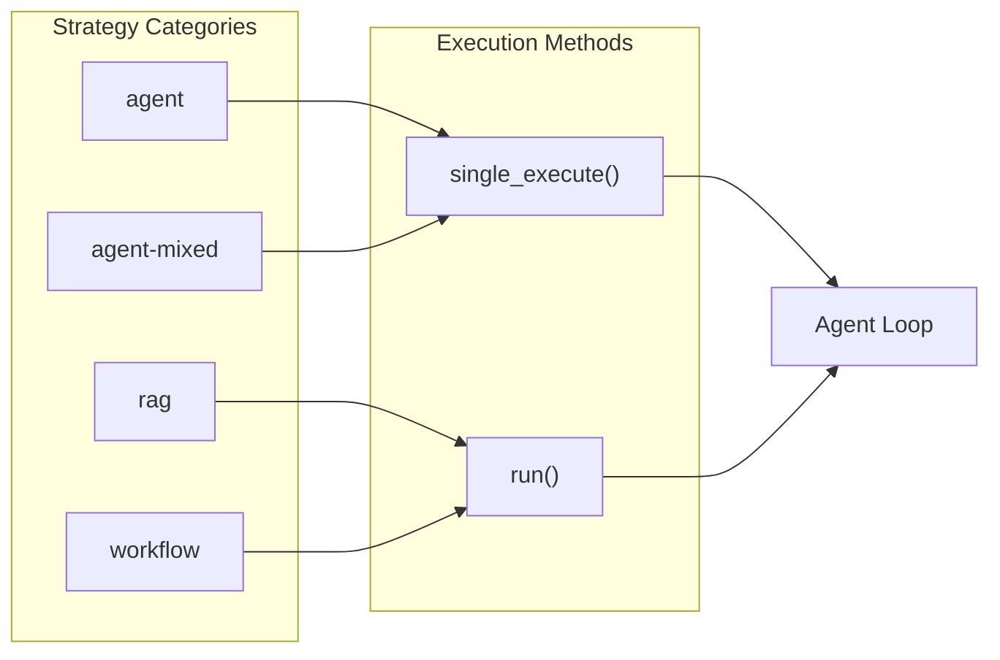
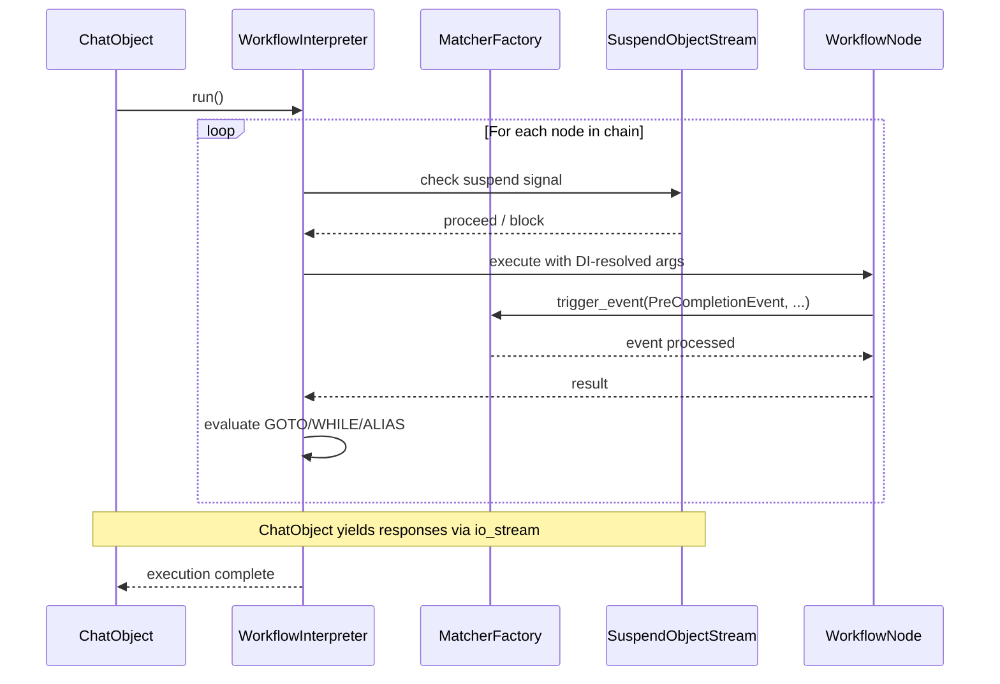
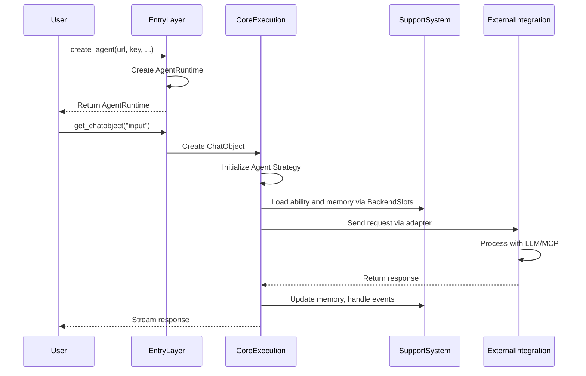

# Project Architecture Understanding

## Architecture Diagram

### Core Architecture

### Backend Architecture and Session Data Flow

#### Backend-Driven Data Management

The `LegacyBackend` implements both `AbilityBackend` and `MemoryBackend` using in-process global containers. Custom backends (e.g., database-backed) can replace either slot independently.

### Strategy-Based Execution Flow

## AmritaSense — The Runtime Substrate

AmritaCore is built on [**AmritaSense**](https://sense.amritabot.com), which serves as the **runtime** that powers every `ChatObject` execution. Think of AmritaSense as the "operating system" for agent workflows — it provides the scheduling, composition, and event plumbing, while AmritaCore defines the domain-specific agent logic on top.

### Runtime Components

| Component                 | Role in ChatObject                                                                                                                                                                                                                                                                   |
| ------------------------- | ------------------------------------------------------------------------------------------------------------------------------------------------------------------------------------------------------------------------------------------------------------------------------------ |
| **`WorkflowInterpreter`** | Drives the node chain (`LOAD_STATE → JINJA2_RENDER → _limiting_memory → BUILD_MESSAGE → … → LLM_COMPLETION → COMMIT_MEMORY`). Since v0.12.0, core workflow nodes have been extracted to the `amrita_core.components` package. Each node is a composable `@Node` decorated coroutine. |
| **`MatcherFactory`**      | Manages the event system. `PreCompletionEvent`, `CompletionEvent`, `FallbackContext` are dispatched through matchers registered via `@on_precompletion().handle()` etc.                                                                                                              |
| **`SuspendObjectStream`** | The streaming I/O backbone. All LLM chunks, tool call notifications, and reasoning content flow through this bidirectional stream with built-in suspend/resume.                                                                                                                      |
| **Dependency Injection**  | `WorkflowInterpreter` resolves type annotations and `Depends()` markers in node signatures, injecting `ChatObject`, DI context objects (`_di_ability`, `_di_memory`, `_di_input`, etc.), config, and custom dependencies automatically.                                              |
| **Node Compose (`>>`)**   | Nodes are chained with the `>>` operator into a `NodeCompose` graph. The interpreter follows `GOTO`/`WHILE`/`ALIAS` instructions for control flow.                                                                                                                                   |

### How AmritaSense Drives a ChatObject

This separation keeps AmritaCore's Agent layer thin and focused on strategy, sessions, tools, MCP, and adapters — all the orchestration is handled by AmritaSense.

## Core Component Relationships

- **Entry Layer**: Provides a simplified interaction interface for users
  - `create_agent()`: Factory function that creates an `AgentRuntime` with minimal parameters
  - `AgentRuntime`: High-level wrapper that encapsulates complexity and provides reusable agent operations

- **Core Execution Layer**: Handles the main processing logic
  - `ChatObject`: Manages the primary interaction point for a single conversation, coordinating all components
  - `Agent Core`: The central processing logic inside `ChatObject` that executes the complete agent loop
  - `Agent Strategy`: Abstract base class defining execution modes, supporting four strategy categories

- **Support System**: Provides essential services and data management
  - `Configuration`: Controls system behavior via `AmritaConfig`
  - `Event System`: Enables hooks in the processing pipeline through decorators and dependency injection
  - `Tool Manager`: Extends functionality via dynamic registration of external functions
  - `Memory Model`: Maintains conversation context and history within session data

- **External Integration**: Handles communication with external systems
  - `Adapter Layer`: Abstracts LLM provider communication, enabling vendor‑neutral integration
  - `MCP Client`: Provides Model Context Protocol support for external service integration

- **Data Backend**: Manages data isolation and persistence
  - `BackendSlots`: Holds `AbilityBackend` + `MemoryBackend` references
  - `LegacyBackend`: Built-in in-memory backend using global containers
  - Custom backends can replace memory or ability slots for database/cloud persistence

## Agent Loop and Backend Data Flow

### Strategy-Based Execution Modes

1. **Layered Architecture**: The system follows a clear hierarchical structure with well‑defined layers:
   - Entry Layer: Simplified user interface
   - Core Execution Layer: Main processing logic
   - **AmritaSense Runtime**: Workflow engine, event system, streaming, DI — the substrate that drives execution
   - Support System: Essential services (config, tools, memory)
   - External Integration: Third‑party communication (adapters, MCP)
   - Data Backend: State isolation and persistence

2. **Strategy Pattern Implementation**: Four execution strategies provide flexible behavior:
   - **'agent'**: Uses `single_execute()` for iterative tool calling and step‑by‑step execution
   - **'rag'**: Uses `run()` for retrieval‑augmented generation with minimal context
   - **'workflow'**: Uses `run()` for full manual control over tool calls and context management
   - **'agent-mixed'**: Uses `single_execute()` for dynamic mode switching between RAG and agent modes

3. **Backend-Driven Data**: Memory and ability resolution are delegated to `BackendSlots`. The default `LegacyBackend` stores data in in-process global containers, while custom backends enable persistence and distributed state.

4. **Event‑Driven Design**: The system uses decorators and event handlers to allow behavior extension without modifying core logic.

5. **Vendor Neutrality**: The adapter layer ensures that the same agent logic can work with different LLM providers without code changes.

6. **Template Support**: [Jinja2 templates](/guide/extensions-integration/jinja2-templates) enable dynamic prompt construction based on context, memory, and configuration.
