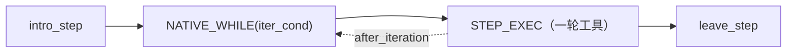

# Step 循环

内置 `ReActAgentStrategy` 以**节点驱动 Step 循环**运行：LLM 决定计划，框架
走完它，一切可观测、可中断。

## Step 解剖

| 阶段           | 发生什么                                                                                                        |
| -------------- | --------------------------------------------------------------------------------------------------------------- |
| **decompose**  | 首次 `intro_step`：LLM 决定 simple 还是 DAG `{needs_decomposition, dag, reason}`                                |
| **intro_step** | 选取下一个就绪 DAG 节点（`graphlib.TopologicalSorter` 拓扑序）；消费 peer 消息；发出 `step_intro` 事件 + 元数据 |
| **STEP_EXEC**  | 一轮 `single_execute()`：模型 → 工具 → 结果；`after_iteration()` 在*循环内*运行停滞检测                         |
| **leave_step** | 摘要（主谓短语）、完成节点、压缩历史；发出 `step_leave` 事件 + 元数据                                           |

## 语义状态：`AgentRunState`

所有 step 级状态在 `AgentRunState` 中（在 `AgentLoopState.run_state` 与
`strategy.run_state` 之间桥接——**同一实例**）：

| 字段                                | 含义                                  |
| ----------------------------------- | ------------------------------------- |
| `step_index`                        | 全局 step 计数器                      |
| `current_phase` / `current_step_id` | 活动 DAG 节点                         |
| `plan` / `completed_step_ids`       | 任务 DAG + 进度                       |
| `step_tool_signatures`              | 当前 Step 内的工具签名（停滞窗口）    |
| `stall_injected`                    | give-up prompt 已注入（每 Step 一次） |
| `last_summary`                      | 前一个 Step 的主谓摘要                |
| `tokens`                            | 真实 API token 统计（压缩触发）       |
| `exec_finished`                     | 策略完成工具调用 → 迭代循环结束       |

## 停滞防护

1. **`_should_cancel_tool_call`** —— 执行前，第 N 个相同签名被取消，返回
   `"Cancelled: Reach the max limit of repeatly calling tool."`
2. **`after_iteration`** —— 每轮钩子（循环*内*！）在窗口重复时注入 give-up
   prompt；设置 `stall_injected`/`exec_finished` 使 `iter_cond` 立即停止
   循环——不再烧 token。

> 历史教训：停滞检测必须**在循环内**（`after_iteration`）运行，而非
> `leave_step`（循环外）——否则卡住的 agent 永远到不了检测器。

## 生命周期事件

| 事件                   | 时机       | 可变                                |
| ---------------------- | ---------- | ----------------------------------- |
| `agent.step_intro`     | Step 开始  | `override_phase`                    |
| `agent.step_leave`     | Step 结束  | `override_verb` / `override_object` |
| `agent.step_iteration` | 每轮工具   | `end_step`                          |
| `agent.tool_call`      | 常规工具前 | `arguments` / `cancel`              |
| `agent.tool_return`    | 常规工具后 | `result` / `skip_append`            |

Matcher 可修改事件或抛 `StepAbortError`（控制流）。内置工具
（REASONING / UPDATE_STEP / STOP）不触发事件。

## Step 间压缩

设置 `llm.memory_abstract_threshold` 后，当真实 API prompt-token 数在
Step 边界超过该值时，`leave_step` 会把最旧的历史折叠成一条摘要消息：LLM
以 `ABSTRACT_INSTRUCTION` 提示总结被丢弃的前缀，摘要替换之，token 基线重置。
折叠时 `assistant(tool_calls)` 与其 `ToolResult` 配对保持在一起，剩余上下文始终保持形态良好
始终形态良好。摘要失败/为空时保留历史不动（基线仍重置，不重试循环）。
`compress` 元数据携带触发时的 token 数与阈值。

## Step 元数据

以 `MessageWithMetadata` 发出（`type="step"`）：

| `extra_type` | 内容                                     |
| ------------ | ---------------------------------------- |
| `decompose`  | 决策、DAG id + 描述、原因                |
| `intro`      | phase、step_index、simple_mode、节点描述 |
| `leave`      | phase、停滞标志、摘要动词/宾语           |
| `stall`      | 重复签名、注入标志                       |
| `compress`   | prompt tokens、阈值                      |

## `update_step` 工具

agent 可中途修订计划：`replan`（替换 DAG）、`mark_done`、`add_step`、
`remove_step`。每次修订递增 `plan_revision`；执行保持线性（DAG 是语义层，
不是并行图）。

## Peer 消息

`intro_step` 消费反向流（`send_to_producer`）并追加 `[peer message]` 用户
消息——见[挂起与恢复](suspend.md)。

## 下一步

[工作流调试](workflow-debugging.md)——单步执行解释器。
