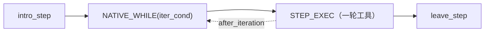

# Step 循环

内置 `ReActAgentStrategy` 以**节点驱动 Step 循环**运行：LLM 决定计划，框架
走完它，一切可观测、可中断。

## 启用 Step 循环

Step 循环是**显式启用**的——默认的 `ChatObject` 工作流
（`_workflow_rendered`）运行完整外壳，其 agent 分支是**传统单调用 agent
循环**（每轮一次 `single_execute`，不分解）。传入 step 循环工作流即可启用：

```python
from amrita_core.chatmanager import _step_workflow_rendered

chat = agent.get_chatobject("规划并执行迁移", workflow=_step_workflow_rendered)
```

或使用完整预组合管线：

```python
from amrita_core.builtins.workflows import SIMPLE_STEP_REACT

chat = agent.get_chatobject("规划并执行迁移", workflow=SIMPLE_STEP_REACT)
```

> `Agent.get_chatobject(user_input, **kwargs)` 会把 `workflow`（及任何其他
> `ChatObject` 选项）直接透传。`update_step` 工具与 `step_*` 元数据事件
> 只在 step 循环工作流激活时存在。

## Step 解剖


```mermaid
flowchart LR
    A["intro_step"] --> B["NATIVE_WHILE(iter_cond)"]
    B --> C["STEP_EXEC（一轮工具）"]
    C --> D["leave_step"]
    C -. "after_iteration" .-> B
```

| 阶段           | 发生什么                                                                                                        |
| -------------- | --------------------------------------------------------------------------------------------------------------- |
| **decompose**  | 首次 `intro_step`：LLM 决定 simple 还是 DAG `{needs_decomposition, dag, reason}`                                |
| **intro_step** | 选取下一个就绪 DAG 节点（`graphlib.TopologicalSorter` 拓扑序）；消费 peer 消息；发出 `step_intro` 事件 + 元数据 |
| **STEP_EXEC**  | 一轮 `single_execute()`：模型 → 工具 → 结果；`after_iteration()` 在*循环内*运行停滞检测                         |
| **leave_step** | 摘要（主谓短语）、完成节点、压缩历史；发出 `step_leave` 事件 + 元数据                                           |

## 语义状态：`AgentRunState`

所有 step 级状态在 `AgentRunState` 中（在 `AgentLoopState.run_state` 与
`strategy.run_state` 之间桥接——**同一实例**）：

| 字段                                | 含义                                                   |
| ----------------------------------- | ------------------------------------------------------ |
| `step_index`                        | 全局 step 计数器                                       |
| `current_phase` / `current_step_id` | 活动 DAG 节点                                          |
| `plan` / `completed_step_ids`       | 任务 DAG + 进度                                        |
| `step_tool_signatures`              | 当前 Step 内的工具签名（停滞窗口）                     |
| `stall_injected`                    | give-up prompt 已注入（每 Step 一次）                  |
| `tool_error_hints`                  | 本 Step 中遇到的硬 ERROR 工具结果数（重试→改计划指引） |
| `last_summary`                      | 前一个 Step 的主谓摘要                                 |
| `tokens`                            | 真实 API token 统计（压缩触发）                        |
| `exec_finished`                     | 策略完成工具调用 → 迭代循环结束                        |
| `step_started_ts`                   | Step 的墙上时钟起点（token 预算窗口锚点）              |

## 停滞防护

1. **`_should_cancel_tool_call`** —— 执行前，第 N 个相同签名被取消，返回
   `"Cancelled: Reach the max limit of repeatly calling tool."`
2. **`after_iteration`** —— 每轮钩子（循环*内*！）在窗口重复时注入 give-up
   prompt；设置 `stall_injected`/`exec_finished` 使 `iter_cond` 立即停止
   循环——不再烧 token。

> 历史教训：停滞检测必须**在循环内**（`after_iteration`）运行，而非
> `leave_step`（循环外）——否则卡住的 agent 永远到不了检测器。

## 生命周期事件

| 事件                   | 时机       | 可变                                |
| ---------------------- | ---------- | ----------------------------------- |
| `agent.step_intro`     | Step 开始  | `override_phase`                    |
| `agent.step_leave`     | Step 结束  | `override_verb` / `override_object` |
| `agent.step_iteration` | 每轮工具   | `end_step`                          |
| `agent.tool_call`      | 常规工具前 | `arguments` / `cancel`              |
| `agent.tool_return`    | 常规工具后 | `result` / `skip_append`            |

Matcher 可修改事件或抛 `StepAbortError`（控制流）。内置工具
（REASONING / UPDATE_STEP / STOP）不触发事件。

## Step 间压缩

当 provider 为当前 Step 上报的 prompt token 超过压缩阈值时，step 循环会折叠
已完成的 Step 历史（`ContextCompactor.threshold` = 预设注意力窗口 ×
`llm.compaction_trigger_ratio`）。它与轮边界压缩受同一个
`llm.enable_compaction` 开关控制，且两者从同一处读取阈值，因此一个数字就
描述了一个模型。

成功后，被折叠的前缀由一条 `user` 消息（`[Summary of previous steps]\n<summary>`）
加保留的尾部替代。切点落在 `user` 消息上，因此每个
`assistant(tool_calls)` 都紧邻其 `ToolResult`，剩余上下文依然形态良好。
摘要失败或为空时历史保持不变；两种情况都会重置 token 基线，因此不存在
重试循环。`compress` step 元数据携带触发时的 token 数与阈值。

## Step 元数据

以 `MessageWithMetadata` 发出（`type="step"`）：

| `extra_type` | 内容                                     |
| ------------ | ---------------------------------------- |
| `decompose`  | 决策、DAG id + 描述、原因                |
| `intro`      | phase、step_index、simple_mode、节点描述 |
| `leave`      | phase、停滞标志、摘要动词/宾语           |
| `stall`      | 重复签名、注入标志                       |
| `compress`   | prompt tokens、阈值                      |

## `update_step` 工具

agent 可中途修订计划：`replan`（替换 DAG）、`mark_done`、`add_step`、
`remove_step`。每次修订递增 `plan_revision`；执行保持线性（DAG 是语义层，
不是并行图）。

## Peer 消息

`intro_step` 消费反向流（`send_to_producer`）并追加 `[peer message]` 用户
消息——见[挂起与恢复](suspend.md)。

## 下一步

[工作流调试](workflow-debugging.md)——单步执行解释器。
