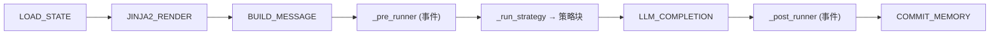
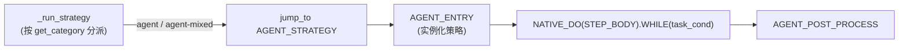

# 工作流引擎

## 管线

每个 `ChatObject` 运行预编译工作流。**默认**管线是简单对话（一次 LLM
调用、不分解）；Step 驱动变体通过显式传入 `workflow=_step_workflow_rendered`
（或 `SIMPLE_STEP_REACT`）启用。两者共享同一外壳：



**策略块**按模式变化。简单对话完全跳过它；Step 驱动循环运行：



```python
# STEP_BODY —— 一次任务循环迭代 = 一个 Step
STEP_BODY = NODE_INTRO >> NATIVE_WHILE(iter_cond).ACTION(STEP_EXEC) >> NODE_LEAVE
```

## DI 上下文作为状态层

工作流节点是**无状态函数**；所有状态存在于按参数类型注入的 DI 上下文中
（见[数据层](../concepts/data.md)）。这就是同一批节点可跨管线复用的原因。

## 预组合管线

`amrita_core.builtins.workflows` 提供现成图。两个家族，每个家族选一个：

| 管线                    | 组合                                                                                                                                              |
| ----------------------- | ------------------------------------------------------------------------------------------------------------------------------------------------- |
| `STEP_REACT_BLOCK`      | `STRATEGY_INIT >> AGENT_ENTRY >> NATIVE_DO(STEP_BODY).WHILE(task_cond) >> AGENT_POST_PROCESS`                                                     |
| `SIMPLE_STEP_REACT`     | `LOAD_STATE >> JINJA2_RENDER >> BUILD_MESSAGE >> STEP_REACT_BLOCK >> LLM_COMPLETION >> COMMIT_MEMORY`                                             |
| `STEP_REACT_ONLY`       | `LOAD_STATE >> JINJA2_RENDER >> BUILD_MESSAGE >> STEP_REACT_BLOCK`                                                                                |
| `CHATOBJECT_STEP_REACT` | `ARCHIVED_SEGMENT(ALIAS(AGENT_ENTRY, AGENT_STRATEGY) >> NATIVE_DO(STEP_BODY).WHILE(task_cond) >> AGENT_POST_PROCESS) >> ALIAS(NOP, STRATEGY_EOF)` |
| `REACT_BLOCK`（遗留）   | `STRATEGY_INIT >> AGENT_ENTRY >> WHILE(SINGLE_STRATEGY_CALL).ACTION(REACT_COUNTER) >> AGENT_POST_PROCESS`                                         |
| `SIMPLE_REACT`（遗留）  | `LOAD_STATE >> JINJA2_RENDER >> BUILD_MESSAGE >> REACT_BLOCK >> LLM_COMPLETION >> COMMIT_MEMORY`                                                  |
| `REACT_ONLY`（遗留）    | `LOAD_STATE >> JINJA2_RENDER >> BUILD_MESSAGE >> REACT_BLOCK`                                                                                     |
| `SIMPLE_CHAT`           | `LOAD_STATE >> JINJA2_RENDER >> BUILD_MESSAGE >> LLM_COMPLETION >> COMMIT_MEMORY`                                                                 |

**如何选择**：

- `SIMPLE_CHAT`——普通单轮对话，无 agent 循环。这是默认值
  （`workflow=None` 解析到这里）。
- `*_ONLY` 变体在 agent 块结束后停止：没有最后的 `LLM_COMPLETION` 冲刷，
  不提交记忆。适合自行组合尾部时使用。
- `SIMPLE_*` 变体是完整管线（前奏 + 块 + 完成 + 提交）打包成一个对象——
  直接把对象传给 `get_chatobject(workflow=...)`。
- `STEP_REACT_BLOCK` / `SIMPLE_STEP_REACT` / `STEP_REACT_ONLY` 运行
  **Step 驱动**循环（选择启用的 ReAct 模式；见[Step 循环](step-loop.md)）。
- `REACT_BLOCK` / `SIMPLE_REACT` / `REACT_ONLY` 是遗留单次调用循环——
  为兼容保留，优先用 Step 驱动家族。
- `CHATOBJECT_STEP_REACT` 是策略块在 ChatObject runner 内被归档
  （JMP 跳过）时使用的内部变体——`_run_strategy` 跳到 `AGENT_STRATEGY`，
  尾部 `NOP` 别名 `STRATEGY_EOF` 提供顺延。一般无需手工传入。

`ChatObject(workflow=...)` 接受任意渲染图；`workflow` 与 `archived_nodes`
互斥。默认 `workflow=None` 解析为简单对话管线——需要 Step 驱动循环时传
`_step_workflow_rendered`（来自 `amrita_core.chatmanager`），或用
`SIMPLE_STEP_REACT` 一次拿到完整管线。

## 循环条件

| 条件        | 何时停止                                                    |
| ----------- | ----------------------------------------------------------- |
| `task_cond` | 调用上限、`_suggested_stop`、停滞注入、或全部 DAG 节点完成  |
| `iter_cond` | 调用上限、停滞、token 预算耗尽、`exec_finished`、或建议停止 |

两者都在 `amrita_core.components.react` 中，读取 `loop.run_state`——在循环与
策略之间桥接的语义状态。

## 下一步

[挂起与恢复](suspend.md)——中途暂停工作流。
