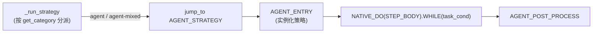

# 工作流引擎

## 管线

每个 `ChatObject` 运行预编译工作流。默认（Step 驱动）管线：


**策略块**按模式变化：



```python
# STEP_BODY —— 一次任务循环迭代 = 一个 Step
STEP_BODY = NODE_INTRO >> NATIVE_WHILE(iter_cond).ACTION(STEP_EXEC) >> NODE_LEAVE
```

## DI 上下文作为状态层

工作流节点是**无状态函数**；所有状态存在于按参数类型注入的 DI 上下文中
（见[数据层](../concepts/data.md)）。这就是同一批节点可跨管线复用的原因。

## 预组合管线

`amrita_core.builtins.workflows` 提供现成图：

| 管线                   | 组合                                                                                                      |
| ---------------------- | --------------------------------------------------------------------------------------------------------- |
| `STEP_REACT_BLOCK`     | `STRATEGY_INIT >> AGENT_ENTRY >> NATIVE_DO(STEP_BODY).WHILE(task_cond) >> AGENT_POST_PROCESS`             |
| `SIMPLE_STEP_REACT`    | `LOAD_STATE >> JINJA2_RENDER >> BUILD_MESSAGE >> STEP_REACT_BLOCK >> LLM_COMPLETION >> COMMIT_MEMORY`     |
| `REACT_BLOCK`（遗留）  | `STRATEGY_INIT >> AGENT_ENTRY >> WHILE(SINGLE_STRATEGY_CALL).ACTION(REACT_COUNTER) >> AGENT_POST_PROCESS` |
| `SIMPLE_REACT`（遗留） | `LOAD_STATE >> ... >> REACT_BLOCK >> LLM_COMPLETION >> COMMIT_MEMORY`                                     |
| `SIMPLE_CHAT`          | `LOAD_STATE >> JINJA2_RENDER >> BUILD_MESSAGE >> LLM_COMPLETION >> COMMIT_MEMORY`                         |

`ChatObject(workflow=...)` 接受任意渲染图；`workflow` 与 `archived_nodes`
互斥。

## 循环条件

| 条件        | 何时停止                                                    |
| ----------- | ----------------------------------------------------------- |
| `task_cond` | 调用上限、`_suggested_stop`、停滞注入、或全部 DAG 节点完成  |
| `iter_cond` | 调用上限、停滞、token 预算耗尽、`exec_finished`、或建议停止 |

两者都在 `amrita_core.components.react` 中，读取 `loop.run_state`——在循环与
策略之间桥接的语义状态。

## 下一步

[挂起与恢复](suspend.md)——中途暂停工作流。
