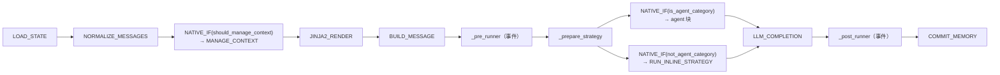
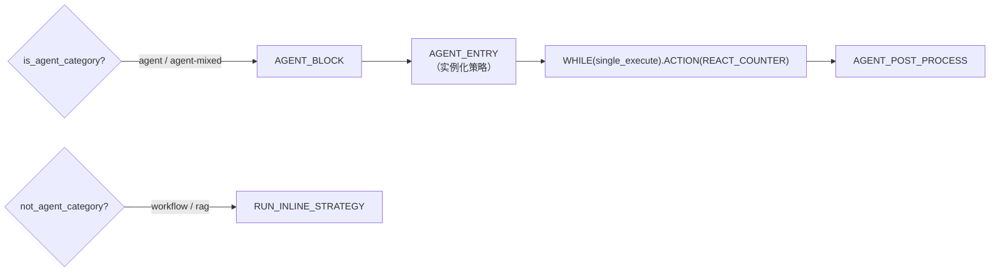

# 工作流引擎

## 管线

每个 `ChatObject` 运行预编译工作流。**默认**管线是简单对话（一次 LLM
调用、不分解）；Step 驱动变体通过显式传入 `workflow=_step_workflow_rendered`
（或 `SIMPLE_STEP_REACT`）启用。两者共享同一外壳：


```mermaid
flowchart LR
    A["LOAD_STATE"] --> N["NORMALIZE_MESSAGES"]
    N --> Q["NATIVE_IF(should_manage_context)<br/>→ MANAGE_CONTEXT"]
    Q --> B["JINJA2_RENDER"]
    B --> C["BUILD_MESSAGE"]
    C --> D["_pre_runner（事件）"]
    D --> P["_prepare_strategy"]
    P --> E["NATIVE_IF(is_agent_category)<br/>→ agent 块"]
    P --> E2["NATIVE_IF(not_agent_category)<br/>→ RUN_INLINE_STRATEGY"]
    E --> F["LLM_COMPLETION"]
    E2 --> F
    F --> G["_post_runner（事件）"]
    G --> H["COMMIT_MEMORY"]
```

其中两步是为了把历史控制在窗口内，且顺序不能调换：`NORMALIZE_MESSAGES`
先把内容块拍平，总结器读到的才是文本而非原始块；`MANAGE_CONTEXT` 在
`JINJA2_RENDER` 之前运行，因此 `compact` 产出的摘要能进入它所计算的那次
请求的系统指令。两者详见[数据与记忆](../concepts/data-memory.md)。

**agent 块**按模式变化。内联运行器不是旁路特例：分派是两个带守卫的分支，
各自在断言为假时被跳过。


```mermaid
flowchart LR
    G1{"is_agent_category?"} -->|agent / agent-mixed| AB["AGENT_BLOCK"]
    G2{"not_agent_category?"} -->|workflow / rag| IN["RUN_INLINE_STRATEGY"]
    AB --> K["AGENT_ENTRY<br/>（实例化策略）"]
    K --> L["WHILE(single_execute).ACTION(REACT_COUNTER)"]
    L --> M["AGENT_POST_PROCESS"]
```

Step 驱动变体只替换中间那一环：

```python
# AGENT_BLOCK —— 每次迭代一次 single_execute
AGENT_BLOCK = (
    AGENT_ENTRY >> WHILE(single_execute).ACTION(REACT_COUNTER) >> AGENT_POST_PROCESS
)

# STEP_AGENT_BLOCK —— 一次任务循环迭代 = 一个 Step
STEP_AGENT_BLOCK = (
    AGENT_ENTRY >> NATIVE_DO(STEP_BODY).WHILE(task_cond) >> AGENT_POST_PROCESS
)
```

```python
# STEP_BODY —— 一次任务循环迭代 = 一个 Step
STEP_BODY = NODE_INTRO >> NATIVE_WHILE(iter_cond).ACTION(STEP_EXEC) >> NODE_LEAVE
```

## DI 上下文作为状态层

工作流节点是**无状态函数**；所有状态存在于按参数类型注入的 DI 上下文中
（见[数据层](../concepts/data.md)）。这就是同一批节点可跨管线复用的原因。

## 预组合管线

`amrita_core.builtins.workflows` 提供现成图。两个家族，每个家族选一个：

| 管线                   | 组合                                                                                                                                           |
| ---------------------- | ---------------------------------------------------------------------------------------------------------------------------------------------- |
| `MANAGE_HISTORY`       | `NATIVE_IF(should_manage_context, MANAGE_CONTEXT)`                                                                                             |
| `STEP_REACT_BLOCK`     | `STRATEGY_INIT >> AGENT_ENTRY >> NATIVE_DO(STEP_BODY).WHILE(task_cond) >> AGENT_POST_PROCESS`                                                  |
| `SIMPLE_STEP_REACT`    | `LOAD_STATE >> NORMALIZE_MESSAGES >> MANAGE_HISTORY >> JINJA2_RENDER >> BUILD_MESSAGE >> STEP_REACT_BLOCK >> LLM_COMPLETION >> COMMIT_MEMORY`  |
| `STEP_REACT_ONLY`      | `LOAD_STATE >> NORMALIZE_MESSAGES >> MANAGE_HISTORY >> JINJA2_RENDER >> BUILD_MESSAGE >> STEP_REACT_BLOCK`                                     |
| `REACT_BLOCK`（遗留）  | `STRATEGY_INIT >> AGENT_ENTRY >> WHILE(SINGLE_STRATEGY_CALL).ACTION(REACT_COUNTER) >> AGENT_POST_PROCESS`                                      |
| `SIMPLE_REACT`（遗留） | `LOAD_STATE >> NORMALIZE_MESSAGES >> MANAGE_HISTORY >> JINJA2_RENDER >> BUILD_MESSAGE >> REACT_BLOCK >> LLM_COMPLETION >> COMMIT_MEMORY`       |
| `REACT_ONLY`（遗留）   | `LOAD_STATE >> NORMALIZE_MESSAGES >> MANAGE_HISTORY >> JINJA2_RENDER >> BUILD_MESSAGE >> REACT_BLOCK`                                          |
| `SIMPLE_CHAT`          | `LOAD_STATE >> NORMALIZE_MESSAGES >> MANAGE_HISTORY >> JINJA2_RENDER >> BUILD_MESSAGE >> LLM_COMPLETION >> COMMIT_MEMORY`                      |

**如何选择**：

- `SIMPLE_CHAT`——普通单轮对话，无 agent 循环。这是默认值
  （`workflow=None` 解析到这里）。
- `*_ONLY` 变体在 agent 块结束后停止：没有最后的 `LLM_COMPLETION` 冲刷，
  不提交记忆。适合自行组合尾部时使用。
- `SIMPLE_*` 变体是完整管线（前奏 + 块 + 完成 + 提交）打包成一个对象——
  直接把对象传给 `get_chatobject(workflow=...)`。
- `STEP_REACT_BLOCK` / `SIMPLE_STEP_REACT` / `STEP_REACT_ONLY` 运行
  **Step 驱动**循环（选择启用的 ReAct 模式；见[Step 循环](step-loop.md)）。
- `REACT_BLOCK` / `SIMPLE_REACT` / `REACT_ONLY` 是遗留单次调用循环——
  为兼容保留，优先用 Step 驱动家族。

> 上表中的块自带 `STRATEGY_INIT`，因为它们的设计用途是手工组合。
> `ChatObject` 默认运行的管线用其局部 `_prepare_strategy` 节点做同一件事，
> 这也是 `AGENT_BLOCK` / `STEP_AGENT_BLOCK` 不含它的原因。

`ChatObject(workflow=...)` 接受任意渲染图；`workflow` 与 `archived_nodes`
互斥。默认 `workflow=None` 解析为简单对话管线——需要 Step 驱动循环时传
`_step_workflow_rendered`（来自 `amrita_core.chatmanager`），或用
`SIMPLE_STEP_REACT` 一次拿到完整管线。

## 循环条件

| 条件        | 何时停止                                                    |
| ----------- | ----------------------------------------------------------- |
| `task_cond` | 调用上限、`_suggested_stop`、停滞注入、或全部 DAG 节点完成  |
| `iter_cond` | 调用上限、停滞、token 预算耗尽、`exec_finished`、或建议停止 |

两者都在 `amrita_core.components.react` 中，读取 `loop.run_state`——在循环与
策略之间桥接的语义状态。

## 下一步

[挂起与恢复](suspend.md)——中途暂停工作流。
