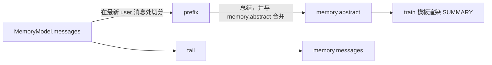

# ContextCompactor

压缩策略对象：触发点相对模型注意力窗口的位置、历史前缀如何被总结，以及折叠如何被应用。

## 描述

`ContextCompactor` 是一个 dataclass，在**每个使用点**由当前 config、preset 与运行账本构建，因此触发阈值始终反映真正被调用的那个模型。它是唯一知道如何折叠历史的地方；工作流节点与 agent 循环都驱动同一个对象，这就是「一个模型由一个阈值描述」的原因。

两个消费方：

| 调用点                            | 时机                         |
| --------------------------------- | ---------------------------- |
| `COMPACT` 节点                    | 轮边界，在请求构建之前       |
| `ReActAgentStrategy` 的 Step 之间 | agent 循环内的 Step 边界     |

摘要存放在 [`MemoryModel.abstract`](MemoryModel.md)，由 train 模板渲染回系统指令。不会向消息列表注入任何内容，因此 provider 的消息顺序规则不受影响。



## 字段

- `config` ([AmritaConfig](AmritaConfig.md))：必填。提供 `enable_compaction`、`compaction_trigger_ratio` 与 `memory_length_limit`
- `preset` ([ModelPreset](ModelPreset.md) | None)：其窗口驱动阈值。为 `None` 时回退到 `LLMConfig.session_tokens_windows`
- `usage` (SessionUsageProxy | None)：运行账本，使总结调用本身也像普通请求一样被计费
- `instruction` (str)：交给总结器的 system prompt，默认为 `ABSTRACT_INSTRUCTION`

## 属性

### `enabled -> bool`

用户是否开启了压缩（`config.llm.enable_compaction`）。

### `budget -> int`

输入 token 预算：经 `resolve_max_context` 取预设的 `max_context`，否则取 `config.llm.session_tokens_windows`。

### `threshold -> int`

`int(budget * config.llm.compaction_trigger_ratio)`。由注意力窗口推导，因此触发点跟随模型，而不是一个人工维护的全局数字。

### `message_limit -> int`

`config.llm.memory_length_limit`。token 触发依赖 provider 上报 usage；该兜底覆盖从不上报的网关，以及超大窗口。

## 方法

### `should_compact(memory: MemoryModel | None) -> bool`

判断是否应在下次请求前折叠 `memory`。两条触发线先到者生效：

- provider 为上一次请求上报的 prompt 大小（`memory.usage.prompt_tokens`）达到 `threshold`
- 历史达到 `message_limit` 条

当压缩被禁用、`memory` 为 `None`，或没有可折叠的前缀时返回 `False`。

### `async summarize(prefix, previous: str = "") -> str`

总结 `prefix`；当给出 `previous` 时，把它并入 `<EXISTING_SUMMARY>` 块。返回去掉首尾空白的摘要；模型没有产出可用内容时返回空字符串。

### `async fold(messages, previous: str = "") -> CompactionResult | None`

总结可折叠的前缀并返回存活的历史。

**原子性**：摘要先产出，在拿到非空摘要之前不返回任何东西，因此总结失败会让调用方的历史保持原样。无可折叠内容或模型未返回摘要时返回 `None`。

### `async compact(memory: MemoryModel) -> bool`

就地折叠 `memory`。成功后前缀被丢弃、`abstract` 被替换、实测 usage 被清空，以便下次请求重新度量。返回是否发生了折叠。

## `split_history(messages) -> tuple[list, list]`

模块级辅助函数，把历史切成可折叠前缀与保留尾部。切点落在**最新的 `user` 消息**上，因此尾部总是从干净的轮次开始，assistant 的工具调用永远不会与其工具结果分离。无可折叠内容时返回 `([], messages)`。

这正是「在 Step 边界折叠是安全的」的原因：切点永远不会落在 tool-call/result 配对中间。

## `CompactionResult`

```python
@dataclass
class CompactionResult:
    messages: CONTENT_LIST_TYPE  # 存活的历史，从干净的轮次边界开始
    summary: str                 # 替换被折叠前缀的摘要
```

## 相关

- [MemoryModel](MemoryModel.md)——`abstract` 与 `usage` 所在
- [LLMConfig](LLMConfig.md)——`enable_compaction` / `compaction_trigger_ratio` / `memory_length_limit` 开关
- [ModelPreset](ModelPreset.md)——`max_context`，阈值所依据的窗口
