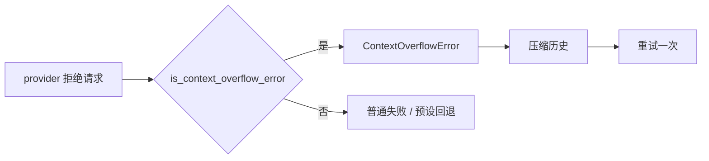

# ContextOverflowError

当 provider 因超出上下文窗口而拒绝请求时抛出。

## 描述

`ContextOverflowError` 是 `RuntimeError` 的子类，用来把「对话已经装不下」与其余所有 provider 失败区分开。这个区分之所以重要，是因为两者需要相反的反应：

- **溢出**值得处理：压缩历史并重试，因为原样重发会以同样方式失败
- **普通失败**是瞬时的：照常回退到下一个预设

`libchat.call_completion` 会检查每个失败，并在预设回退循环**之前**把溢出重新抛出为 `ContextOverflowError`，因此过大的请求不会白烧掉整条回退链。

## `is_context_overflow_error(error: BaseException) -> bool`

判断某个错误是否看起来像 provider 的上下文窗口拒绝。

Provider 以散文而非机器可读的错误码上报，因此该检查是对消息的模式匹配。**刻意保守**：把瞬时失败误判为溢出会白白丢弃历史，所以只匹配已知的措辞：

- `maximum context length`
- `context_length_exceeded` / `context length exceeded`
- `context window exceed`
- `exceed(s) the (maximum) (model's) context`
- `prompt is too long`
- `input is too long`
- `input length and max_tokens exceed`
- `too many tokens`
- `reduce the length of the messages`
- `maximum number of tokens`

匹配不区分大小写。

## 恢复

恢复由 `LLMConfig.enable_overflow_recovery` 控制（默认 `True`）。启用时，`LLM_COMPLETION` 捕获该错误，经 [`ContextCompactor`](ContextCompactor.md) 折叠历史，并重试**一次**。若重试仍然溢出，错误向上传播。



## 使用

```python
from amrita_core.exceptions import ContextOverflowError, is_context_overflow_error

try:
    response = await call_completion(messages, config=config)
except ContextOverflowError:
    # 压缩之后历史仍然装不下
    ...
```

## 相关

- [ContextCompactor](ContextCompactor.md)——执行折叠的对象
- [LLMConfig](LLMConfig.md)——`enable_overflow_recovery` 开关
