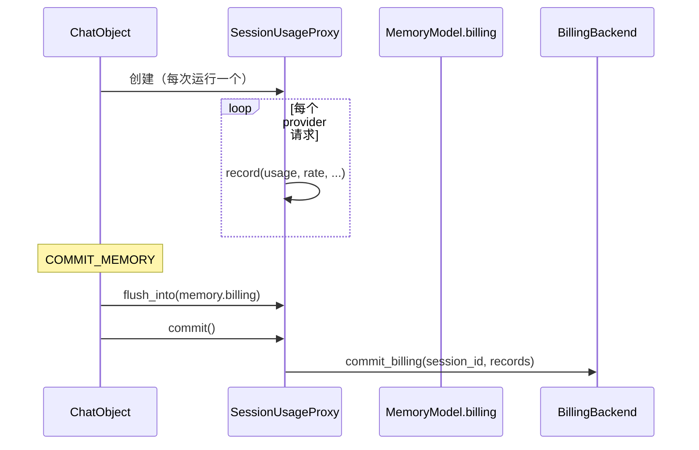

# SessionUsageProxy

带可选外部接收端的、运行作用域的计费账本。

## 描述

每一次上报 usage 的 provider 请求都会向本次运行的账本追加一条 [`BillingRecord`](BillingRecord.md)。账本在运行期间驻留进程内存，因此热路径读取（总量、Step 窗口）保持同步；在运行边界一次性交给 [`BillingBackend`](BillingBackend.md)。

同一批记录也随 `MemoryModel.billing` 流动，那是默认持久化路径；后端只为需要把数据镜像到外部成本存储的消费方而存在。

每次运行由 `ChatObject` 创建一个实例，存放在 `RespState.usage`，并交给 compactor，使总结调用也像普通请求一样被计费。

## 构造函数

```python
SessionUsageProxy(
    session_id: str,
    stream_id: str,
    backend: BillingBackend | None = None,
    records: list[BillingRecord] | None = None,
)
```

**参数**：

- `session_id` (str)：所属会话
- `stream_id` (str)：本次运行的唯一 id
- `backend` ([BillingBackend](BillingBackend.md) | None，可选)：接收记录的外部出口。为 `None` 时 `commit()` 是空操作
- `records` (list[[BillingRecord](BillingRecord.md)] | None，可选)：预先存在的、要追加到的列表

## 方法

### `record(usage, *, model=None, preset_name=None, rate=None, request_id=None) -> None`

向运行账本追加一条 provider 用量样本。`usage` 为 `None` 时是空操作，调用方无需自行判断。

`model`、`preset_name` 与 `rate` 由调用方填入：适配器传入 `preset.rate`，因此每条记录都携带请求时刻生效的价格。

### `flush_into(target: list[BillingRecord]) -> None`

把尚未刷出的记录追加到 `target`。

**幂等**：调用两次只会追加新记录的样本，因此被重试的提交节点不会重复对话账本。`COMMIT_MEMORY` 正是通过它把运行记录移入 `MemoryModel.billing`。

### `async commit() -> None`

把本次运行的记录交给外部出口（若已绑定），否则是空操作。

## 属性

### `records -> list[BillingRecord]`

运行记录的**副本**，调用方无法改动账本。

### `extra_total -> UniResponseUsage[int]`

对运行内全部记录求和的派生值（prompt / completion / total tokens）。

### `prompt_since(since_ts: float) -> int`

`since_ts` 及之后记录的 prompt token 数。用作 Step 窗口的 prompt 计数，供预算检查与 Step 间压缩阈值使用。

## 生命周期



## 相关

- [BillingRecord](BillingRecord.md)——记录结构
- [BillingBackend](BillingBackend.md)——可选外部出口
- [BackendSlots](BackendSlots.md)——后端绑定的位置
