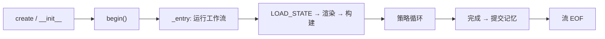

# ChatObject——生命周期管理器

## 核心定位

**`ChatObject` 是 AmritaCore 的核心——对话的基本单位。** 它是*生命周期
管理器*：为一次对话拥有工作流图、解释器、双向流和全部运行时状态
（DI 上下文）。

```
ChatObject
├── _workflow / _interpreter   ← AmritaSense 指令序列
├── io_stream                  ← SuspendObjectStream（双向）
├── _di_* 上下文               ← 与工作流节点共享的类型化 DI 状态
│   ├── _di_session            ← SessionMetadata（id、时间戳）
│   ├── _di_memory             ← MemoryContext
│   ├── _di_ability            ← AbilityState（配置、preset、后端槽位）
│   ├── _di_input              ← GeneralInput（用户输入、模板）
│   ├── _di_working            ← WorkingState（消息包装）
│   ├── _di_resp               ← RespState（响应 + 用量）
│   ├── _di_loop               ← AgentLoopState（策略、调用计数、run_state）
│   └── _di_agent              ← StrategyPayload（策略工厂）
└── state                      ← StateContext（向后兼容访问器）
```

## 生命周期



- **`begin()`** 运行一次工作流；`_is_done` 防止重复进入。
- 退出时 `set_queue_done()` 关闭响应通道；会话由 `ChatManager` 清理。
- **中间件**（`middleware=...`）可包装整个工作流。

## 工作流选择

你可以整体替换执行管线：

```python
from amrita_core.chatmanager import _step_workflow_rendered
from amrita_core.builtins.workflows import SIMPLE_REACT, SIMPLE_CHAT

# 默认：Step 驱动 ReAct（workflow=None 时使用）
chat = ChatObject(train=..., user_input=..., session_id="s1")

# 显式：内置预组合管线
chat = ChatObject(..., workflow=SIMPLE_CHAT)       # 无 agent，纯对话
chat = ChatObject(..., workflow=SIMPLE_REACT)      # 传统 ReAct 循环
```

> `workflow` 与 `archived_nodes` 互斥。

## 为什么"生命周期管理器"重要

策略和钩子**从不拥有生命周期**——它们通过 DI 字段获得资源
（见 [Agent 策略](agent-strategy.md)）。`ChatObject` 是唯一把所有东西
接线的位置：这就是为什么它是对话的基本单位，而非薄包装。

## 下一步

[配置系统](configuration.md)——运行时如何配置。
