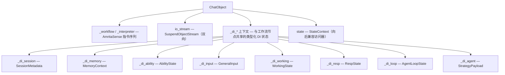
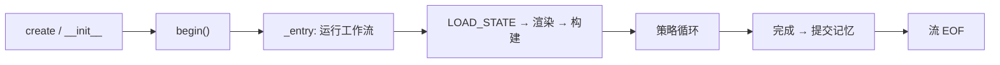

# ChatObject——生命周期管理器

## 核心定位

**`ChatObject` 是 AmritaCore 的核心——对话的基本单位。** 它是*生命周期
管理器*：为一次对话拥有工作流图、解释器、双向流和全部运行时状态
（DI 上下文）。



## 生命周期



- **`begin()`** 运行一次工作流；`_is_done` 防止重复进入。
- 退出时 `set_queue_done()` 关闭响应通道；会话由 `ChatManager` 清理。
- **中间件**（`middleware=...`）可包装整个工作流。

## 工作流选择

`ChatObject` 运行一条预编译的工作流。**默认**（`workflow=None` 时）是
简单对话管线（`_workflow_rendered`）——一次 LLM 调用、一个回答、不分解。
要运行内置的 **Step 驱动 ReAct 循环**（decompose → Step → summarize、
`update_step` 计划修订），请**显式传入** step 循环工作流：

```python
from amrita_core.chatmanager import _step_workflow_rendered
from amrita_core.builtins.workflows import SIMPLE_STEP_REACT, SIMPLE_CHAT

# 默认：简单对话，一次调用（workflow=None 时使用）
chat = ChatObject(train=..., user_input=..., session_id="s1")

# 显式：Step 驱动 ReAct 循环（decompose → Step → summarize）
chat = ChatObject(..., workflow=_step_workflow_rendered)

# 显式：内置预组合管线
chat = ChatObject(..., workflow=SIMPLE_CHAT)  # 无 agent，纯对话
chat = ChatObject(..., workflow=SIMPLE_STEP_REACT)  # 完整 Step 循环管线
```

> `workflow` 与 `archived_nodes` 互斥。Step 循环工作流正是开启 `step`
> 元数据事件（`decompose` / `intro` / `leave`）与 `update_step` 工具的
> 开关——见 [进阶 → Step 循环](../advanced/step-loop.md)。

## 为什么"生命周期管理器"重要

策略和钩子**从不拥有生命周期**——它们通过 DI 字段获得资源
（见 [Agent 策略](agent-strategy.md)）。`ChatObject` 是唯一把所有东西
接线的位置：这就是为什么它是对话的基本单位，而非薄包装。

## 下一步

[配置系统](configuration.md)——运行时如何配置。
