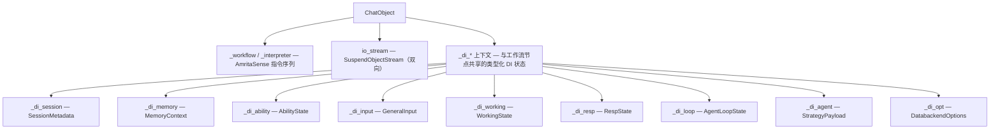
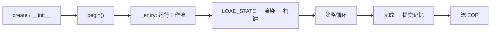

# ChatObject——生命周期管理器

## 核心定位

**`ChatObject` 是 AmritaCore 的核心——对话的基本单位。** 它是*生命周期
管理器*：为一次对话拥有工作流图、解释器、双向流和全部运行时状态
（DI 上下文）。


```mermaid
flowchart TD
    CO["ChatObject"] --> WF["_workflow / _interpreter — AmritaSense 指令序列"]
    CO --> IO["io_stream — SuspendObjectStream（双向）"]
    CO --> DI["_di_* 上下文 — 与工作流节点共享的类型化 DI 状态"]
    DI --> S1["_di_session — SessionMetadata"]
    DI --> S2["_di_memory — MemoryContext"]
    DI --> S3["_di_ability — AbilityState"]
    DI --> S4["_di_input — GeneralInput"]
    DI --> S5["_di_working — WorkingState"]
    DI --> S6["_di_resp — RespState"]
    DI --> S7["_di_loop — AgentLoopState"]
    DI --> S8["_di_agent — StrategyPayload"]
    DI --> S9["_di_opt — DatabackendOptions"]
```

## 生命周期


```mermaid
flowchart LR
    A["create / __init__"] --> B["begin()"]
    B --> C["_entry: 运行工作流"]
    C --> D["LOAD_STATE → 渲染 → 构建"]
    D --> E["策略循环"]
    E --> F["完成 → 提交记忆"]
    F --> G["流 EOF"]
```

- **`begin()`** 把 `_entry()` 调度为任务，但只调度一次——守卫条件是
  `hasattr(self, "_task")`。`_entry()` 自身会再检查 `_is_running` / `_is_done`，
  若对象已在运行或已完成则抛出 `RuntimeError`。
- 退出时设置 `_is_done`，`set_queue_done()` 向响应通道写入 EOF，打上 `end_at`
  时间戳，从 `ChatManager.running_chat_object_id2map` 中移除，并由
  `ChatManager.clean_obj()` 强制限制每个会话保留的对象数量。
- **中间件**（`middleware=...`）可包装整个工作流；设置后会跳过解释器，直接
  等待该中间件。

## 工作流选择

`ChatObject` 运行一条预编译的工作流。**默认**（`workflow=None` 时）是
`_workflow_rendered`，即完整外壳：

`LOAD_STATE → NORMALIZE_MESSAGES → (COMPACT) → JINJA2_RENDER → BUILD_MESSAGE →
_pre_runner → _prepare_strategy → agent 分支 → LLM_COMPLETION → _post_runner →
COMMIT_MEMORY`

其 **agent 分支是传统的单调用循环**（`AGENT_BLOCK`：每轮迭代一次
`single_execute`，不做 DAG 分解）。非 agent 类别的策略则走
`RUN_INLINE_STRATEGY` 分支。`_pre_runner`（触发 `PRECOMPLE` 断点与预完成匹配器）
和 `_post_runner` 都属于这个默认外壳。

要运行内置的 **Step 驱动 ReAct 循环**（decompose → Step → summarize、
`update_step` 计划修订），请传入 `_step_workflow_rendered`——同一外壳，
只是把 `AGENT_BLOCK` 换成 `STEP_AGENT_BLOCK`：

```python
from amrita_core.chatmanager import _step_workflow_rendered
from amrita_core.builtins.workflows import SIMPLE_STEP_REACT, SIMPLE_CHAT

# 默认：完整外壳 + 传统单调用 agent 循环
chat = ChatObject(train=..., user_input=..., session_id="s1")

# 原生 Step 循环：同一外壳，STEP_AGENT_BLOCK
chat = ChatObject(..., workflow=_step_workflow_rendered)

# amrita_core.builtins.workflows 中的预组合管线
chat = ChatObject(..., workflow=SIMPLE_CHAT)  # 无 agent 分支：一次 LLM 调用
chat = ChatObject(..., workflow=SIMPLE_STEP_REACT)  # Step 循环，仅组件节点
```

> `amrita_core.builtins.workflows` 中的管线只由组件节点拼装——**不含**
> `_pre_runner` / `_prepare_strategy` / `_post_runner`。使用 `SIMPLE_CHAT` 时
> 预完成匹配器永不触发，因此 `PRECOMPLE` 断点不可达。

> `workflow` 与 `archived_nodes` 互斥——同时传入会抛出 `ValueError`。
> Step 循环工作流正是开启 `step` 元数据事件（`decompose` / `intro` /
> `leave`）与 `update_step` 工具的开关——见
> [进阶 → Step 循环](../advanced/step-loop.md)。

## 为什么"生命周期管理器"重要

策略和钩子**从不拥有生命周期**——它们通过 DI 字段获得资源
（见 [Agent 策略](agent-strategy.md)）。`ChatObject` 是唯一把所有东西
接线的位置：这就是为什么它是对话的基本单位，而非薄包装。

## 下一步

[配置系统](configuration.md)——运行时如何配置。
