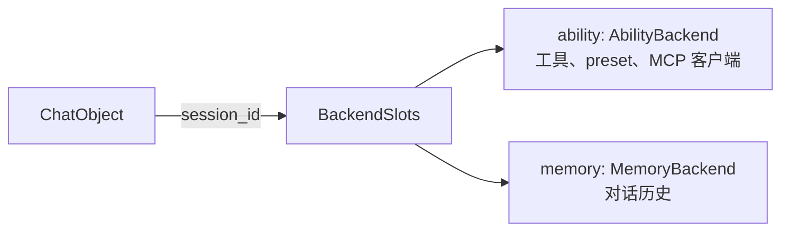

# 数据后端——持久化能力与记忆

## 后端是什么

AmritaCore 本身**不存储**任何东西。它定义两个接口并把 `session_id` 交给它们；
**你的后端实现**决定数据存放在哪里——进程内、数据库、Redis、文件……



## 接口

```python
from amrita_core.base.backend import AbilityBackend, MemoryBackend


class AbilityBackend:  # 抽象
    async def load_ability_all(self, session_id: str) -> AbilityContext: ...
    async def load_mcp_clients(self, session_id: str) -> MultiClientManager: ...
    async def load_tools(self, session_id: str) -> MultiToolsManager: ...
    async def load_presets(self, session_id: str) -> MultiPresetManager: ...


class MemoryBackend:  # 抽象
    async def load_memory(self, session_id: str) -> MemoryModel: ...
    async def commit_memory(self, session_id: str, memory: MemoryModel) -> None: ...
```

> `AbilityContext` 打包工具 / preset / MCP 客户端；`MemoryModel` 持有
> `messages: list[Message | ToolResult]`（见[记忆模型](data-memory.md)）。

## 内置 `LegacyBackend`

默认实现把一切保存在**进程内**：

- Ability 在**全局**容器（`glb`）——所有会话共享同一批工具与 preset
- Memory 在按会话的 `StateContext`（已弃用，**v0.14.0** 移除——见
  [StateContext](data-memory.md#statecontext遗留访问器)）——历史只存活于进程
  生命周期，且仅限本进程见过的 id

```python
from amrita_core.builtins.backends import LegacyBackend

backend = LegacyBackend()  # 进程内按会话记忆
```

> **推论**：两个 `ChatObject` 用同一 `session_id`"共享"历史，*仅仅*因为
> `LegacyBackend` 按 id 存储。换一个后端就不同——**共享是后端属性，不是
> 框架特性**。

## 编写自己的后端

实现一个或两个接口，用 `BackendSlots` 包装：

```python
import json
from pathlib import Path

from amrita_core.base.backend import BackendSlots, AbilityBackend, MemoryBackend
from amrita_core.contexts import AbilityContext
from amrita_core.types.memory import MemoryModel


class FileMemoryBackend(MemoryBackend):
    """把对话历史存为 JSON 文件，每会话一个。"""

    def __init__(self, directory: Path):
        self.directory = directory
        directory.mkdir(parents=True, exist_ok=True)

    def _path(self, session_id: str) -> Path:
        # session_id 是用户可控输入——碰文件系统前先净化
        safe = "".join(c for c in session_id if c.isalnum() or c in "-_")
        return self.directory / f"{safe}.json"

    async def load_memory(self, session_id: str) -> MemoryModel:
        path = self._path(session_id)
        if not path.exists():
            return MemoryModel()
        with path.open() as f:
            return MemoryModel.model_validate(json.load(f))

    async def commit_memory(self, session_id: str, memory: MemoryModel) -> None:
        with self._path(session_id).open("w") as f:
            json.dump(memory.model_dump(), f)


class StaticAbilityBackend(AbilityBackend):
    """每个会话返回同一份全局 ability（像 LegacyBackend）。"""

    def __init__(self, ability: AbilityContext):
        self.ability = ability

    async def load_ability_all(self, session_id: str) -> AbilityContext:
        return self.ability

    async def load_mcp_clients(self, session_id):
        return self.ability.mcp

    async def load_tools(self, session_id):
        return self.ability.tools

    async def load_presets(self, session_id):
        return self.ability.presets


my_backend = BackendSlots(
    ability=StaticAbilityBackend(AbilityContext()),
    memory=FileMemoryBackend(Path("./sessions")),
)
```

## 挂接后端

```python
# 直接构造 ChatObject
chat = ChatObject(
    train=...,
    user_input=...,
    session_id="abc123",
    backend=my_backend,
)

# 通过 Agent 工厂（转发给 ChatObject）
chat = agent.get_chatobject(
    "Hello!",
    session_id="abc123",
    backend=my_backend,
)
```

此后每次对话在开始时从 `load_memory` 加载历史，结束时经 `commit_memory`
保存——你的文件现在跨重启存活。

## 细粒度控制：`DatabackendOptions`

`backend_options=DatabackendOptions(...)` 跳过加载/提交周期的部分环节：

| 标志                         | 跳过                                   |
| ---------------------------- | -------------------------------------- |
| `skip_memory_fetch`          | `load_memory`——以空 `MemoryModel` 开始 |
| `skip_tools_fetch`           | `load_tools`                           |
| `skip_mcp_fetch`             | `load_mcp_clients`                     |
| `skip_presets_fetch`         | `load_presets`                         |
| `skip_ability_extra_setting` | 整个 `load_ability_all`                |
| `skip_memory_commit`         | 结束时的 `commit_memory`               |

```python
from amrita_core.contexts import DatabackendOptions

chat = ChatObject(
    train=...,
    user_input=...,
    session_id="abc123",
    backend=my_backend,
    backend_options=DatabackendOptions(skip_memory_commit=True),  # 只读
)
```

## 下一步

[记忆模型](data-memory.md)——`MemoryModel` 携带什么、加载/提交生命周期如何运作。
