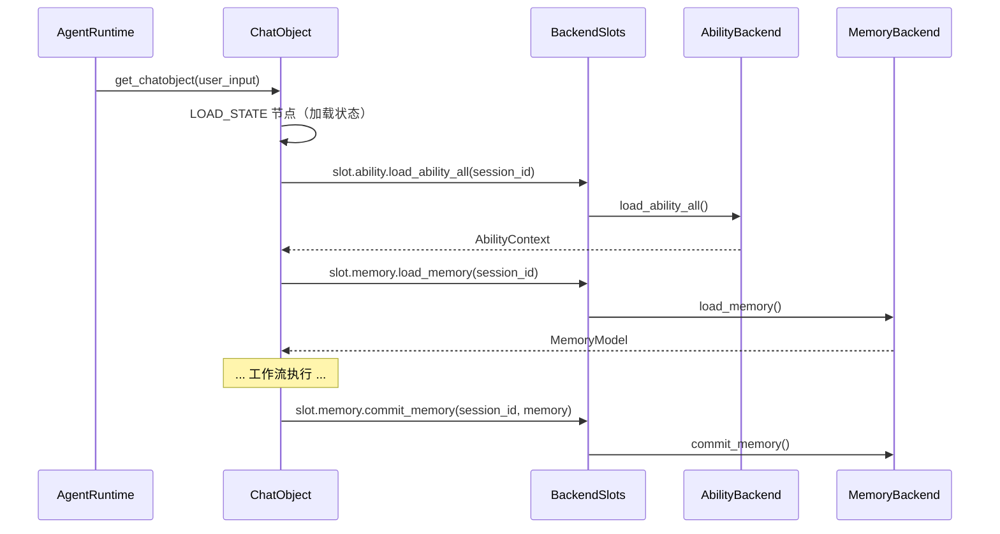

# 数据后端

**数据后端**机制将记忆和能力管理与 `ChatObject` 解耦，支持可插拔的存储后端（内存中的全局容器、数据库、分布式缓存等），而无需更改核心执行逻辑。

## BackendSlots

[`BackendSlots`](../api-reference/classes/BackendSlots.md) 是一个简单的 dataclass，持有两个后端引用：

```python
from amrita_core.base.backend import BackendSlots

@dataclass
class BackendSlots:
    ability: AbilityBackend
    memory: MemoryBackend
```

`ChatObject` 接收一个 `BackendSlots` 实例，并通过工作流节点 `LOAD_STATE` 和 `COMMIT_MEMORY`（来自 `amrita_core.components.process` 包）将所有数据 I/O 委托给它。

## AbilityBackend（抽象）

[`AbilityBackend`](../api-reference/classes/AbilityBackend.md) 定义了加载会话能力的接口：

```python
from amrita_core.base.backend import AbilityBackend

class AbilityBackend:
    @abstractmethod
    async def load_ability_all(self, session_id: str) -> AbilityContext: ...

    @abstractmethod
    async def load_mcp_clients(self, session_id: str) -> MultiClientManager: ...

    @abstractmethod
    async def load_tools(self, session_id: str) -> MultiToolsManager: ...

    @abstractmethod
    async def load_presets(self, session_id: str) -> MultiPresetManager: ...
```

- `load_ability_all()`：返回完全填充的 `AbilityContext`
- `load_mcp_clients()` / `load_tools()` / `load_presets()`：细粒度加载，当 `DatabackendOptions` 跳过标志设置时使用

## MemoryBackend（抽象）

[`MemoryBackend`](../api-reference/classes/MemoryBackend.md) 定义了加载和持久化对话记忆的接口：

```python
from amrita_core.base.backend import MemoryBackend

class MemoryBackend:
    @abstractmethod
    async def load_memory(self, session_id: str) -> MemoryModel: ...

    @abstractmethod
    async def commit_memory(self, session_id: str, memory: MemoryModel) -> None: ...
```

- `load_memory()`：在每次 `ChatObject` 执行开始时调用
- `commit_memory()`：完成后调用以持久化更改

## LegacyBackend——内置全局容器

[`LegacyBackend`](../api-reference/classes/LegacyBackend.md) 使用进程内全局容器实现了 `AbilityBackend` 和 `MemoryBackend`。当未提供后端时，它是**默认**后端：

```python
from amrita_core.builtins.backends import LegacyBackend

# LegacyBackend 使用类级全局 AbilityContext
LegacyBackend.glb  # ClassVar[AbilityContext]——所有会话共享
```

**关键行为**：

| 方法                 | 行为                                                 |
| -------------------- | ---------------------------------------------------- |
| `load_ability_all()` | 返回类级的 `glb`（全局单例）                         |
| `load_memory()`      | 创建/返回存储在 `self.ctx` 中的每会话 `StateContext` |
| `commit_memory()`    | 将 `memory` 写入 `self.ctx.memory`（进程内存储）     |

```python
from amrita_core.base.backend import BackendSlots
from amrita_core.builtins.backends import LegacyBackend

# 两个槽共享同一个 LegacyBackend 实例
backend = BackendSlots(ability=LegacyBackend(), memory=LegacyBackend())
```

> **注意**：`LegacyBackend` **仅存储在内存中**。重启进程后所有数据丢失。如需持久化，请实现自定义后端。

## DatabackendOptions——细粒度控制

[`DatabackendOptions`](../api-reference/classes/DatabackendOptions.md) 控制在 `ChatObject` 运行期间跳过哪些后端操作：

> **v0.12.0 迁移**：`DatabackendOptions` 已移至 `amrita_core.contexts`。

```python
from amrita_core.contexts import DatabackendOptions

options = DatabackendOptions(
    skip_memory_fetch=False,        # 跳过加载记忆？
    skip_tools_fetch=False,         # 跳过加载工具？
    skip_mcp_fetch=False,           # 跳过加载 MCP 客户端？
    skip_presets_fetch=False,       # 跳过加载预设？
    skip_ability_extra_setting=False, # 跳过整个能力块？
    skip_memory_commit=False,       # 跳过完成后提交记忆？
)
```

通过 `backend_options` 参数传递给 `ChatObject`，或通过 `**kwargs` 传递给 `AgentRuntime.get_chatobject()`。

## 自定义后端示例

实现一个将记忆持久化到 JSON 文件的自定义后端：

```python
import json
from pathlib import Path
from amrita_core.base.backend import MemoryBackend
from amrita_core.types import MemoryModel

class JSONFileBackend(MemoryBackend):
    """将每个会话的记忆持久化为 JSON 文件。"""

    def __init__(self, base_dir: str = "./session_data"):
        self.base_dir = Path(base_dir)
        self.base_dir.mkdir(parents=True, exist_ok=True)

    def _path(self, session_id: str) -> Path:
        return self.base_dir / f"{session_id}.json"

    async def load_memory(self, session_id: str) -> MemoryModel:
        path = self._path(session_id)
        if path.exists():
            return MemoryModel.model_validate(json.loads(path.read_text()))
        return MemoryModel()

    async def commit_memory(self, session_id: str, memory: MemoryModel) -> None:
        self._path(session_id).write_text(
            json.dumps(memory.model_dump(), ensure_ascii=False)
        )
```

与 `AgentRuntime` 一起使用：

```python
from amrita_core.agent.functions import AgentRuntime
from amrita_core.base.backend import BackendSlots
from amrita_core.builtins.backends import LegacyBackend

runtime = AgentRuntime(
    config=...,
    preset=...,
    train=...,
    backend=BackendSlots(
        ability=LegacyBackend(),       # 保持全局能力
        memory=JSONFileBackend(),       # 自定义记忆持久化
    ),
)
```

## 数据流总结


