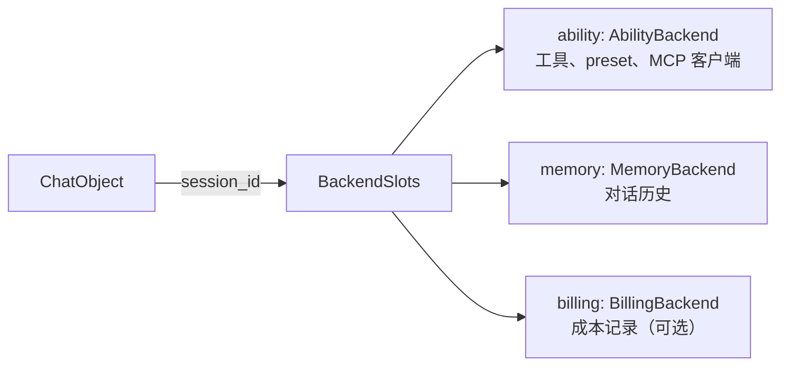
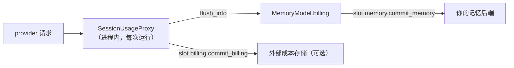

# 数据后端——持久化能力、记忆与计费

## 后端是什么

AmritaCore 本身**不存储**任何东西。它定义三个接口并把 `session_id` 交给它们；
**你的后端实现**决定数据存放在哪里——进程内、数据库、Redis、文件……


```mermaid
flowchart LR
    CO["ChatObject"] -->|session_id| BS["BackendSlots"]
    BS --> AB["ability: AbilityBackend<br/>工具、preset、MCP 客户端"]
    BS --> MB["memory: MemoryBackend<br/>对话历史"]
    BS --> BB["billing: BillingBackend<br/>成本记录（可选）"]
```

## 接口

```python
from amrita_core.base.backend import (
    AbilityBackend,
    BillingBackend,
    MemoryBackend,
)
from amrita_core.types.billing import BillingRecord


class AbilityBackend:  # 抽象
    async def load_ability_all(self, session_id: str) -> AbilityContext: ...
    async def load_mcp_clients(self, session_id: str) -> MultiClientManager: ...
    async def load_tools(self, session_id: str) -> MultiToolsManager: ...
    async def load_presets(self, session_id: str) -> MultiPresetManager: ...


class MemoryBackend:  # 抽象
    async def load_memory(self, session_id: str) -> MemoryModel: ...
    async def commit_memory(self, session_id: str, memory: MemoryModel) -> None: ...


class BillingBackend:  # 抽象，可选
    async def commit_billing(
        self, session_id: str, records: list[BillingRecord]
    ) -> None: ...
    async def load_billing(self, session_id: str) -> list[BillingRecord]: ...
```

> `AbilityContext` 打包工具 / preset / MCP 客户端；`MemoryModel` 持有
> `messages: list[Message | ToolResult]`（见[记忆模型](data-memory.md)）。

## 三个槽位，以及计费为何不同

`BackendSlots` 携带全部三个。前两个是**必填**；计费有默认值，因为成本数据的
默认持久化路径根本不是后端：

```python
from amrita_core.base.backend import BackendSlots
from amrita_core.builtins.backends import LegacyBackend

backend = LegacyBackend()
slot = BackendSlots(ability=backend, memory=backend, billing=backend)
```

每一次上报 usage 的 provider 请求都会向本次运行的内存账本追加一条
[`BillingRecord`](../api-reference/classes/BillingRecord.md)。运行结束时，
`COMMIT_MEMORY` 按顺序执行三步：

1. 把本次运行的记录移入 `MemoryModel.billing`（`SessionUsageProxy.flush_into`）
2. 通过 `slot.memory` 提交记忆
3. 把同一批记录交给 `slot.billing`

因为第 1 步在**第 2 步之前**，持久化整个 `MemoryModel` 的记忆后端（比如下面
的 `FileMemoryBackend`）已经把计费历史存下来了。`BillingBackend` 只为需要让
记录*另外*抵达别处的消费方而存在：成本数据库、指标管道、配额执行器。


```mermaid
flowchart LR
    R["provider 请求"] --> L["SessionUsageProxy<br/>（进程内，每次运行）"]
    L -->|"flush_into"| M["MemoryModel.billing"]
    M -->|"slot.memory.commit_memory"| DB["你的记忆后端"]
    L -->|"slot.billing.commit_billing"| EX["外部成本存储（可选）"]
```

> **推论**：手工构造 `BackendSlots` 时省略 `billing` 是安全的——记录仍会
> 通过记忆存活。你只是少了外部镜像。

## 内置 `LegacyBackend`

默认实现把一切保存在**进程内**：

- Ability 在**全局**容器（`glb`）——所有会话共享同一批工具与 preset
- Memory 在每实例的 `MemoryModel` 字段中——历史只存活于进程
  生命周期内，且仅限本进程见过的会话 id
- 计费记录累积在按会话的进程内存储中，由锁保护，
  因此并发运行不会交叠出半截追加

```python
from amrita_core.builtins.backends import LegacyBackend

backend = LegacyBackend()  # 进程内按会话记忆
```

> **推论**：两个 `ChatObject` 用同一 `session_id`"共享"历史，*仅仅*因为
> `LegacyBackend` 按 id 存储。换一个后端就不同——**共享是后端属性，不是
> 框架特性**。

## 编写自己的后端

实现一个或两个接口，用 `BackendSlots` 包装：

```python
import json
from pathlib import Path

from amrita_core.base.backend import BackendSlots, AbilityBackend, MemoryBackend
from amrita_core.contexts import AbilityContext
from amrita_core.types.memory import MemoryModel


class FileMemoryBackend(MemoryBackend):
    """把对话历史存为 JSON 文件，每会话一个。"""

    def __init__(self, directory: Path):
        self.directory = directory
        directory.mkdir(parents=True, exist_ok=True)

    def _path(self, session_id: str) -> Path:
        # session_id 是用户可控输入——碰文件系统前先净化
        safe = "".join(c for c in session_id if c.isalnum() or c in "-_")
        return self.directory / f"{safe}.json"

    async def load_memory(self, session_id: str) -> MemoryModel:
        path = self._path(session_id)
        if not path.exists():
            return MemoryModel()
        with path.open() as f:
            return MemoryModel.model_validate(json.load(f))

    async def commit_memory(self, session_id: str, memory: MemoryModel) -> None:
        with self._path(session_id).open("w") as f:
            # 必须用 mode="json"：rate 价格是 Decimal，直接 model_dump() 交给
            # json.dump 会得到不可序列化对象。
            json.dump(memory.model_dump(mode="json"), f)


class StaticAbilityBackend(AbilityBackend):
    """每个会话返回同一份全局 ability（像 LegacyBackend）。"""

    def __init__(self, ability: AbilityContext):
        self.ability = ability

    async def load_ability_all(self, session_id: str) -> AbilityContext:
        return self.ability

    async def load_mcp_clients(self, session_id):
        return self.ability.mcp

    async def load_tools(self, session_id):
        return self.ability.tools

    async def load_presets(self, session_id):
        return self.ability.presets


my_backend = BackendSlots(
    ability=StaticAbilityBackend(AbilityContext()),
    memory=FileMemoryBackend(Path("./sessions")),
)
```

### 增加外部计费出口

仅当记录需要抵达*不同于*记忆后端所写位置的其他存储时才需要：

```python
from amrita_core import BillingBackend, BillingRecord


class CostDatabaseSink(BillingBackend):
    async def commit_billing(
        self, session_id: str, records: list[BillingRecord]
    ) -> None:
        await cost_db.insert_many(session_id, records)

    async def load_billing(self, session_id: str) -> list[BillingRecord]:
        return await cost_db.fetch(session_id)


my_backend = BackendSlots(
    ability=StaticAbilityBackend(AbilityContext()),
    memory=FileMemoryBackend(Path("./sessions")),
    billing=CostDatabaseSink(),
)
```

如果你要的是相反效果——记录刻意不去任何地方——就传
[`NullBillingBackend`](../api-reference/classes/NullBillingBackend.md)。

AmritaCore 不计算货币金额。它存下倍率与 token 计数
（见 [RateConfig](../api-reference/classes/RateConfig.md)），由消费方自行推导
成本，这样后续调价不会改写历史。

## 挂接后端

```python
# 直接构造 ChatObject
chat = ChatObject(
    train=...,
    user_input=...,
    session_id="abc123",
    backend=my_backend,
)

# 通过 Agent 工厂（转发给 ChatObject）
chat = agent.get_chatobject(
    "Hello!",
    session_id="abc123",
    backend=my_backend,
)
```

此后每次对话在开始时从 `load_memory` 加载历史，结束时经 `commit_memory`
保存——你的文件现在跨重启存活。

## 细粒度控制：`DatabackendOptions`

`backend_options=DatabackendOptions(...)` 跳过加载/提交周期的部分环节：

| 标志                         | 跳过                                                                |
| ---------------------------- | ------------------------------------------------------------------- |
| `skip_memory_fetch`          | `load_memory`——以空 `MemoryModel` 开始                              |
| `skip_tools_fetch`           | `load_tools`                                                        |
| `skip_mcp_fetch`             | `load_mcp_clients`                                                  |
| `skip_presets_fetch`         | `load_presets`                                                      |
| `skip_ability_extra_setting` | 整个 `load_ability_all`                                             |
| `skip_memory_commit`         | 结束时的 `commit_memory`                                            |
| `skip_billing_commit`        | 仅跳过 `slot.billing.commit_billing`——`memory.billing` 仍会收到记录 |

```python
from amrita_core.contexts import DatabackendOptions

chat = ChatObject(
    train=...,
    user_input=...,
    session_id="abc123",
    backend=my_backend,
    backend_options=DatabackendOptions(skip_memory_commit=True),  # 只读
)
```

## 下一步

[记忆模型](data-memory.md)——`MemoryModel` 携带什么、加载/提交生命周期如何运作。
