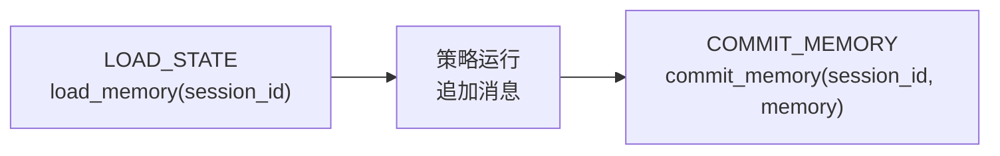

# 记忆模型——持久化什么

## `MemoryModel`

持久化单位是 `MemoryModel`——一个持有单会话对话历史的 Pydantic 模型：

```python
from amrita_core.types.memory import MemoryModel

memory = MemoryModel()  # 空历史
memory.messages  # list[Message | ToolResult]
```

- `messages` —— 对话本身：`Message` 条目（user / assistant）与配对的
  `ToolResult` 条目。
- 作为 Pydantic 模型，可用 `model_dump()` 序列化、`model_validate()` 校验——
  正是文件/DB 后端需要的（见[数据后端](data-backend.md)）。

## 生命周期



1. **加载** —— 工作流的 `LOAD_STATE` 节点调用 `memory.load_memory(session_id)`，
   结果存入 `MemoryContext`（`chat._di_memory.memory`）。
2. **修改** —— 策略向 `SendMessageWrap` 追加；结束时（`_post_runner`）assistant
   响应也被追加，最终列表写回 `mem_ctx.memory.messages`。
3. **提交** —— `COMMIT_MEMORY` 节点调用 `memory.commit_memory(session_id, memory)`。

所以*同一* `session_id` + 后端组合决定下一次对话加载什么——框架只负责编排调用。

## `MemoryContext`（DI）

运行时记忆存在于 `MemoryContext` DI 槽位：

```python
chat._di_memory.memory  # MemoryModel | None——LOAD_STATE 之后被设置
```

工作流节点与策略通过类型匹配注入访问（`mem: MemoryContext`）。

## 记忆摘要

`LLMConfig.enable_memory_abstract` + `memory_abstract_threshold` 触发摘要：
当 prompt token 数超过阈值，较旧轮次在请求发出前被摘要替换
（见[教程 5——记忆](../tutorials/memory.md)）。内置 step 策略还会在 Step
之间压缩历史（见[Step 循环](../advanced/step-loop.md)）。

## `StateContext`（遗留访问器）

`StateContext`（session_id + memory + ability）仍作为向后兼容访问器存在：
`chat.state` 从 DI 上下文合成一个，`LegacyBackend` 用它作进程内存储。
新代码应直接使用 DI 上下文（`_di_memory`、`_di_ability`、`_di_session`）。

## 下一步

[数据管理](data.md)——回到总览，或继续
[扩展与集成](../extensions-integration/index.md)。
