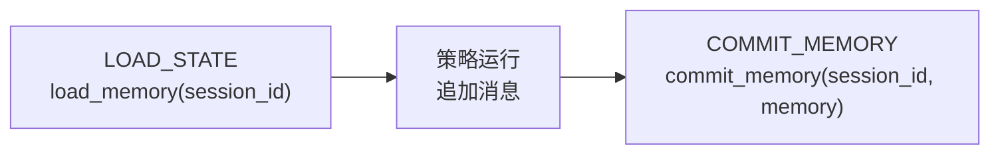

# 记忆模型——持久化什么

## `MemoryModel`

持久化单位是 `MemoryModel`——一个持有单会话对话历史的 Pydantic 模型：

```python
from amrita_core.types.memory import MemoryModel

memory = MemoryModel()  # 空历史
memory.messages  # list[Message | ToolResult]
```

| 字段       | 承载                                                                   |
| ---------- | ---------------------------------------------------------------------- |
| `messages` | 对话本身：`Message` 条目（user / assistant）与配对的 `ToolResult` 条目 |
| `abstract` | 压缩产生的摘要。由 train 模板渲染进系统指令                            |
| `usage`    | provider 为最近一次请求上报的用量。驱动压缩触发；每次折叠后被清空      |
| `billing`  | 本会话累积的逐请求 `BillingRecord`——成本数据的默认持久化路径           |
| `time`     | 时间戳                                                                 |

作为 Pydantic 模型，可用 `model_dump()` 序列化、`model_validate()` 校验——
正是文件/DB 后端需要的（见[数据后端](data-backend.md)）。由于 `billing` 可能
含有 `Decimal` 价格，写 JSON 时请用 `model_dump(mode="json")`。

## 生命周期


```mermaid
flowchart LR
    A["LOAD_STATE<br/>load_memory(session_id)"] --> B["策略运行<br/>追加消息"]
    B --> C["COMMIT_MEMORY<br/>commit_memory(session_id, memory)"]
```

1. **加载** —— 工作流的 `LOAD_STATE` 节点调用 `memory.load_memory(session_id)`，
   结果存入 `MemoryContext`（`chat._di_memory.memory`）。
2. **修改** —— 策略向 `SendMessageWrap` 追加；结束时（`_post_runner`）assistant
   响应也被追加，最终列表写回 `mem_ctx.memory.messages`。
3. **提交** —— `COMMIT_MEMORY` 节点调用 `memory.commit_memory(session_id, memory)`。

所以*同一* `session_id` + 后端组合决定下一次对话加载什么——框架只负责编排调用。

## `MemoryContext`（DI）

运行时记忆存在于 `MemoryContext` DI 槽位：

```python
chat._di_memory.memory  # MemoryModel | None——LOAD_STATE 之后被设置
```

工作流节点与策略通过类型匹配注入访问（`mem: MemoryContext`）。

## 让历史装进模型的限制里

在请求被构建之前，有三个相互独立的机制会运行。它们刻意彼此独立——各自可
单独启用，解决的是不同问题：

| 机制     | 解决什么                                 | 何时运行                             |
| -------- | ---------------------------------------- | ------------------------------------ |
| 内容归一化 | 历史携带了模型读不懂的内容块           | `llm.enable_multi_modal` 为**关**时  |
| 历史压缩 | 历史太长                                 | 触发阈值达到时                       |
| 溢出恢复 | provider 已经拒绝了请求                 | 抛出 `ContextOverflowError` 时       |

默认管线顺序是
`LOAD_STATE >> NORMALIZE_MESSAGES >> COMPACT >> JINJA2_RENDER >> BUILD_MESSAGE`
（见[工作流引擎](../advanced/workflow-engine.md)）。

### 1. 内容归一化

有些 provider 只接受纯文本。因此携带内容块（图片、文件）的对话必须在请求被
构建之前拍平，否则适配器会发出模型读不懂的块。

`NORMALIZE_MESSAGES` 节点负责此事，由 `LLMConfig.enable_multi_modal`
（默认 `True`）门控：

- `enable_multi_modal=True` —— 节点是空操作，内容块原样通过
- `enable_multi_modal=False` —— 每条 `content` 为内容块列表的 **user** 消息
  被改写为其拼接后的文本

只有 user 消息会被改写。assistant 轮次保持结构，因为工具调用配对依赖它。

它与压缩刻意分离：归一化是对已有内容的**无损**拍平，而压缩会丢弃历史。
分开之后，任一机制都能单独运行。

### 2. 历史压缩

`LLMConfig.enable_compaction` 开启历史折叠。
[`ContextCompactor`](../api-reference/classes/ContextCompactor.md) 从当前预设
读取注意力窗口（`max_context`，未声明时回退到
`LLMConfig.session_tokens_windows`），当上次实测的 prompt 达到其
`compaction_trigger_ratio` 时强制折叠。

压缩在两条触发线中先到者触发：

- **token 触发** —— provider 为上一次请求上报的 prompt 大小达到阈值。全程
  不涉及本地分词器；度量值就是 provider 自己的 usage 上报
- **消息条数兜底** —— 历史达到 `LLMConfig.memory_length_limit`（默认 `200`）。
  该兜底存在的原因是 token 触发依赖 provider 上报 usage；从不上报的网关否则
  会让历史无界增长

切点落在**最新的 `user` 消息**上，因此存活的尾部从干净的轮次开始，assistant
的工具调用永远不会与其工具结果分离。摘要存放在 `MemoryModel.abstract`，由
train 模板渲染回系统指令，因此不会往消息列表里注入任何内容，provider 的消息
顺序规则不受影响。

实操配置见[教程 5——记忆](../tutorials/memory.md)；内置 step 策略额外执行的
Step 间变体见 [Step 循环](../advanced/step-loop.md)。

### 3. 溢出恢复

有时估算就是错的——provider 直接拒绝请求。`libchat` 会检测到这一点并在预设
回退循环**之前**抛出
[`ContextOverflowError`](../api-reference/classes/ContextOverflowError.md)，
因此过大的请求不会白烧掉整条回退链。

开启 `LLMConfig.enable_overflow_recovery`（默认 `True`）时，`LLM_COMPLETION`
捕获该错误，经同一个 `ContextCompactor` 折叠历史，并重试**一次**。若重试仍然
溢出，错误向上传播。

检测是对 provider 消息的模式匹配，且刻意保守：把瞬时失败误判为溢出会白白
丢弃历史。

## 下一步

[数据管理](data.md)——回到总览，或继续
[扩展与集成](../extensions-integration/index.md)。
