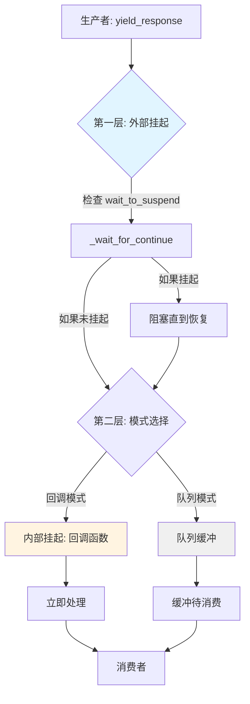

# 挂起与恢复机制

> **自 v0.9.0rc1 起**：`SuspendObjectStream` 已迁移至 [AmritaSense](https://sense.amritabot.com)。完整文档见[执行与中断](https://sense.amritabot.com/guide/concepts/exec_and_interrupt)和 [SuspendObjectStream API](https://sense.amritabot.com/reference/api/suspend-object-stream)。`amrita_core.streaming` 兼容性端点已在 v0.10.x+ 中移除；请直接从 `amrita_sense` 导入。

**注意：这是一项用于特殊场景的高级功能。大多数用户无需直接使用。**

::: tip 挂起在什么场景下适用？

- **用于观察**（日志、审计、通知），使用[事件系统](../tutorials/event-hooks.md)——它会广播但从不阻塞工作流。
- **用于交互式开发调试**（单步执行、断点、状态检查），使用[工作流级调试](workflow-debugging.md)——它直接操作解释器并注入中间件，无需代码配合。
- **挂起是生产就绪的调试断点**——协作式、基于标签、可安全交付：仅当外部控制器显式等待时才暂停。

:::

AmritaCore 提供了一种简单而明确的挂起机制，允许外部控制 `ChatObject` 的执行流程，在指定节点暂停和恢复处理。此机制由 `SuspendObjectStream` 类提供，`ChatObject` 通过其 `io_stream` 属性使用（自 v0.9.1 起为组合关系）。

适用场景：

- 需要在处理步骤之间检查状态的交互式调试
- 在复杂的多智能体系统中实现自定义流程控制
- 与需要同步点的外部系统协调
- **带标签的断点控制**：使用标签标记特定断点以实现精确的流程控制

## 标准断点标签

AmritaCore 通过 `SuspendEnum` 枚举提供**标准化的断点标签**。这些内置标签对应 ChatObject 生命周期中的关键执行点。自 v0.9.0rc1 起，ChatObject 由[工作流引擎](workflow-engine.md)驱动，并提供额外的节点级断点：

> **v0.12.0 迁移**：`SuspendEnum` 已从 `amrita_core.chatmanager.enums` 移至 `amrita_core.enums`。`amrita_core` 顶层包重新导出所有枚举值，因此 `from amrita_core import SuspendEnum` 仍然有效。

```python
from amrita_core import SuspendEnum

# 可用的标准断点标签：
SuspendEnum.ENTRY_POINT        # "ChatObject::_entry"——入口点
SuspendEnum.TRAIN_RENDER       # "ChatObject::render_train_template"——模板渲染
SuspendEnum.MEMORY             # "ChatObject::memory_limiting"——记忆摘要
SuspendEnum.MESSAGES_PREPARED  # "ChatObject::prepare_send_messages"——消息准备完毕
SuspendEnum.PRECOMPLE          # "matcher_call::pre_completion"——模型完成前
SuspendEnum.STRATEGY_START     # "ChatObject::run_strategy_start"——策略执行
SuspendEnum.LLM_CALL           # "ChatObject::call_llm"——LLM API 调用
SuspendEnum.SINGLE_TOOL        # "ChatObject::single_tool_call"——每次工具调用前
SuspendEnum.COMPLE             # "matcher_call::post_completion"——模型完成后
SuspendEnum.FINALIZE           # "ChatObject::finalize"——管道结束
```

**建议**：使用这些标准标签而非自定义字符串标签，以获得更好的可维护性和兼容性。

## 架构概览

挂起/恢复机制在 `SuspendObjectStream` 的两个不同层级上运作：



### 两级中断机制

#### 外部挂起——控制流中断

通过 `@SuspendObjectStream.suspend` 装饰器和 `wait_to_suspend()/resume()` 方法实现：

- **外部驱动**：由外部调用 `wait_to_suspend()` 触发
- **流程控制**：暂停整个协程的执行
- **标签过滤**：支持细粒度断点选择
- **双向通信**：需要显式调用 `resume()` 才能继续

**类比**：🚦 红绿灯——完全停止，等待绿灯（resume）才能通行

#### 内部挂起/回调——数据流拦截

通过 `callback` 机制实现：

- **内部驱动**：每次 `yield_response` 时自动触发
- **数据拦截**：在数据传输路径中插入处理逻辑
- **实时响应**：无需外部 `resume()`，自动继续
- **单向流动**：数据流经处理后通过，不阻塞生产

**类比**：🛂 海关检查站——每件物品必须检查，但检查立即完成，不会长时间扣留

::: warning 回调和迭代器互斥
**重要限制**：`callback` 和 `async for` 迭代消费是**互斥的**。单个 `ChatObject` 实例只能使用一种方式处理响应流。同时使用回调和迭代器将导致 `RuntimeError`。
:::

## 工作原理

自 v0.9.0rc1 起，`ChatObject` 的核心生命周期由[可组合的工作流引擎](workflow-engine.md)驱动。自 v0.12.0 起，核心工作流节点已提取到 `amrita_core.components` 包中（`LOAD_STATE`、`JINJA2_RENDER`、`BUILD_MESSAGE`、`LLM_COMPLETION`、`COMMIT_MEMORY` 等）。每个工作流节点都装饰了 `@SuspendObjectStream.suspend`，并在执行前自动检查挂起信号。

基本使用步骤：

1. 调用 `chat.begin()` 启动 ChatObject 的内部任务
2. 在 ChatObject 执行上下文**之外**的独立异步任务中，调用 `await chat.io_stream.wait_to_suspend(timeout)` 监听挂起状态
3. ChatObject 在到达下一个用 `@SuspendObjectStream.suspend` 装饰的方法时自动暂停
4. 调用 `chat.io_stream.resume()` 恢复正常执行流程

## 使用标签标记断点

AmritaCore 支持使用 `tag` 参数为挂起点分配唯一标识符，实现精确的断点控制：

### 标准标签的基本用法

```python
from amrita_core import ChatObject, SuspendEnum
from amrita_core.types import MemoryModel, Message

context = MemoryModel()
train = Message(content="你是一个乐于助人的助手。", role="system")

chat = ChatObject(
    context=context,
    session_id="session_123",
    user_input="你好！",
    train=train.model_dump()
)

# 外部控制器监听特定的标准断点
async def external_controller(chat_obj):
    # 等待标准的 "single_tool_call" 断点
    await chat_obj.io_stream.wait_to_suspend(SuspendEnum.SINGLE_TOOL.value, timeout=5.0)
    print("在工具调用前挂起！")

    # 可以在这里检查或修改状态
    # ...

    chat_obj.io_stream.resume()

chat.begin()
# 启动控制器任务
controller_task = asyncio.create_task(external_controller(chat))
# 等待聊天任务完成
await chat
controller_task.cancel()
```

### 在自定义函数中使用标签

挂起是 **IO 流**（`SuspendObjectStream`）的机制，而不是 `ChatObject` 的。要在自己的函数中插入带标签的挂起点，调用流上的 `_wait_for_continue(tag)`——只有在外部控制器等待匹配标签时才会阻塞，否则立即返回：

```python
from amrita_core import SuspendObjectStream

class MyAgent:
    async def call_external_api(self, chat_obj: ChatObject, url: str):
        """在调用外部 API 前挂起（如果外部监听器在等待此标签）"""
        # 仅当外部控制器调用了 wait_to_suspend("before_api_call") 时才阻塞
        await chat_obj.io_stream._wait_for_continue("before_api_call")

        async with aiohttp.ClientSession() as session:
            async with session.get(url) as response:
                return await response.json()
```

或者，`@SuspendObjectStream.suspend_with_tag` 装饰器自动执行相同调用：它在运行函数体之前调用流上的 `_wait_for_continue(tag)`。装饰器通过扫描函数参数定位流，因此被装饰的函数**必须声明一个 `SuspendObjectStream` 参数**——否则会引发 `TypeError`。

### 标签匹配规则

1. **精确匹配**：`wait_to_suspend("xxx")` 仅匹配标记为 `"xxx"` 的挂起点
2. **无标签挂起**：`wait_to_suspend()`（无标签）匹配**所有**挂起点
3. **带标签的等待跳过无标签点**：当带标签的 `wait_to_suspend("xxx")` 等待中时，无标签挂起点立即返回而不阻塞

## 手动使用 `_wait_for_continue()`

对于更细粒度的控制，你可以在自定义异步逻辑中手动调用 `await chat_obj.io_stream._wait_for_continue()`，自由插入自定义挂起点：

```python
import asyncio
from amrita_core import create_agent, minimal_init

async def custom_processing_step(chat_obj):
    """带手动挂起点的自定义处理函数"""
    print("开始处理步骤...")
    await asyncio.sleep(0.5)

    # 手动挂起点：仅当外部 wait_to_suspend 触发时才阻塞，否则立即返回
    await chat_obj.io_stream._wait_for_continue()

    print("挂起点后继续...")
```
