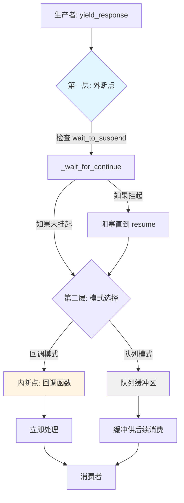
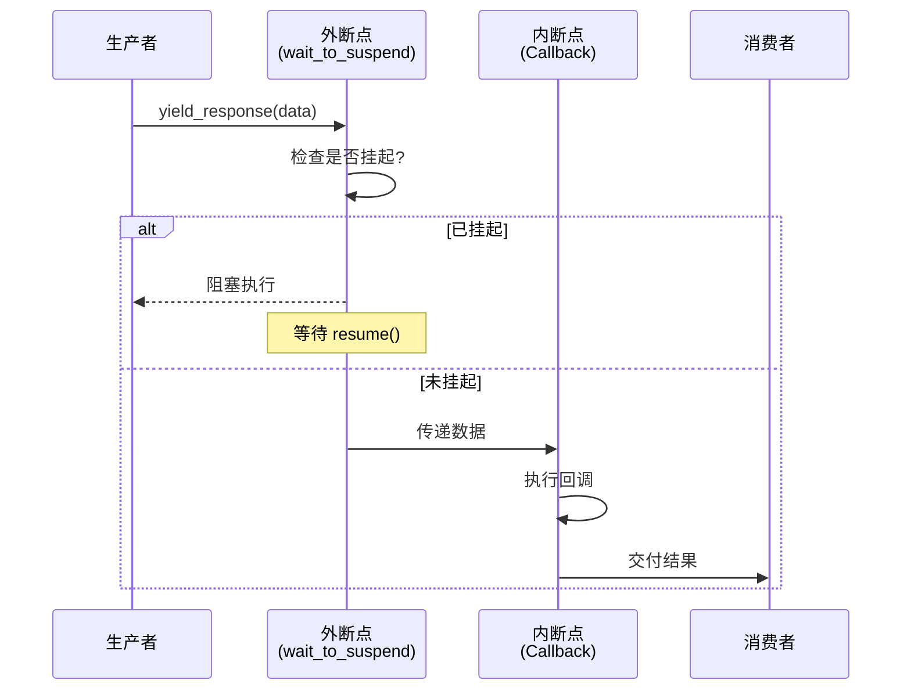

# 挂起与恢复机制

> **v0.9.0rc1 起**：`SuspendObjectStream` 已迁移至 [AmritaSense](https://sense.amritabot.com)。完整文档见 [执行与中断](https://sense.amritabot.com/guide/concepts/exec_and_interrupt) 和 [SuspendObjectStream API](https://sense.amritabot.com/reference/api/suspend-object-stream)。`amrita_core.streaming` 兼容端点在 v0.10.x+ 已移除，请直接从 `amrita_sense` 导入。

**注意：这是一个用于特殊场景的高级功能。大多数用户不需要直接使用它。**

AmritaCore 提供了一套简单显式的挂起机制，允许外部控制 `ChatObject` 的执行流程，在指定节点暂停和恢复处理。此机制由 `SuspendObjectStream` 类提供，`ChatObject` 通过其 `io_stream` 属性使用（自 v0.9.1 起采用组合方式）。

适用场景：

- 需要在处理步骤之间检查状态的交互式调试
- 在复杂多代理系统中实现自定义流程控制
- 与需要同步卡点的外部系统协同工作
- **带标签的断点控制**：通过 tag 标记特定断点，实现精确的流程控制

## 标准断点标签

AmritaCore 通过 `SuspendEnum` 枚举提供了**标准化的断点标签**。这些内置标签对应 ChatObject 生命周期中的关键执行点：

> **v0.12.0 迁移**: `SuspendEnum` 现已从 `amrita_core.chatmanager.enums` 移至 `amrita_core.enums`。`amrita_core` 顶层包重导出了所有枚举值，因此 `from amrita_core import SuspendEnum` 仍然有效。

```python
from amrita_core import SuspendEnum

# 可用的标准断点标签：
SuspendEnum.MEMORY        # "ChatObject::memory_limiting" - 内存摘要前
SuspendEnum.SINGLE_TOOL   # "ChatObject::single_tool_call" - 每次工具调用前
SuspendEnum.PRECOMPLE     # "matcher_call::pre_completion" - 模型完成前
SuspendEnum.COMPLE        # "matcher_call::post_completion" - 模型完成后
```

**推荐**：使用这些标准标签而不是自定义字符串标签，以获得更好的可维护性和兼容性。

## 架构概览

挂起/恢复机制在 `SuspendObjectStream` 内部通过两个不同的层级运作：



### 两层中断机制

#### 1. 外断点（Outer Suspend）- 控制流中断

通过 `@SuspendObjectStream.suspend` 装饰器和 `wait_to_suspend()/resume()` 方法实现：

- **外部驱动**：由外部调用 `wait_to_suspend()` 触发
- **流程控制**：暂停整个协程的执行
- **标签过滤**：支持细粒度的断点选择
- **双向通信**：需要显式调用 `resume()` 才能继续

**比喻**：🚦 交通信号灯 - 完全停止，等待绿灯（resume）才能继续前行

#### 2. 内断点（Inner Suspend / Callback）- 数据流拦截

通过 `callback` 机制实现：

- **内部驱动**：每次 `yield_response` 自动触发
- **数据拦截**：在数据传输路径上插入处理逻辑
- **实时响应**：无需外部 `resume()`，自动继续
- **单向流动**：数据流过即处理，不阻塞生产

**比喻**：🛂 海关检查站 - 每件货物都要经过检查，但检查完立即放行，不会长时间滞留

::: warning 回调模式与迭代器互斥
**重要限制**：`callback` 与 `async for` 迭代消费是**互斥的**。同一个 `ChatObject` 实例只能选择其中一种方式处理响应流。同时设置回调并使用迭代器将导致 `RuntimeError`。
:::

## 工作原理

`ChatObject` 的核心生命周期方法（`_entry`、`_run`、`_run_strategy` 等）均被 `@SuspendObjectStream.suspend` 装饰器托管，执行前会自动检测挂起信号。

基础使用步骤：

1. 调用 `chat.begin()` 启动 ChatObject 内部任务
2. 从 ChatObject 执行上下文**外部**，单独异步任务中调用 `await chat.io_stream.wait_to_suspend(timeout)` 监听挂起状态
3. ChatObject 运行到下一个被 `@SuspendObjectStream.suspend` 装饰的方法时自动暂停
4. 调用 `chat.io_stream.resume()` 恢复正常执行流程

## 使用 Tag 标记断点

AmritaCore 支持使用 tag 参数为挂起点添加唯一标识，实现精确的断点控制：

### 使用标准标签的基本用法

```python
from amrita_core import ChatObject, SuspendEnum
from amrita_core.types import MemoryModel, Message

context = MemoryModel()
train = Message(content="You are a helpful assistant.", role="system")

chat = ChatObject(
    context=context,
    session_id="session_123",
    user_input="Hello!",
    train=train.model_dump()
)

# 外部控制器监听特定的标准断点
async def external_controller(chat_obj):
    # 等待标准的 "single_tool_call" 断点
    await chat_obj.io_stream.wait_to_suspend(SuspendEnum.SINGLE_TOOL.value, timeout=5.0)
    print("在工具调用前挂起！")

    # 可以在此检查或修改状态
    # ...

    chat_obj.io_stream.resume()

chat.begin()
# 启动控制器任务
controller_task = asyncio.create_task(external_controller(chat))
```

### 在自定义函数中使用标签

使用 `@SuspendObjectStream.suspend_with_tag` 装饰器为自定义函数添加带标签的挂起点：

```python
from amrita_core.streaming import SuspendObjectStream

class MyAgent:
    @SuspendObjectStream.suspend_with_tag("before_api_call")
    async def call_external_api(self, chat_obj: ChatObject, url: str):
        """在调用外部API前挂起（如果外部监听器正在等待此标签）"""
        # 如果外部调用了 wait_to_suspend("before_api_call")
        # 代码将在此处暂停，直到调用 resume()
        async with aiohttp.ClientSession() as session:
            async with session.get(url) as response:
                return await response.json()

    @SuspendObjectStream.suspend_with_tag("after_response")
    async def post_process_response(self, chat_obj: ChatObject, response: str):
        """在处理响应后挂起"""
        # 后处理逻辑
        print(f"处理响应: {response}")
```

### 标签匹配规则

1. **精确匹配**：`wait_to_suspend("xxx")` 只会匹配 `@SuspendObjectStream.suspend_with_tag("xxx")` 装饰的函数
2. **无标签挂起**：`wait_to_suspend()` 会匹配所有被 `@SuspendObjectStream.suspend` 装饰的函数
3. **优先级**：带标签的挂起优先于无标签的挂起

```python
# 示例：多断点控制流程
async def multi_breakpoint_controller(chat_obj):
    # 等待第一个断点
    await chat_obj.io_stream.wait_to_suspend("step1")
    print("步骤1完成")

    # 继续等待第二个断点
    await chat_obj.io_stream.wait_to_suspend("step2")
    print("步骤2完成")

    # 最后等待任意断点
    await chat_obj.io_stream.wait_to_suspend()  # 匹配任何被 suspend 装饰的方法
    print("任意步骤完成")

    chat_obj.io_stream.resume()
```

## 手动使用 `_wait_for_continue()`

如需更细粒度控制，可在自定义异步逻辑中手动调用 `await chat._wait_for_continue()`，自由植入自定义挂起点：

```python
import asyncio
from amrita_core import create_agent, minimal_init

async def custom_processing_step(chat_obj):
    """带有手动挂起点的自定义处理函数"""
    print("开始处理步骤...")
    await asyncio.sleep(0.5)

    # 手动挂起点：仅外部触发 wait_to_suspend 时阻塞，否则立即返回
    await chat_obj.io_stream._wait_for_continue()

    print("在挂起点后继续...")
    await asyncio.sleep(0.5)

async def main():
    await minimal_init()
    agent = create_agent(
        base_url="https://api.example.com",
        api_key="your-api-key",
        model="gpt-3.5-turbo",
    )

    chat = agent.get_chatobject("Hello!")

    # 外部独立控制任务
    async def external_controller(chat_obj):
        await chat_obj.io_stream.wait_to_suspend(timeout=5.0)
        print("聊天已挂起！")
        await asyncio.sleep(1)
        chat_obj.io_stream.resume()
        print("聊天已恢复！")

    controller_task = asyncio.create_task(external_controller(chat))

    try:
        await custom_processing_step(chat)
        chat.begin()
        async with chat:
            async for response in chat.io_stream.get_response_generator():
                content = response if isinstance(response, str) else response.get_content()
                print(content, end="", flush=True)
    finally:
        controller_task.cancel()

asyncio.run(main())
```

### 关键说明

- `_wait_for_continue()` 会被所有 `@SuspendObjectStream.suspend` 装饰的方法自动调用
- 支持开发者手动植入，定制业务内部挂点
- 无待处理挂起请求时，调用会立即返回，不阻塞流程
- 基于异步信号实现，独立于业务执行流
- **tag 参数传递**：手动调用时可传入 tag 参数 `await chat_obj.io_stream._wait_for_continue(tag="custom_tag")`

## 组合使用两种中断机制

两种中断机制是正交的，可以组合使用。但由于**回调与迭代器互斥**，你需要根据所选响应消费方式调整组合策略。



### 回调模式 + 外断点

当使用回调处理响应时，外断点仍然可以正常工作。**注意**：必须先调用 `chat.begin()` 启动任务，然后通过 `await chat` 等待任务结束。

```python
# 场景：既要监控数据，又要在关键点暂停（回调模式）

async def monitor(response):
    """内断点：实时监控每个响应"""
    if "error" in str(response):
        await send_alert(response)

chat.io_stream.set_callback_func(monitor)  # 设置内断点（回调）

# 外断点：在特定时刻暂停
async def controller():
    await chat.io_stream.wait_to_suspend(SuspendEnum.PRECOMPLE.value)
    print("即将调用 LLM，是否继续？")
    await asyncio.to_thread(input, "按回车继续...")
    chat.io_stream.resume()

# 启动任务和控制任务
chat.begin()
asyncio.create_task(controller())

# 等待 ChatObject 执行完成
await chat
# 或者获取完整响应
# final_response = await chat.full_response()
```

### 迭代器模式 + 外断点

如果不使用回调，仅使用迭代器消费，外断点同样有效。推荐使用 `async with chat:` 上下文管理器。

```python
# 场景：流式输出同时支持挂起（迭代器模式）

# 外断点控制任务
async def controller():
    await chat.io_stream.wait_to_suspend(SuspendEnum.PRECOMPLE.value)
    print("\n[系统] 即将调用 LLM，暂停中...")
    input("按回车继续...")
    chat.io_stream.resume()

chat.begin()
async with chat:
    asyncio.create_task(controller())
    async for chunk in chat.io_stream.get_response_generator():
        content = chunk if isinstance(chunk, str) else chunk.get_content()
        print(content, end="", flush=True)
    # 迭代器自然耗尽后，上下文退出
```

::: tip 如何选择？

- 需要逐块处理但不想手动写循环？使用**回调模式**，通过 `chat.begin()` 启动后 `await chat` 等待完成。
- 需要流式输出到终端或 WebSocket？使用**迭代器模式**，结合 `async with chat:` 上下文管理器。
- 无论哪种模式，外断点（`wait_to_suspend`）都能正常生效。
  :::

## 使用模式示例

### 迭代器模式（最常用）

```python
import asyncio
from amrita_core import create_agent, minimal_init

async def main():
    await minimal_init()
    agent = create_agent(
        base_url="https://api.example.com",
        api_key="your-api-key",
        model="gpt-3.5-turbo",
    )

    chat = agent.get_chatobject("Hello!")

    # 外部并发控制逻辑
    async def external_controller(chat_obj):
        await chat_obj.io_stream.wait_to_suspend(timeout=5.0)
        print("聊天已挂起。")
        await asyncio.sleep(1)
        chat_obj.io_stream.resume()
        print("聊天已恢复。")

    chat.begin()
    async with chat:
        controller_task = asyncio.create_task(external_controller(chat))
        try:
            async for response in chat.io_stream.get_response_generator():
                content = response if isinstance(response, str) else response.get_content()
                print(content, end="", flush=True)
        finally:
            controller_task.cancel()

asyncio.run(main())
```

### 回调模式

```python
async def handle_chunk(chunk):
    print(chunk, end="", flush=True)

chat.io_stream.set_callback_func(handle_chunk)

async def external_controller(chat_obj):
    await chat_obj.io_stream.wait_to_suspend(timeout=5.0)
    print("\n[挂起]")
    await asyncio.sleep(1)
    chat_obj.io_stream.resume()

chat.begin()
asyncio.create_task(external_controller(chat))
# 等待流程自然完成
await chat
```

## 重要使用说明

- 控制接口必须在 `ChatObject` 主异步上下文之外、独立并发任务中调用
- `wait_to_suspend` 超时参数用于避免无限阻塞
- **tag 参数帮助精确定位**：在复杂流程中使用 tag 可以准确控制特定断点
- 属于底层能力，面向框架扩展、高级调试与定制流程编排场景
- **继承关系**：由于 `ChatObject` 继承自 `SuspendObjectStream`，所有挂起/恢复方法都可在 ChatObject 实例上使用

::: warning 回调与迭代器互斥
请不要同时设置回调函数并使用 `get_response_generator()`，这会导致 `RuntimeError`。
:::

::: danger 生命周期管理

- 必须先调用 `chat.begin()` 创建内部任务，然后才能使用 `async with chat:` 或 `await chat`。
- `async with chat:` 是**迭代器模式**的推荐写法，它会在退出时自动终止任务。
- **回调模式**下，请使用 `chat.begin()` 启动任务后直接 `await chat` 等待完成，无需进入上下文管理器。
  :::

## 何时不使用此功能

普通业务开发请优先使用标准交互模式：

- 流式响应输出：`chat.begin(); async with chat: async for response in chat.io_stream.get_response_generator()`
- 回调式响应：`chat.io_stream.set_callback_func(callback); chat.begin(); await chat`
- 完整一次性应答：`chat.begin(); response = await chat.full_response()`

仅在需要外部精细控制内部执行流程的高阶场景，才启用挂起/恢复能力。
