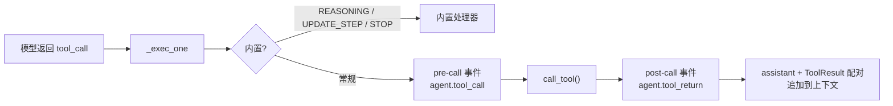

# 工具系统

> **概念页。** 实操见[教程 2——添加工具](../tutorials/tools.md)与
> [自定义工具——进阶模式](../extensions-integration/tools.md)。

## 什么是工具

工具是**带 JSON Schema 的函数**。模型从不执行你的函数——它生成调用请求；
框架校验参数、运行函数、把结果喂回。

## 注册

三种注册方式：

| 方式                                 | Schema 来源                     | 作用域           |
| ------------------------------------ | ------------------------------- | ---------------- |
| `@simple_tool`                       | 类型注解 + docstring            | 全局（模块加载） |
| `@on_tools(schema)`                  | 显式 `FunctionDefinitionSchema` | 全局（模块加载） |
| `ToolsManager` / `MultiToolsManager` | 手动                            | 每会话、运行时   |

handler 接收校验后的参数 `dict` 并返回 `str`（模型看到的结果）。

## Schema 与校验

`FunctionPropertySchema` 支持完整 JSON Schema 约束——`minimum`、`pattern`、
`enum`、`items`、`required`、`default`……在 LLM 产生工具调用时自动校验。
坏参数永远到不了你的函数。

## 执行路径

- **内置工具**（`STOP_TOOL`、`REASONING_TOOL`、`UPDATE_STEP_TOOL`、
  `PROCESS_MESSAGE`）绕过事件——见[内置能力](../builtins.md)。
- **停滞护栏**：相同签名重复 `loop_reasoning_trigger` 次时，调用在**执行前**
  被取消，返回 `"Cancelled: Reach the max limit of repeatly calling tool."`
- **生命周期事件**让 matcher 改写参数、取消、改写结果或跳过追加。

## 进阶：`custom_run` 与 `ToolContext`

需要框架访问的工具使用 `custom_run` 模式：handler 接收 `ToolContext`
（含 `.data` 参数与 `.ctx` 即 `StrategyContext`）——适合流式进度或读取
会话状态。

## 下一步

[Agent 策略](agent-strategy.md)——谁驱动工具循环。
