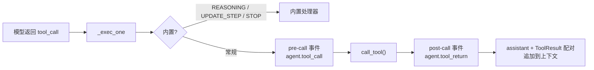

# 工具系统

> **概念页。** 实操见[教程 2——添加工具](../tutorials/tools.md)与
> [自定义工具——进阶模式](../extensions-integration/tools.md)。

## 什么是工具

工具是**带 JSON Schema 的函数**。模型从不执行你的函数——它生成调用请求；
框架解析参数、运行函数、把结果喂回。

## 注册

三种注册方式：

| 方式                                 | Schema 来源                     | 作用域           |
| ------------------------------------ | ------------------------------- | ---------------- |
| `@simple_tool`                       | 类型注解 + docstring            | 全局（模块加载） |
| `@on_tools(schema)`                  | 显式 `FunctionDefinitionSchema` | 全局（模块加载） |
| `ToolsManager` / `MultiToolsManager` | 手动                            | 每会话、运行时   |

handler 接收已解析的参数 `dict` 并返回 `str`（模型看到的结果）。

## Schema 与校验

`FunctionPropertySchema` 携带 AmritaCore 转发给 provider 的 JSON Schema 约束：
`minimum` / `maximum`（以及 `exclusiveMinimum` / `exclusiveMaximum` /
`multipleOf`）、`minLength` / `maxLength`、`pattern`、`enum`、`const`、
`items` / `minItems` / `maxItems`、`default` 等。`required` 位于外层的
`FunctionParametersSchema` 上。

`amrita_core.tools.schema` 把这个 schema 当作中间表示，提供两个正交方向：

| 方向 | 入口                                                                      | 用途                 |
| ---- | ------------------------------------------------------------------------- | -------------------- |
| 投影 | `function_definition_from_pydantic`、`function_definition_from_signature` | Python 类型 → schema |
| 编译 | `compile_parameters_model`                                                | schema → 校验器      |

schema 是给**模型**读的；编译出的 Pydantic 模型负责校验**调用**。因为编译只从
schema 出发，所以它对所有来源都成立——手写 schema、`@simple_tool` 的类型注解、
以及 MCP 服务器。

`call_tool()` 在 handler 之前运行编译出的校验器，因此违反声明类型或约束的调用
会抛 `ValidationError`，而不是带着坏数据抵达你的函数。Agent 循环会把它转成
`ERR: ...` 工具结果，模型就能读到字段级报错并自行修正调用。

两个值得知道的细节：

- 模型省略的参数保持省略，因此你的 handler 上的 Python 默认值仍然生效——校验
  不会塞一个 `None` 进去顶替它。
- 设 `function_config.validate_tool_arguments = False` 可原样传递参数。

### 用一个 Pydantic 模型描述工具

`function_definition_from_pydantic` 会把模型的字段、docstring、约束与默认值投影
成一份定义，因此一处声明同时完成两件事：

```python
from pydantic import BaseModel, Field

from amrita_core.tools.manager import on_tools
from amrita_core.tools.schema import function_definition_from_pydantic


class LookupArgs(BaseModel):
    """Look a user up by id."""

    user_id: int = Field(description="Numeric user id", ge=1)
    verbose: bool = Field(default=False, description="Include history")


@on_tools(function_definition_from_pydantic(LookupArgs, name="lookup"))
async def lookup(args: dict) -> str:
    return f"user {args['user_id']}"
```

`ge=1` 会变成模型看到的 schema 里的 `minimum: 1`，同一个边界在调用回来时也会被
强制执行。

## 执行路径


```mermaid
flowchart LR
    A["模型返回 tool_call"] --> B["_exec_one"]
    B --> C{"内置?"}
    C -->|REASONING / UPDATE_STEP / STOP| D["内置处理器"]
    C -->|常规| E["pre-call 事件<br/>agent.tool_call"]
    E --> F["call_tool()"]
    F --> G["post-call 事件<br/>agent.tool_return"]
    G --> H["assistant + ToolResult 配对<br/>追加到上下文"]
```

- **内联处理工具**——`REASONING_TOOL`（`think_and_reason`）、`UPDATE_STEP_TOOL`
  与 `STOP_TOOL`（`agent_stop`）在 `_exec_one` 内直接分派，因此**绕过**
  `agent.tool_call` / `agent.tool_return` 事件。`PROCESS_MESSAGE`
  （`processing_message`）**不属于**这一类：它是常规的 `custom_run` 工具，由
  `function_config.agent_middle_message` 开关控制，因此会经过事件。
  `REFLECTION_TOOL` 只在反思阶段内部使用。见[内置能力](../builtins.md)。
- **停滞护栏**：相同签名重复 `loop_reasoning_trigger` 次时，调用在**执行前**
  被取消，返回 `"Cancelled: Reach the max limit of repeatly calling tool."`
- **生命周期事件**让 matcher 改写参数、取消、改写结果或跳过追加。

## 进阶：`custom_run` 与 `ToolContext`

需要框架访问的工具使用 `custom_run` 模式：handler 接收 `ToolContext`
（含 `.data` 参数与 `.ctx` 即 `StrategyContext`）——适合流式进度或读取
会话状态。

## 下一步

[Agent 策略](agent-strategy.md)——谁驱动工具循环。
