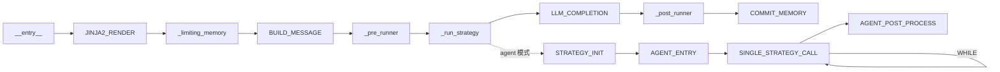

# 工作流引擎

> 自 AmritaCore v0.9.0rc1 起，ChatObject 由 [AmritaSense](https://sense.amritabot.com) 的可组合工作流引擎驱动。

## 概述

ChatObject 的执行管道被分解为离散的**节点**，由 AmritaSense 的 `WorkflowInterpreter` 执行。AmritaCore 不实现自己的工作流引擎——它直接使用 AmritaSense 的。

工作流引擎的核心类型（`Node`、`NodeComposeRendered`、`WorkflowInterpreter`）和控制流指令（`IF`/`WHILE`/`JUMP`/`TRY`/`CALL`/`ALIAS`）全部由 AmritaSense 提供。

**完整文档：**

| 主题                             | AmritaSense 文档                                                                        |
| -------------------------------- | --------------------------------------------------------------------------------------- |
| 工作流组合与执行                 | [组合与执行](https://sense.amritabot.com/guide/concepts/compose_and_exec)               |
| @Node 装饰器与自定义节点         | [自定义节点](https://sense.amritabot.com/guide/advanced/custom_node)                    |
| 控制流（IF/WHILE/JUMP/TRY）      | [控制流](https://sense.amritabot.com/guide/concepts/flow_control)                       |
| ALIAS / 子程序调用               | [控制流](https://sense.amritabot.com/guide/concepts/flow_control)                       |
| 依赖注入                         | [依赖注入](https://sense.amritabot.com/guide/advanced/dependency_injection)             |
| 事件系统                         | [事件系统](https://sense.amritabot.com/guide/advanced/event_system)                     |
| 执行与中断                       | [执行与中断](https://sense.amritabot.com/guide/concepts/exec_and_interrupt)             |

## ChatObject 节点链（v0.12.0+）

自 v0.12.0 起，核心工作流节点已提取到 `amrita_core.components` 包中。组件节点通过基于类型注解的依赖注入注入 DI 上下文对象，而非直接访问 `ChatObject` 属性。



当使用 `"agent"` 或 `"agent-mixed"` 策略类别时，`_run_strategy` 节点分支进入一个 agent 子工作流。该子工作流使用 `WHILE` 循环和一个计数器工厂（`REACT_COUNTER`）来遍历工具调用。

| 节点                   | SuspendEnum 标签    | 位置                               | 描述                                   |
| ---------------------- | ------------------- | ---------------------------------- | -------------------------------------- |
| `LOAD_STATE`           | `LOAD_STATE`        | `amrita_core.components.process`   | 从后端加载运行时状态                   |
| `JINJA2_RENDER`        | `TRAIN_RENDER`      | `amrita_core.components.llm`       | 渲染 Jinja2 系统提示模板               |
| `_limiting_memory`     | `MEMORY`            | `chat_object.py`（保留）           | 应用记忆长度和 token 限制              |
| `BUILD_MESSAGE`        | `MESSAGES_PREPARED` | `amrita_core.components.process`   | 为 LLM 准备最终消息列表                |
| `_pre_runner`          | `PRECOMPLE`         | `chat_object.py`（保留）           | 触发前置完成匹配器事件                 |
| `_run_strategy`        | `STRATEGY_START`    | `chat_object.py`（保留）           | 执行策略；分支进入 agent 子工作流      |
| `STRATEGY_INIT`        | —                   | `amrita_core.components.react`     | 用 DI 资源字段初始化 `StrategyContext` |
| `AGENT_ENTRY`          | —                   | `amrita_core.components.react`     | 初始化 agent 策略实例                  |
| `SINGLE_STRATEGY_CALL` | `SINGLE_TOOL`       | `amrita_core.components.react`     | 执行一次工具调用迭代                   |
| `REACT_COUNTER`        | `ADVANCE_COUNTER`   | `amrita_core.components.react`     | 推进工具调用计数器                     |
| `AGENT_POST_PROCESS`   | —                   | `amrita_core.components.react`     | 所有工具调用后对策略进行后处理         |
| `LLM_COMPLETION`       | `LLM_CALL`          | `amrita_core.components.llm`       | 通过适配器调用 LLM                     |
| `_post_runner`         | `COMPLE`            | `chat_object.py`（保留）           | 触发后置完成匹配器事件                 |
| `COMMIT_MEMORY`        | `COMMIT_MEMORY`     | `amrita_core.components.process`   | 将记忆提交回后端                       |
| `APPEND_RESPONSE`      | `MEMORY_APPEND`     | `amrita_core.components.process`   | 将 LLM 响应追加到上下文包装器          |
| `APPLY_CONTEXT`        | `APPLY_CONTEXT`     | `amrita_core.components.process`   | 将上下文包装器写回记忆模型             |

### 控制流指令

Agent 子工作流使用 AmritaSense v0.3.0+ 控制流指令：

- **`GOTO(BuiltinName.STRATEGY_EOF)`**——使用非 agent 策略时跳过 agent 子工作流
- **`ALIAS(_agent_entry, BuiltinName.AGENT_STRATEGY)`**——将 agent 入口点注册为子程序目标
- **`WHILE(_single_strategy_exec).ACTION(_counter_factory())`**——循环工具调用执行，使用计数器强制调用次数限制
- **`ALIAS(NOP, BuiltinName.STRATEGY_EOF)`**——标记 agent 子工作流的结束

### SuspendEnum 标签

自 v0.9.1 起，额外的挂起标签可用：

- `SuspendEnum.ADVANCE_COUNTER`——推进工具调用计数器之前
- `SuspendEnum.STRATEGY_EOF`——agent 策略子工作流结束时

## AmritaCore 特定概念

### WorkflowInterpreter 集成

ChatObject 在 `__init__` 中组装工作流并执行它：

- `_middleware` 参数可以包装整个工作流
- `archived_nodes` 参数在标准管道后追加自定义节点
- `BuiltinName.AGENT_STRATEGY` 别名启用子程序调用

### BuiltinName

```python
from amrita_core.chatmanager import BuiltinName
BuiltinName.AGENT_STRATEGY  # "ChatObject::__agent_main__"
```

### Middleware

```python
async def my_middleware(chat_obj: ChatObject) -> None:
    """包装整个 ChatObject 工作流的中间件。"""
    logger.info("工作流启动中...")
    try:
        await chat_obj._interpreter.run()
    finally:
        logger.info("工作流完成。")

chat = ChatObject(
    ...,
    middleware=my_middleware,
)
```

### 使用 archived_nodes 扩展

```python
from amrita_sense import Node
from amrita_sense.instructions import ARCHIVED_NODES

custom_nodes = ARCHIVED_NODES()

@Node("custom_logging")
async def log_completion(self):
    logger.info(f"响应：{self.response.content}")

custom_nodes._nodes += (log_completion,)

chat = ChatObject(..., archived_nodes=custom_nodes)
```

## 预组合工作流（v0.12.6+）

自 v0.12.6 起，AmritaCore 在 `amrita_core.builtins.workflows` 中提供预组合的工作流管道。这些是即用型的 `NodeComposeRendered` 图，可直接传递给 `ChatObject(workflow=...)`。

| 工作流         | 组合                                                                                             | 用例                               |
| -------------- | ------------------------------------------------------------------------------------------------ | ---------------------------------- |
| `REACT_BLOCK`  | `STRATEGY_INIT >> AGENT_ENTRY >> WHILE(...) >> AGENT_POST_PROCESS`                               | ReAct 循环块（无 LLM 完成）        |
| `SIMPLE_REACT` | `LOAD_STATE >> JINJA2_RENDER >> BUILD_MESSAGE >> REACT_BLOCK >> LLM_COMPLETION >> COMMIT_MEMORY` | 完整的 ReAct 管道，支持工具调用    |
| `REACT_ONLY`   | `LOAD_STATE >> JINJA2_RENDER >> BUILD_MESSAGE >> REACT_BLOCK`                                    | 不含最终 LLM 调用的 ReAct 管道     |
| `SIMPLE_CHAT`  | `LOAD_STATE >> JINJA2_RENDER >> BUILD_MESSAGE >> LLM_COMPLETION >> COMMIT_MEMORY`                | 纯聊天，不含 agent/工具调用        |

### 使用自定义工作流

通过 `workflow` 参数传递预组合的工作流：

```python
from amrita_core import ChatObject
from amrita_core.builtins.workflows import SIMPLE_REACT, SIMPLE_CHAT

# 使用完整的 ReAct 管道
chat = ChatObject(
    train={"role": "system", "content": "你是一个乐于助人的助手。"},
    user_input="搜索最新的 AI 新闻。",
    session_id="session_123",
    workflow=SIMPLE_REACT,
)

# 或使用纯聊天（无 agent）
chat = ChatObject(
    train={"role": "system", "content": "你是一个乐于助人的助手。"},
    user_input="你好！",
    session_id="session_456",
    workflow=SIMPLE_CHAT,
)
```

> **注意**：`workflow` 和 `archived_nodes` **互斥**——同时提供两者会引发 `ValueError`。两者都不提供时，使用内置的默认管道。

## 从 v0.8.x 迁移

| 旧方式                                   | 新方式                                    |
| ---------------------------------------- | ----------------------------------------- |
| Override `_run()`                        | `@Node` 装饰器 + `archived_nodes`         |
| `from amrita_core.protocol import ...`   | `from amrita_core.base.adapter import ...` |
| `from amrita_core.streaming import ...`  | `from amrita_sense.streaming import ...`   |
| `from amrita_core.logging import ...`    | `from amrita_sense.logging import ...`     |
