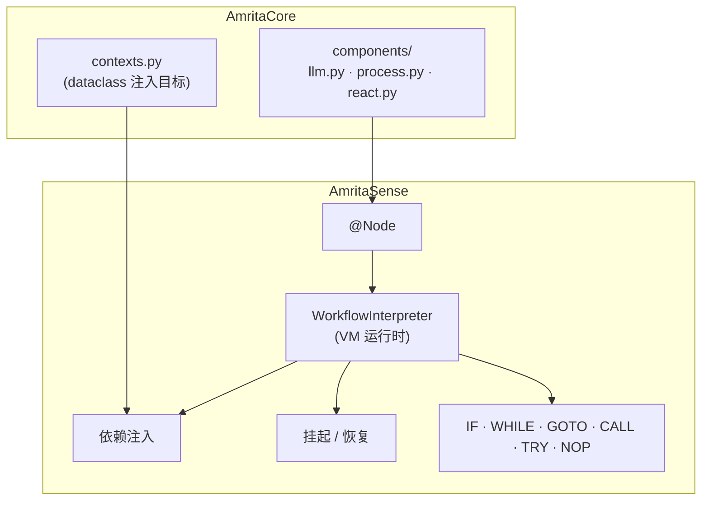
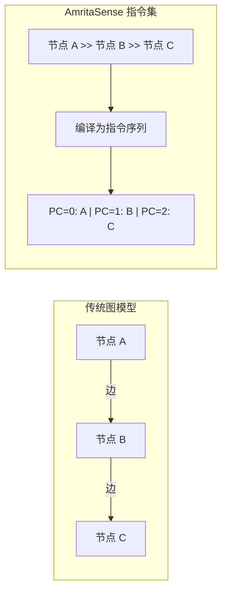
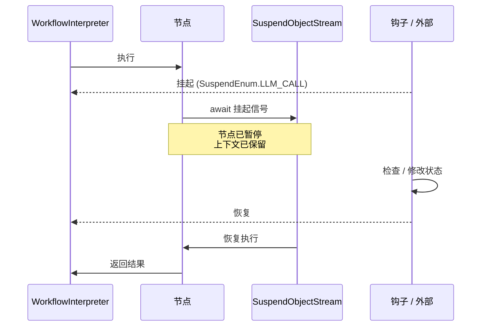
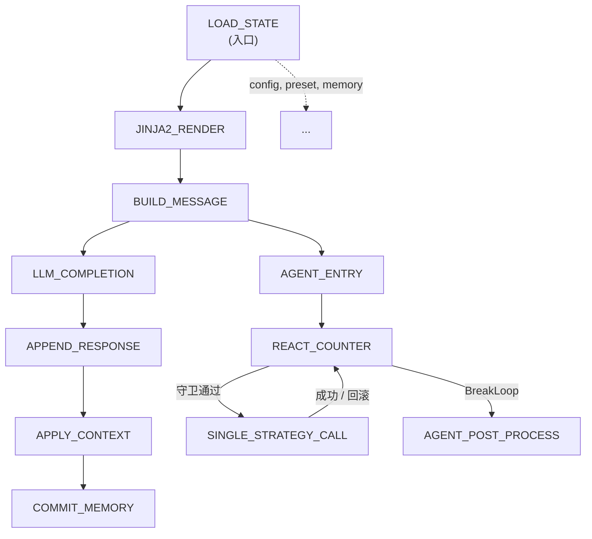

<div v-pre>

# 与 AmritaSense 集成

## 5.5.1 概述

[AmritaSense](https://sense.amritabot.com) 是 AmritaCore 驱动处理管线的**通用工作流编排引擎**。与传统节点-边图不同，Sense 将工作流编译为**线性指令序列**，由一个轻量级虚拟机逐条执行——类似 CPU 运行机器码。



## 5.5.2 指令集架构 vs 图模型

传统引擎需要定义显式的节点和边。Sense 将它们编译为由**程序计数器**（`PointerVector`）和**调用栈**驱动的指令。



| 特性     | 图模型            | AmritaSense                       |
| -------- | ----------------- | --------------------------------- |
| 调度方式 | 图遍历 + 拓扑排序 | 程序计数器递增/跳转               |
| 控制流   | 通过路由边模拟    | 原生 `IF`、`WHILE`、`GOTO`、`TRY` |
| 调试     | 需要图可视化      | 单步执行 `run_step_by()`          |
| 中断     | 需额外状态管理    | 原生 `Future` 挂起/恢复           |
| 编译性能 | O(V+E) 遍历       | 10 万节点约 200 ms                |

## 5.5.3 @Node 装饰器

`@Node` 将普通 Python 函数转化为工作流节点。Sense 在装饰时捕获调用帧，存储所有必要元数据。

```python
from amrita_sense import Node

@Node(
    tag="my_node",          # 可读标识（默认使用函数名）
    wrap_to_async=True,     # 自动包装同步函数为异步
    address_able=True,      # 可被 GOTO / CALL 寻址
)
async def my_node(param1: int, param2: str) -> str:
    return f"{param1}: {param2}"
```

| 参数            | 类型          | 默认值 | 说明                                      |
| --------------- | ------------- | ------ | ----------------------------------------- |
| `tag`           | `str \| None` | 函数名 | 节点标识符，对应 `SuspendEnum` 和 `ALIAS` |
| `wrap_to_async` | `bool`        | `True` | 将同步函数包装为异步执行                  |
| `address_able`  | `bool`        | `True` | 允许 `GOTO` / `CALL` 按别名寻址此节点     |

## 5.5.4 WorkflowInterpreter — 虚拟机

`WorkflowInterpreter` 接收编译后的图，通过程序计数器驱动执行：

```python
from amrita_sense import Node, NOP, WorkflowInterpreter

@Node()
async def step_one() -> None:
    print("[1] 加载状态")

@Node()
async def step_two() -> None:
    print("[2] 处理")

# >> 串联节点；NOP 是终止哨兵
composition = step_one >> step_two >> NOP
rendered = composition.render()

interpreter = WorkflowInterpreter(rendered)
await interpreter.run()              # 完整运行
# 或
async for result in interpreter.run_step_by():  # 逐步调试
    print(f"→ {result}")
```

它管理 **调用栈**（`Stack`）以支持 `CALL` / `GOTO` / `INTERRUPT`，在每个节点边界处理异常，并在调用每个节点函数之前解析依赖。

## 5.5.5 依赖注入

节点通过**函数签名**声明依赖。运行时，解释器将参数类型与已注册的 `@dataclass` 实例池进行匹配。

```mermaid
flowchart TD
    N["节点函数(opt: DatabackendOptions, ability: AbilityState, ...)"] --> M{参数类型？}
    M -->|已知 dataclass| T[类型匹配注入]
    M -->|str / int / bool| K[名称匹配 via extra_kwargs]
    M -->|Depends(包装)| D[特殊运行时对象]
    M -->|其他| P[位置匹配 via extra_args]
    T --> I[依赖已解析]
    K --> I
    D --> I
    P --> I
```

AmritaCore 的入口节点清晰地展示了这一机制：

```python
@Node(SuspendEnum.LOAD_STATE)
async def LOAD_STATE(
    opt: DatabackendOptions,   # 按类型注入
    ability: AbilityState,      # 按类型注入
    meta: SessionMetadata,     # 按类型注入
    mem: MemoryContext,         # 按类型注入
    rt_payload: WorkingState,  # 按类型注入
    ip: GeneralInput,           # 按类型注入
):
    ...
```

所有上下文对象在 `contexts.py` 中以 `@dataclass` 定义。无需手动接线——Sense 自动解析。

## 5.5.6 挂起 / 恢复

Sense 通过 `Future` 回调支持双向暂停与恢复。当外部钩子在 `SuspendEnum` 点发出挂起信号时，当前节点进入等待状态，完整上下文被保留，直到钩子发出恢复信号。



AmritaCore 的 `SuspendEnum` 将每个节点映射到一个拦截点：

| SuspendEnum         | 对应节点             | 拦截时机                   |
| ------------------- | -------------------- | -------------------------- |
| `LOAD_STATE`        | LOAD_STATE           | 后端状态加载完成后         |
| `TRAIN_RENDER`      | JINJA2_RENDER        | Jinja2 渲染完成后          |
| `MESSAGES_PREPARED` | BUILD_MESSAGE        | SendMessageWrap 构建完成后 |
| `LLM_CALL`          | LLM_COMPLETION       | LLM API 调用期间           |
| `MEMORY`            | APPEND_RESPONSE      | 响应追加后                 |
| `SINGLE_TOOL`       | SINGLE_STRATEGY_CALL | 工具调用期间               |
| `ADVANCE_COUNTER`   | REACT_COUNTER        | 计数器递增后               |
| `APPLY_CONTEXT`     | APPLY_CONTEXT        | 写回记忆前                 |
| `COMMIT_MEMORY`     | COMMIT_MEMORY        | 持久化前                   |

## 5.5.7 控制流指令集

所有控制流最终编译为线性指令序列。可用指令如下：

| 指令                          | 等价概念               | 用途                       |
| ----------------------------- | ---------------------- | -------------------------- |
| `IF(cond, then, else_)`       | if / else              | 条件分支                   |
| `WHILE(cond, body)`           | while 循环             | 前置条件循环               |
| `DO(body, cond)`              | do-while               | 后置条件循环               |
| `TRY(body, catch, then, fin)` | try / except / finally | 异常处理                   |
| `GOTO(target)`                | goto                   | 无条件跳转（操作 PC）      |
| `CALL(target)`                | 函数调用               | 子程序调用（压入返回地址） |
| `NOP`                         | pass                   | 哨兵 / 终止符              |
| `INTERRUPT`                   | —                      | 显式中断信号               |
| `TRIGGER_EVENT`               | —                      | 触发 `MatcherFactory` 事件 |

最简分支示例：

```python
from amrita_sense import Node, IF, NOP

@Node()
def is_greeting(msg: str) -> bool:
    return msg.lower().startswith("你好")

@Node()
def greet(): print("Hi!")

@Node()
def echo(msg: str): print(f"Echo: {msg}")

flow = IF(is_greeting, greet, echo) >> NOP
```

## 5.5.8 AmritaCore 如何使用 AmritaSense

### 完整节点图

AmritaCore 在三个模块中定义了 11 个 `@Node` 函数：



### 模块分工

| 模块         | 包含节点                                                                           | 职责                    |
| ------------ | ---------------------------------------------------------------------------------- | ----------------------- |
| `llm.py`     | `JINJA2_RENDER`, `LLM_COMPLETION`                                                  | 模板渲染 & LLM API 调用 |
| `process.py` | `LOAD_STATE`, `BUILD_MESSAGE`, `APPEND_RESPONSE`, `APPLY_CONTEXT`, `COMMIT_MEMORY` | 状态生命周期 & 持久化   |
| `react.py`   | `AGENT_ENTRY`, `REACT_COUNTER`, `SINGLE_STRATEGY_CALL`, `AGENT_POST_PROCESS`       | Agent 工具调用循环      |

### 上下文 Dataclass 体系

所有上下文均以 `@dataclass` 定义于 `contexts.py`，由 Sense DI 按类型解析：

| Dataclass            | 作用                     | 消费者节点                                                                                       |
| -------------------- | ------------------------ | ------------------------------------------------------------------------------------------------ |
| `AbilityState`       | 配置、后端槽位、当前预设 | 大部分节点                                                                                       |
| `MemoryContext`      | 会话消息历史             | LOAD_STATE, BUILD_MESSAGE, JINJA2_RENDER, APPLY_CONTEXT, COMMIT_MEMORY                           |
| `WorkingState`       | 消息上下文包装器         | BUILD_MESSAGE, LLM_COMPLETION, APPEND_RESPONSE, APPLY_CONTEXT, AGENT_ENTRY, SINGLE_STRATEGY_CALL |
| `GeneralInput`       | 用户输入、模板、渲染变量 | LOAD_STATE, BUILD_MESSAGE, JINJA2_RENDER                                                         |
| `RespState`          | LLM 最终响应             | LLM_COMPLETION, APPEND_RESPONSE                                                                  |
| `DatabackendOptions` | 加载 / 提交策略          | LOAD_STATE, COMMIT_MEMORY                                                                        |
| `SessionMetadata`    | 会话 ID 与时间戳         | LOAD_STATE, COMMIT_MEMORY                                                                        |
| `AgentLoopState`     | 策略、备份、计数器       | AGENT_ENTRY, REACT_COUNTER, SINGLE_STRATEGY_CALL, AGENT_POST_PROCESS                             |
| `StrategyPayload`    | 策略工厂                 | AGENT_ENTRY                                                                                      |

## 5.5.9 实践示例

### 添加内容过滤节点

```python
from amrita_sense import Node

@Node(tag="ContentFilter", wrap_to_async=False)
def content_filter(ip: GeneralInput, ab: AbilityState) -> None:
    blocked = ab.config.llm.extra_config.get("blocked_words", [])
    for word in blocked:
        ip.user_input = ip.user_input.replace(word, "***")
```

插入管线：`LOAD_STATE >> content_filter >> JINJA2_RENDER >> ...`

### 通过 IF 实现条件监控

```python
from amrita_sense import Node, IF, NOP
import time

@Node()
def should_monitor(ab: AbilityState) -> bool:
    return ab.config.llm.extra_config.get("enable_monitoring", False)

@Node()
def record_start(wok: WorkingState) -> None:
    wok.context_wrap._meta = {"start": time.monotonic()}

monitor_chain = IF(should_monitor, record_start, NOP)
```

### 延伸阅读

- [AmritaSense 源码](https://github.com/AmritaBot/AmritaSense)
- [AmritaCore 组件模块](https://github.com/AmritaBot/AmritaCore/tree/main/feat-components/src/amrita_core/components)
- [组件节点参考（docstring）](https://github.com/AmritaBot/AmritaCore/tree/main/feat-components/src/amrita_core/components)

</div>
