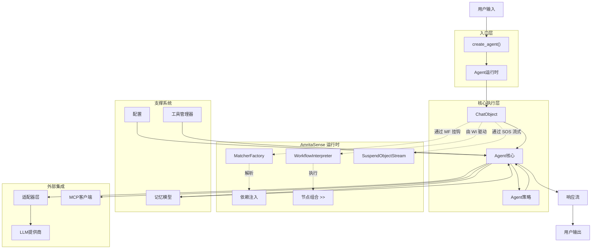
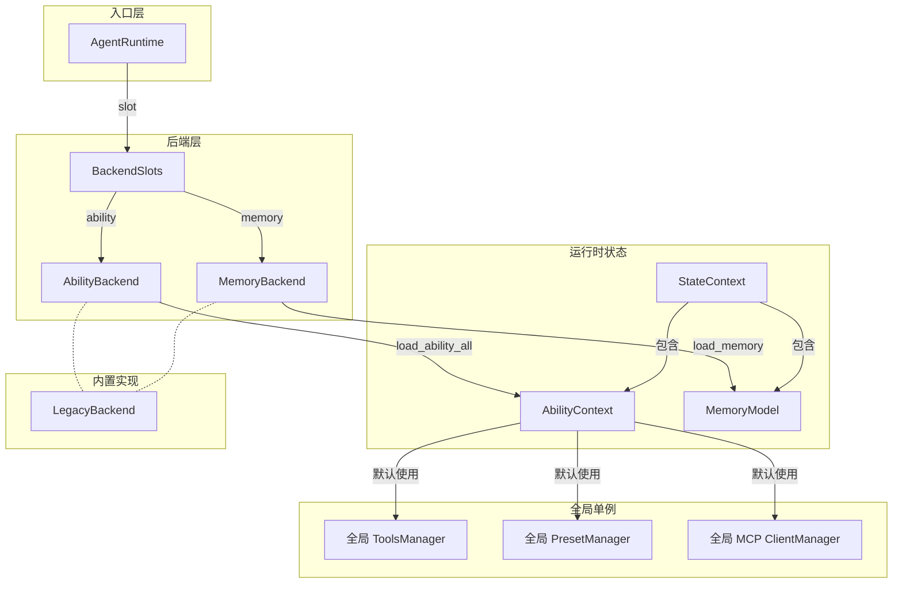
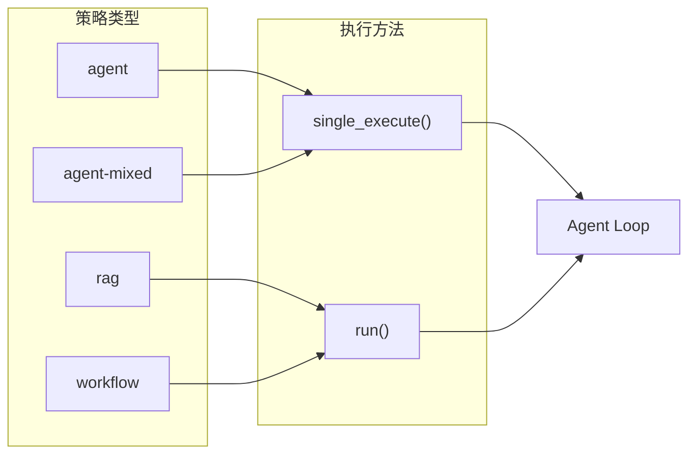
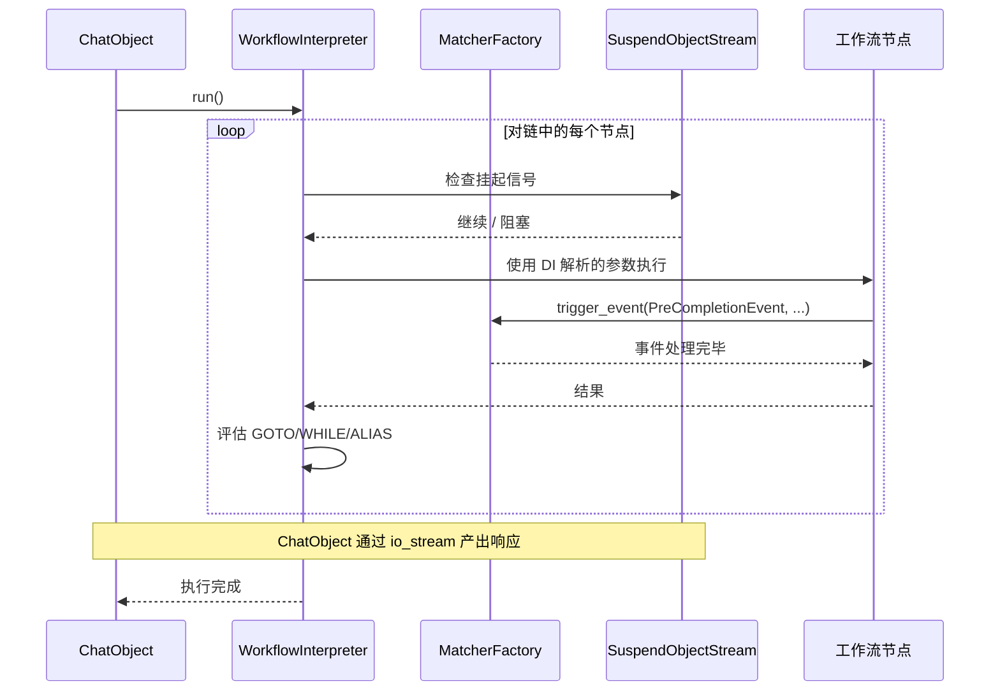
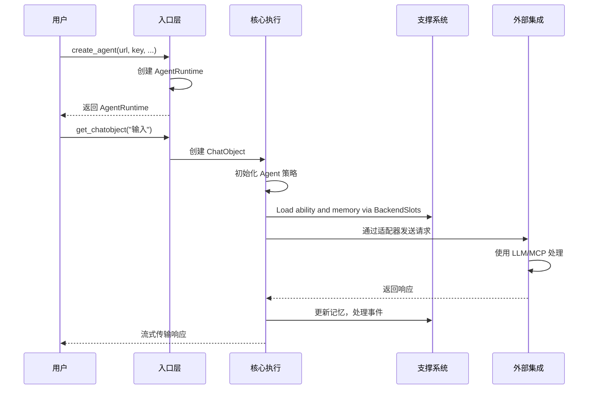

# 2.4 项目架构理解

## 2.4.1 架构图

### Core Architecture

### 后端架构与会话数据流

#### 后端驱动的数据管理

`LegacyBackend` 同时实现了 `AbilityBackend` 和 `MemoryBackend`，使用进程内全局容器。自定义后端（如数据库支持的后端）可以独立替换任一槽位。

### 基于策略的执行流程

## 2.4.2 AmritaSense — 运行时基座

AmritaCore 构建于 [**AmritaSense**](https://sense.amritabot.com) 之上，后者作为**运行时**为每一次 `ChatObject` 执行提供动力。可以将 AmritaSense 理解为 Agent 工作流的"操作系统"——它提供调度、组合和事件管道，而 AmritaCore 在其上定义领域特定的 Agent 逻辑。

### 运行时组件

| 组件                      | 在 ChatObject 中的角色                                                                                                                |
| ------------------------- | ------------------------------------------------------------------------------------------------------------------------------------- |
| **`WorkflowInterpreter`** | 驱动节点链（`_load_state → _render_train → _limiting_memory → … → _commit_memory`）。每个节点是一个可组合的 `@Node` 装饰协程。        |
| **`MatcherFactory`**      | 管理事件系统。`PreCompletionEvent`、`CompletionEvent`、`FallbackContext` 通过 `@on_precompletion().handle()` 等注册的匹配器进行分发。 |
| **`SuspendObjectStream`** | 流式 I/O 主干。所有 LLM 块、工具调用通知和推理内容都通过这个内置挂起/恢复的双向流传输。                                               |
| **依赖注入**              | `WorkflowInterpreter` 解析节点签名中的 `Depends()` 标记，自动注入 `ChatObject`、配置和自定义依赖。                                    |
| **节点组合 (`>>`)**       | 节点通过 `>>` 操作符链接成 `NodeCompose` 图。解释器根据 `GOTO`/`WHILE`/`ALIAS` 指令进行控制流跳转。                                   |

### AmritaSense 如何驱动 ChatObject

这种分离使得 AmritaCore 的 Agent 层保持轻量，专注于策略、会话、工具、MCP 和适配器——所有编排由 AmritaSense 处理。

## 2.4.3 核心组件关系

- **入口层**: 为用户提供简化的交互接口
  - `create_agent()`: 工厂函数，使用最少参数创建 `AgentRuntime`
  - `AgentRuntime`: 高级包装器，封装复杂性并提供可重用的agent操作

- **核心执行层**: 处理主要的处理逻辑
  - `ChatObject`: 管理单个对话的主要交互点，协调所有组件
  - `Agent核心`: `ChatObject` 内部的中央处理逻辑，执行完整的agent循环
  - `Agent策略`: 定义执行模式的抽象基类，支持四种策略类别

- **支撑系统**: 提供基本服务和数据管理
  - `配置`: 通过 `AmritaConfig` 控制系统行为
  - `事件系统`: 通过装饰器和依赖注入在处理流水线中启用钩子
  - `工具管理器`: 通过动态注册使用外部函数扩展功能
  - `记忆模型`: 在会话数据中维护对话上下文和历史

- **外部集成**: 处理与外部系统的通信
  - `适配器层`: 抽象LLM提供商通信，实现厂商无关集成
  - `MCP客户端`: 提供模型上下文协议支持，用于外部服务集成

- **数据后端**: 管理数据隔离与持久化
  - `BackendSlots`：持有 `AbilityBackend` + `MemoryBackend` 引用
  - `LegacyBackend`：内置内存后端，使用全局容器
  - 自定义后端可替换记忆或能力槽位，实现数据库/云端持久化

## 2.4.4 Agent 循环与后端数据流

### 基于策略的执行模式

1. **分层架构**: 系统遵循清晰的分层结构，具有明确的层次：
   - 入口层: 简化的用户界面
   - 核心执行层: 主要处理逻辑
   - **AmritaSense 运行时**: 工作流引擎、事件系统、流式处理、依赖注入——驱动执行的基座
   - 支撑系统: 基本服务（配置、工具、记忆）
   - 外部集成: 第三方通信（适配器、MCP）
   - 数据后端: 状态隔离与持久化

2. **策略模式实现**: 四种执行策略提供灵活的行为：
   - **'agent'**: 使用 `single_execute()` 进行迭代式工具调用，逐步执行
   - **'rag'**: 使用 `run()` 进行检索增强生成，使用最小上下文
   - **'workflow'**: 使用 `run()` 对工具调用和上下文管理进行完全手动控制
   - **'agent-mixed'**: 使用 `single_execute()` 进行动态模式处理，可在RAG和Agent模式之间切换

3. **会话隔离**: 每个对话通过独立的会话上下文保持完全隔离，同时在需要时共享全局资源。

4. **事件驱动设计**: 系统使用装饰器和事件处理器允许在不修改核心逻辑的情况下扩展行为。

5. **厂商无关性**: 适配器层确保相同的agent逻辑可以与不同的LLM提供商配合工作而无需代码更改。

6. **模板支持**: [Jinja2模板](/zh/guide/extensions-integration/jinja2-templates)基于上下文、记忆和配置启用动态提示构建。
