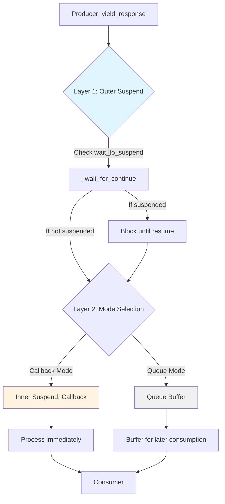
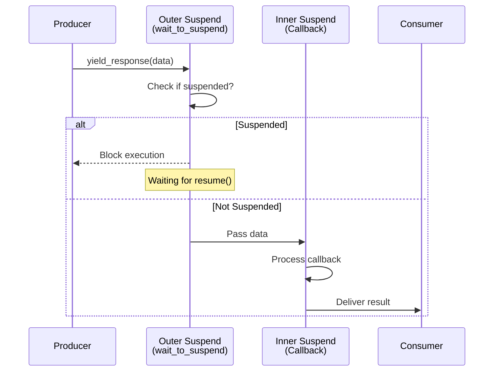

# Suspend & Resume Mechanism

**Note: This is an advanced feature for special scenarios. Most users do not need to use it directly.**

AmritaCore provides an explicit, lightweight suspend mechanism that allows external control over the execution flow of `ChatObject`, enabling you to pause and resume processing at specific points. This mechanism is implemented through the `SuspendObjectStream` base class, which `ChatObject` inherits from.

Typical use cases include:

- Interactive debugging with state inspection between processing steps
- Custom flow control in complex multi-agent systems
- Coordination with external systems that require synchronization points
- **Tagged breakpoint control**: Use tags to mark specific breakpoints for precise flow control

## Standard Breakpoint Tags

AmritaCore provides **standardized breakpoint tags** through the `SuspendEnum` enumeration. These built-in tags correspond to key execution points in the ChatObject lifecycle:

```python
from amrita_core import SuspendEnum

# Available standard breakpoint tags:
SuspendEnum.MEMORY        # "ChatObject::memory_limiting" - Before memory summarization
SuspendEnum.SINGLE_TOOL   # "ChatObject::single_tool_call" - Before each tool call
SuspendEnum.PRECOMPLE     # "matcher_call::pre_completion" - Before model completion
SuspendEnum.COMPLE        # "matcher_call::post_completion" - After model completion
```

**Recommendation**: Use these standard tags instead of custom string tags for better maintainability and compatibility.

## Architecture Overview

The suspend/resume mechanism operates on two distinct layers within `SuspendObjectStream`:



### Two Layers of Interruption

#### 1. Outer Suspend (Control Flow Interruption)

Implemented through the `@SuspendObjectStream.suspend` decorator and `wait_to_suspend()/resume()` methods:

- **External-driven**: Triggered by calling `wait_to_suspend()` from outside
- **Flow control**: Pauses the entire coroutine execution
- **Tag filtering**: Supports fine-grained breakpoint selection
- **Bidirectional communication**: Requires explicit `resume()` to continue

**Analogy**: 🚦 Traffic light - Complete stop, waiting for green light (resume) to proceed

#### 2. Inner Suspend / Callback (Data Flow Interception)

Implemented through the `callback` mechanism:

- **Internal-driven**: Automatically triggered on every `yield_response`
- **Data interception**: Inserts processing logic in the data transmission path
- **Real-time response**: No external `resume()` needed, continues automatically
- **Unidirectional flow**: Data flows through and is processed immediately

**Analogy**: 🛂 Customs checkpoint - Every item is inspected but released immediately after processing

## How It Works

Core internal methods of `ChatObject` (such as `_entry`, `_run`, `_run_strategy`) are decorated with the `@SuspendObjectStream.suspend` decorator. They automatically check for suspend signals before execution.

Basic workflow:

1. Call `await chat.wait_to_suspend(timeout)` **outside** the main `ChatObject` execution context from a separate async task
2. `ChatObject` will automatically pause when reaching the next `@SuspendObjectStream.suspend` decorated method
3. Resume execution by calling `chat.resume()`

## Using Tags for Breakpoint Control

AmritaCore supports adding unique identifiers to suspend points using the `tag` parameter, enabling precise breakpoint control:

### Basic Usage with Standard Tags

```python
from amrita_core import ChatObject, SuspendEnum
from amrita_core.types import MemoryModel, Message

context = MemoryModel()
train = Message(content="You are a helpful assistant.", role="system")

chat = ChatObject(
    context=context,
    session_id="session_123",
    user_input="Hello!",
    train=train.model_dump()
)

# External controller listens for a specific standardized breakpoint
async def external_controller(chat_obj):
    # Wait for the standard "single_tool_call" breakpoint
    await chat_obj.wait_to_suspend(SuspendEnum.SINGLE_TOOL.value, timeout=5.0)
    print("Suspended before tool call!")

    # Can inspect or modify state here
    # ...

    chat_obj.resume()

# Start controller task
controller_task = asyncio.create_task(external_controller(chat))
```

### Using Tags in Custom Functions

Use the `@SuspendObjectStream.suspend_with_tag` decorator to add tagged suspend points to your custom functions:

```python
from amrita_core.streaming import SuspendObjectStream

class MyAgent:
    @SuspendObjectStream.suspend_with_tag("before_api_call")
    async def call_external_api(self, chat_obj: ChatObject, url: str):
        """Suspends before calling external API (if external listener is waiting for this tag)"""
        # If external code called wait_to_suspend("before_api_call")
        # Code will pause here until resume() is called
        async with aiohttp.ClientSession() as session:
            async with session.get(url) as response:
                return await response.json()

    @SuspendObjectStream.suspend_with_tag("after_response")
    async def post_process_response(self, chat_obj: ChatObject, response: str):
        """Suspends after processing response"""
        # Post-processing logic
        print(f"Processing response: {response}")
```

### Tag Matching Rules

1. **Exact Match**: `wait_to_suspend("xxx")` only matches functions decorated with `@SuspendObjectStream.suspend_with_tag("xxx")`
2. **Untagged Suspend**: `wait_to_suspend()` matches all functions decorated with `@SuspendObjectStream.suspend`
3. **Priority**: Tagged suspend takes precedence over untagged suspend

```python
# Example: Multi-breakpoint control flow
async def multi_breakpoint_controller(chat_obj):
    # Wait for first breakpoint
    await chat_obj.wait_to_suspend("step1")
    print("Step 1 completed")

    # Continue waiting for second breakpoint
    await chat_obj.wait_to_suspend("step2")
    print("Step 2 completed")

    # Finally wait for any breakpoint
    await chat_obj.wait_to_suspend()  # Matches any suspend-decorated method
    print("Any step completed")

    chat_obj.resume()
```

## Manual Usage of `_wait_for_continue()`

For fine-grained control, you can manually call `await chat._wait_for_continue()` in your own async functions to create custom suspend points:

```python
import asyncio
from amrita_core import create_agent, minimal_init

async def custom_processing_step(chat_obj):
    """Custom business logic with a manual suspend point"""
    print("Start processing...")
    await asyncio.sleep(0.5)

    # Manual suspend point: blocks only if suspend is triggered externally
    await chat_obj._wait_for_continue()

    print("Resume after suspend point...")
    await asyncio.sleep(0.5)

async def main():
    await minimal_init()
    agent = create_agent(
        base_url="https://api.example.com",
        api_key="your-api-key",
        model="gpt-3.5-turbo",
    )

    chat = agent.get_chatobject("Hello!")

    # External independent control task
    async def external_controller(chat_obj):
        await chat_obj.wait_to_suspend(timeout=5.0)
        print("Chat suspended.")
        await asyncio.sleep(1)
        chat_obj.resume()
        print("Chat resumed.")

    controller_task = asyncio.create_task(external_controller(chat))

    try:
        await custom_processing_step(chat)
        async with chat.begin():
            async for response in chat.get_response_generator():
                content = response if isinstance(response, str) else response.get_content()
                print(content, end="", flush=True)
    finally:
        controller_task.cancel()

asyncio.run(main())
```

### Key Points

- `_wait_for_continue()` is invoked automatically by all `@SuspendObjectStream.suspend` decorated methods
- You can insert custom suspend points anywhere in your business logic
- It returns immediately without blocking if no suspend is pending
- Implemented with async signal scheduling, isolated from main business flow
- **Tag parameter passing**: Can pass tag parameter when manually calling: `await chat_obj._wait_for_continue("custom_tag")`

## Combining Both Interruption Layers

The two interruption mechanisms are orthogonal and can be combined:



Example of combining both mechanisms:

```python
# Scenario: Monitor data AND pause at critical points

async def monitor(response):
    """Inner suspend: Real-time monitoring of each response"""
    if "error" in str(response):
        await send_alert(response)

chat.set_callback_func(monitor)  # Set inner suspend

# Start task
chat.begin()

# Outer suspend: Pause at specific moments
async def controller():
    await chat.wait_to_suspend(SuspendEnum.PRECOMPLE.value)
    print("About to call LLM, continue?")
    input()  # User confirmation
    chat.resume()

asyncio.create_task(controller())

# Stream consumption
async for chunk in chat.get_response_generator():
    print(chunk, end="")
```

**Execution flow**:

1. Each response chunk triggers `monitor()` (inner suspend)
2. Pauses at PRECOMPLE, waiting for user confirmation (outer suspend)
3. After user confirmation, subsequent response chunks continue triggering `monitor()`

## Standard Usage Example

```python
import asyncio
from amrita_core import create_agent, minimal_init

async def main():
    await minimal_init()
    agent = create_agent(
        base_url="https://api.example.com",
        api_key="your-api-key",
        model="gpt-3.5-turbo",
    )

    chat = agent.get_chatobject("Hello!")

    # External concurrent control logic
    async def external_controller(chat_obj):
        await chat_obj.wait_to_suspend(timeout=5.0)
        print("Chat suspended, you may inspect or modify states here.")
        # Custom operations: state checking, context modification, external integration
        chat_obj.resume()

    async with chat.begin():
        controller_task = asyncio.create_task(external_controller(chat))
        try:
            async for response in chat.get_response_generator():
                content = response if isinstance(response, str) else response.get_content()
                print(content, end="", flush=True)
        finally:
            controller_task.cancel()

asyncio.run(main())
```

## Important Notes

- Control interfaces must be called from a separate concurrent task outside the main `ChatObject` async context
- The timeout parameter in `wait_to_suspend` prevents infinite blocking
- **Tag parameter helps precise positioning**: Use tags in complex flows to accurately control specific breakpoints
- This is a low-level capability intended for framework extension, advanced debugging, and custom workflow orchestration
- **Inheritance**: Since `ChatObject` inherits from `SuspendObjectStream`, all suspend/resume methods are available on ChatObject instances

## When Not to Use This Feature

For common scenarios, please use the standard interaction patterns:

- Streaming response: `async with chat.begin(): async for response in chat.get_response_generator()`
- Callback-based response: `chat.set_callback_func(callback)` + `await chat.begin()`
- Full complete response: `async with chat.begin(): response = await chat.full_response()`

Only use the suspend/resume mechanism for advanced scenarios that require fine external control over internal execution.
