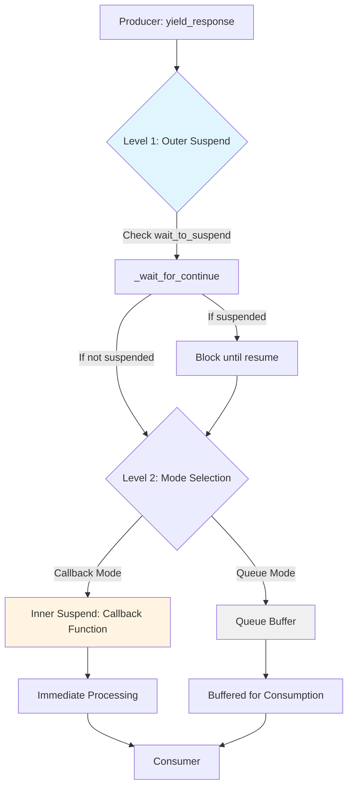

# Suspend and Resume Mechanism

**Note: This is an advanced feature for special scenarios. Most users do not need to use it directly.**

AmritaCore provides a simple and explicit suspend mechanism that allows external control over the execution flow of `ChatObject`, pausing and resuming processing at specified nodes. This mechanism is implemented through the `SuspendObjectStream` base class, from which `ChatObject` inherits.

Applicable scenarios:

- Interactive debugging that requires state inspection between processing steps
- Implementing custom flow control in complex multi-agent systems
- Coordinating with external systems that require synchronization points
- **Tagged breakpoint control**: Use tags to mark specific breakpoints for precise flow control

## Standard Breakpoint Tags

AmritaCore provides **standardized breakpoint tags** through the `SuspendEnum` enumeration. These built-in tags correspond to key execution points in the ChatObject lifecycle:

```python
from amrita_core import SuspendEnum

# Available standard breakpoint tags:
SuspendEnum.MEMORY        # "ChatObject::memory_limiting" - Before memory summarization
SuspendEnum.SINGLE_TOOL   # "ChatObject::single_tool_call" - Before each tool call
SuspendEnum.PRECOMPLE     # "matcher_call::pre_completion" - Before model completion
SuspendEnum.COMPLE        # "matcher_call::post_completion" - After model completion
```

**Recommendation**: Use these standard tags instead of custom string tags for better maintainability and compatibility.

## Architecture Overview

The suspend/resume mechanism operates at two distinct levels within `SuspendObjectStream`:



### Two-Level Interruption Mechanism

#### 1. Outer Suspend - Control Flow Interruption

Implemented via the `@SuspendObjectStream.suspend` decorator and `wait_to_suspend()/resume()` methods:

- **Externally driven**: Triggered by external calls to `wait_to_suspend()`
- **Flow control**: Pauses execution of the entire coroutine
- **Tag filtering**: Supports fine-grained breakpoint selection
- **Bidirectional communication**: Requires explicit `resume()` to continue

**Analogy**: 🚦 Traffic light - complete stop, waiting for green light (resume) to proceed

#### 2. Inner Suspend / Callback - Data Flow Interception

Implemented via the `callback` mechanism:

- **Internally driven**: Automatically triggered on each `yield_response`
- **Data interception**: Inserts processing logic into the data transmission path
- **Real-time response**: No external `resume()` needed, continues automatically
- **Unidirectional flow**: Data flows through and is processed without blocking production

**Analogy**: 🛂 Customs checkpoint - every item must be inspected, but inspection completes immediately without prolonged detention

::: warning Callback and Iterator Are Mutually Exclusive
**Important Limitation**: `callback` and `async for` iteration consumption are **mutually exclusive**. A single `ChatObject` instance can only use one method to handle the response stream. Using both callback and iterator simultaneously will result in a `RuntimeError`.
:::

## How It Works

The core lifecycle methods of `ChatObject` (`_entry`, `_run`, `_run_strategy`, etc.) are all managed by the `@SuspendObjectStream.suspend` decorator and automatically check for suspend signals before execution.

Basic usage steps:

1. Call `chat.begin()` to start the internal task of the ChatObject
2. From **outside** the ChatObject execution context, in a separate asynchronous task, call `await chat.wait_to_suspend(timeout)` to listen for the suspend state
3. The ChatObject automatically pauses when it reaches the next method decorated with `@SuspendObjectStream.suspend`
4. Call `chat.resume()` to resume normal execution flow

## Using Tags to Mark Breakpoints

AmritaCore supports using the `tag` parameter to assign unique identifiers to suspension points, enabling precise breakpoint control:

### Basic Usage with Standard Tags

```python
from amrita_core import ChatObject, SuspendEnum
from amrita_core.types import MemoryModel, Message

context = MemoryModel()
train = Message(content="You are a helpful assistant.", role="system")

chat = ChatObject(
    context=context,
    session_id="session_123",
    user_input="Hello!",
    train=train.model_dump()
)

# External controller listening for a specific standard breakpoint
async def external_controller(chat_obj):
    # Wait for the standard "single_tool_call" breakpoint
    await chat_obj.wait_to_suspend(SuspendEnum.SINGLE_TOOL.value, timeout=5.0)
    print("Suspended before tool call!")

    # You can inspect or modify state here
    # ...

    chat_obj.resume()

chat.begin()
# Start the controller task
controller_task = asyncio.create_task(external_controller(chat))
```

### Using Tags in Custom Functions

Use the `@SuspendObjectStream.suspend_with_tag` decorator to add tagged suspension points to custom functions:

```python
from amrita_core.streaming import SuspendObjectStream

class MyAgent:
    @SuspendObjectStream.suspend_with_tag("before_api_call")
    async def call_external_api(self, chat_obj: ChatObject, url: str):
        """Suspend before calling external API (if an external listener is waiting for this tag)"""
        # If external called wait_to_suspend("before_api_call")
        # Execution will pause here until resume() is called
        async with aiohttp.ClientSession() as session:
            async with session.get(url) as response:
                return await response.json()

    @SuspendObjectStream.suspend_with_tag("after_response")
    async def post_process_response(self, chat_obj: ChatObject, response: str):
        """Suspend after processing response"""
        # Post-processing logic
        print(f"Processing response: {response}")
```

### Tag Matching Rules

1. **Exact match**: `wait_to_suspend("xxx")` only matches functions decorated with `@SuspendObjectStream.suspend_with_tag("xxx")`
2. **Untagged suspend**: `wait_to_suspend()` matches all functions decorated with `@SuspendObjectStream.suspend`
3. **Priority**: Tagged suspension takes precedence over untagged suspension

```python
# Example: Multi-breakpoint control flow
async def multi_breakpoint_controller(chat_obj):
    # Wait for first breakpoint
    await chat_obj.wait_to_suspend("step1")
    print("Step 1 completed")

    # Continue waiting for second breakpoint
    await chat_obj.wait_to_suspend("step2")
    print("Step 2 completed")

    # Finally wait for any breakpoint
    await chat_obj.wait_to_suspend()  # Matches any method decorated with suspend
    print("Any step completed")

    chat_obj.resume()
```

## Manual Use of `_wait_for_continue()`

For finer-grained control, you can manually call `await chat._wait_for_continue()` within custom asynchronous logic to freely insert custom suspension points:

```python
import asyncio
from amrita_core import create_agent, minimal_init

async def custom_processing_step(chat_obj):
    """Custom processing function with a manual suspension point"""
    print("Starting processing step...")
    await asyncio.sleep(0.5)

    # Manual suspension point: blocks only if external wait_to_suspend triggered, otherwise returns immediately
    await chat_obj._wait_for_continue()

    print("Continuing after suspension point...")
    await asyncio.sleep(0.5)

async def main():
    await minimal_init()
    agent = create_agent(
        base_url="https://api.example.com",
        api_key="your-api-key",
        model="gpt-3.5-turbo",
    )

    chat = agent.get_chatobject("Hello!")

    # External independent control task
    async def external_controller(chat_obj):
        await chat_obj.wait_to_suspend(timeout=5.0)
        print("Chat suspended!")
        await asyncio.sleep(1)
        chat_obj.resume()
        print("Chat resumed!")

    controller_task = asyncio.create_task(external_controller(chat))

    try:
        await custom_processing_step(chat)
        chat.begin()
        async with chat:
            async for response in chat.get_response_generator():
                content = response if isinstance(response, str) else response.get_content()
                print(content, end="", flush=True)
    finally:
        controller_task.cancel()

asyncio.run(main())
```

### Key Notes

- `_wait_for_continue()` is automatically called by all methods decorated with `@SuspendObjectStream.suspend`
- Developers can manually insert it to customize internal business suspension points
- When no pending suspend request exists, the call returns immediately without blocking the flow
- Based on asynchronous signals, independent of the business execution flow
- **Tag parameter passing**: When calling manually, you can pass a tag parameter: `await chat_obj._wait_for_continue(tag="custom_tag")`

## Combining Both Interruption Mechanisms

The two interruption mechanisms are orthogonal and can be combined. However, because **callback and iterator are mutually exclusive**, you need to adjust the combination strategy based on the chosen response consumption method.


### Callback Mode + Outer Suspend

When using callbacks to handle responses, outer suspension still works correctly. **Note**: You must first call `chat.begin()` to start the task, then wait for the task to finish using `await chat`.

```python
# Scenario: Monitor data while pausing at key points (callback mode)

async def monitor(response):
    """Inner suspend: real-time monitoring of each response"""
    if "error" in str(response):
        await send_alert(response)

chat.set_callback_func(monitor)  # Set inner suspend (callback)

# Outer suspend: pause at specific moment
async def controller():
    await chat.wait_to_suspend(SuspendEnum.PRECOMPLE.value)
    print("About to call LLM, continue?")
    await asyncio.to_thread(input, "Press Enter to continue...")
    chat.resume()

# Start the task and controller task
chat.begin()
asyncio.create_task(controller())

# Wait for ChatObject execution to complete
await chat
# Or get the full response
# final_response = await chat.full_response()
```

### Iterator Mode + Outer Suspend

If not using callbacks and only consuming via iterator, outer suspension is also effective. Using the `async with chat:` context manager is recommended.

```python
# Scenario: Streaming output with suspension support (iterator mode)

# Outer suspend control task
async def controller():
    await chat.wait_to_suspend(SuspendEnum.PRECOMPLE.value)
    print("\n[System] About to call LLM, pausing...")
    input("Press Enter to continue...")
    chat.resume()

chat.begin()
async with chat:
    asyncio.create_task(controller())
    async for chunk in chat.get_response_generator():
        content = chunk if isinstance(chunk, str) else chunk.get_content()
        print(content, end="", flush=True)
    # Iterator exhausts naturally, then context exits
```

::: tip How to Choose?
- Need to process chunks but don't want to write manual loops? Use **callback mode**, start with `chat.begin()` then `await chat` to wait for completion.
- Need streaming output to terminal or WebSocket? Use **iterator mode** with the `async with chat:` context manager.
- Regardless of mode, outer suspension (`wait_to_suspend`) works normally.
:::

## Usage Pattern Examples

### Iterator Mode (Most Common)

```python
import asyncio
from amrita_core import create_agent, minimal_init

async def main():
    await minimal_init()
    agent = create_agent(
        base_url="https://api.example.com",
        api_key="your-api-key",
        model="gpt-3.5-turbo",
    )

    chat = agent.get_chatobject("Hello!")

    # External concurrent control logic
    async def external_controller(chat_obj):
        await chat_obj.wait_to_suspend(timeout=5.0)
        print("Chat suspended.")
        await asyncio.sleep(1)
        chat_obj.resume()
        print("Chat resumed.")

    chat.begin()
    async with chat:
        controller_task = asyncio.create_task(external_controller(chat))
        try:
            async for response in chat.get_response_generator():
                content = response if isinstance(response, str) else response.get_content()
                print(content, end="", flush=True)
        finally:
            controller_task.cancel()

asyncio.run(main())
```

### Callback Mode

```python
async def handle_chunk(chunk):
    print(chunk, end="", flush=True)

chat.set_callback_func(handle_chunk)

async def external_controller(chat_obj):
    await chat_obj.wait_to_suspend(timeout=5.0)
    print("\n[Suspended]")
    await asyncio.sleep(1)
    chat_obj.resume()

chat.begin()
asyncio.create_task(external_controller(chat))
# Wait for the flow to complete naturally
await chat
```

## Important Usage Notes

- Control interfaces must be called from a separate concurrent task, outside the main asynchronous context of the `ChatObject`
- The `wait_to_suspend` timeout parameter is used to avoid indefinite blocking
- **Tag parameters help precise positioning**: In complex flows, using tags enables accurate control of specific breakpoints
- This is a low-level capability intended for framework extension, advanced debugging, and custom flow orchestration scenarios
- **Inheritance relationship**: Since `ChatObject` inherits from `SuspendObjectStream`, all suspend/resume methods are available on ChatObject instances

::: warning Callback and Iterator Are Mutually Exclusive
Do not set a callback function and use `get_response_generator()` simultaneously; this will cause a `RuntimeError`.
:::

::: danger Lifecycle Management
- You must call `chat.begin()` to create the internal task before using `async with chat:` or `await chat`.
- `async with chat:` is the recommended approach for **iterator mode**; it automatically terminates the task upon exit.
- In **callback mode**, start the task with `chat.begin()` and then directly `await chat` to wait for completion; there is no need to enter the context manager.
:::

## When Not to Use This Feature

For normal business development, prefer the standard interaction patterns:

- Streaming response output: `chat.begin(); async with chat: async for response in chat.get_response_generator()`
- Callback-style response: `chat.set_callback_func(callback); chat.begin(); await chat`
- Complete one-time response: `chat.begin(); response = await chat.full_response()`

Enable the suspend/resume capability only in advanced scenarios that require fine-grained external control over internal execution flow.
