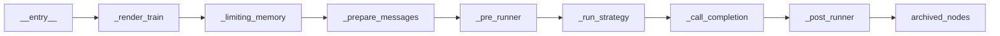

# 工作流引擎

> AmritaCore v0.9.0rc1 起，ChatObject 由 [AmritaSense](https://sense.amritabot.com) 的可组合工作流引擎驱动。

## 概述

ChatObject 的执行管道拆分为离散的**节点**（Node），由 AmritaSense 的 `WorkflowInterpreter` 执行。AmritaCore 本身不实现工作流引擎——它直接使用 AmritaSense 提供的引擎。

工作流引擎的核心类型（`Node`、`NodeComposeRendered`、`WorkflowInterpreter`）和控制流指令（`IF`/`WHILE`/`JUMP`/`TRY`/`CALL`/`ALIAS`）全部由 AmritaSense 提供。

**完整文档：**

| 主题                        | AmritaSense 文档                                                            |
| --------------------------- | --------------------------------------------------------------------------- |
| 工作流组合与执行            | [组合与执行](https://sense.amritabot.com/guide/concepts/compose_and_exec)   |
| Node 装饰器与自定义节点     | [自定义节点](https://sense.amritabot.com/guide/advanced/custom_node)        |
| 控制流（IF/WHILE/JUMP/TRY） | [控制流](https://sense.amritabot.com/guide/concepts/flow_control)           |
| ALIAS / 子程序调用          | [控制流](https://sense.amritabot.com/guide/concepts/flow_control)           |
| 依赖注入                    | [依赖注入](https://sense.amritabot.com/guide/advanced/dependency_injection) |
| 事件系统                    | [事件系统](https://sense.amritabot.com/guide/advanced/event_system)         |
| 执行与中断                  | [执行与中断](https://sense.amritabot.com/guide/concepts/exec_and_interrupt) |

## ChatObject 节点链



| 节点                | SuspendEnum 标签    | 功能                      |
| ------------------- | ------------------- | ------------------------- |
| `_render_train`     | `TRAIN_RENDER`      | 渲染 Jinja2 系统提示模板  |
| `_limiting_memory`  | `MEMORY`            | 执行内存长度和 Token 限制 |
| `_prepare_messages` | `MESSAGES_PREPARED` | 准备最终消息列表          |
| `_pre_runner`       | `PRECOMPLE`         | 触发预完成事件            |
| `_run_strategy`     | `STRATEGY_START`    | 执行 Agent 策略           |
| `_call_completion`  | `LLM_CALL`          | 调用 LLM                  |
| `_post_runner`      | `COMPLE`            | 触发完成事件              |
| `archived_nodes`    | —                   | 用户自定义扩展节点        |

## ChatObject 特有概念

### WorkflowInterpreter 集成

ChatObject 在 `__init__` 中组装工作流并执行：

- `_middleware` 参数可包裹整个工作流
- `archived_nodes` 参数可在管道末尾追加自定义节点
- `BuiltinName.AGENT_STRATEGY` 别名用于子程序调用

### BuiltinName

```python
from amrita_core.chatmanager import BuiltinName
BuiltinName.AGENT_STRATEGY  # "ChatObject::__agent_main__"
```

### 中间件

```python
async def my_middleware(chat_obj: ChatObject) -> None:
    """包裹整个 ChatObject 工作流的中间件。"""
    logger.info("工作流启动中...")
    try:
        await chat_obj._interpreter.run()
    finally:
        logger.info("工作流结束。")

chat = ChatObject(
    ...,
    middleware=my_middleware,
)
```

### 扩展节点

```python
from amrita_sense import Node
from amrita_sense.instructions import ARCHIVED_NODES

custom_nodes = ARCHIVED_NODES()

@Node("custom_logging")
async def log_completion(self):
    logger.info(f"Response: {self.response.content}")

custom_nodes._nodes += (log_completion,)

chat = ChatObject(..., archived_nodes=custom_nodes)
```

## 迁移自 v0.8.x

| 旧方式                                  | 新方式                                     |
| --------------------------------------- | ------------------------------------------ |
| 覆写 `_run()`                           | `@Node` 装饰器 + `archived_nodes`          |
| `from amrita_core.protocol import ...`  | `from amrita_core.base.adapter import ...` |
| `from amrita_core.streaming import ...` | `from amrita_sense.streaming import ...`   |
| `from amrita_core.logging import ...`   | `from amrita_sense.logging import ...`     |
