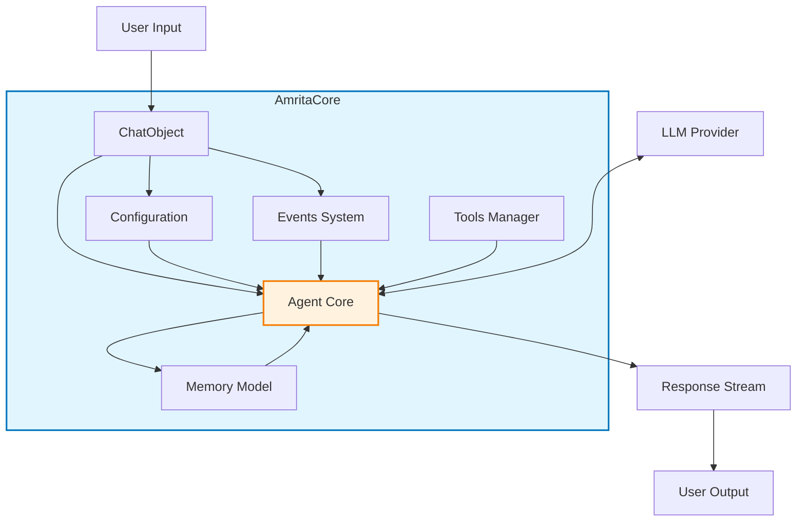
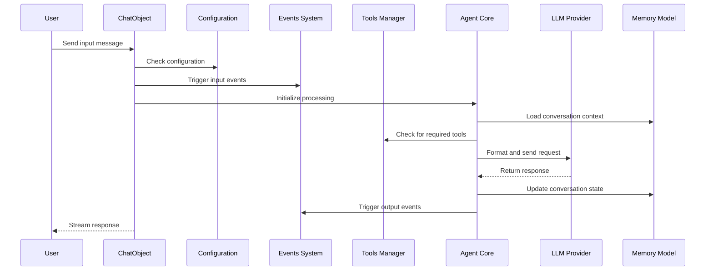

# 2.4 Project Architecture Understanding

## 2.4.1 Architecture Diagram

## 2.4.2 Core Component Relationships

- **ChatObject**: The main interaction point that manages a single conversation
- **Configuration**: Controls how the core behaves (context usage, tool calling, etc.)
- **Events System**: Allows for hooks into the processing pipeline
- **Tools Manager**: Extends the agent's capabilities with external functions
- **Memory Model**: Maintains conversation context and history
- **Agent Core**: The central processing unit coordinating all components

## 2.4.3 Data Flow Explanation

1. User input enters through a ChatObject
2. Configuration determines processing behavior
3. The input triggers various events in the Events System
4. Agent Core loads the conversation context from Memory Model
5. Agent Core checks if any tools need to be called based on the input
6. The processed input is sent to the LLM Provider
7. The response from LLM is handled by Agent Core
8. Memory Model is updated with the new conversation state
9. Output events may intercept and modify the final response
10. The response is streamed back to the user via ChatObject