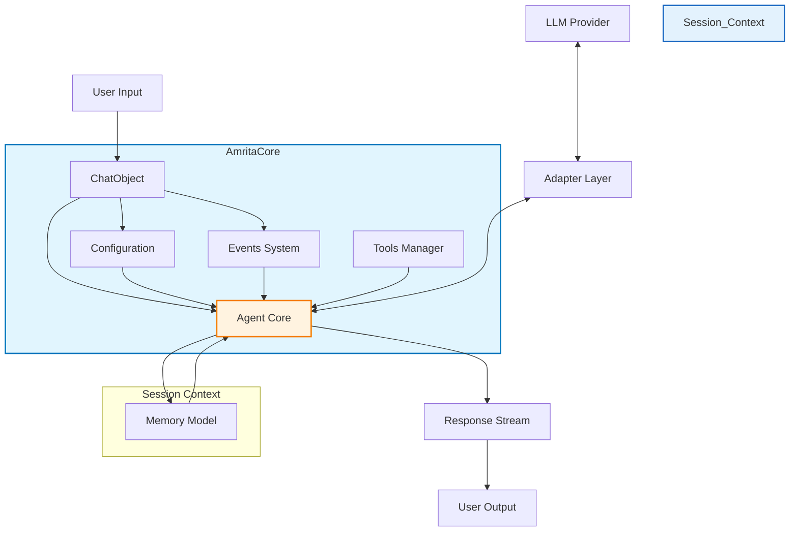
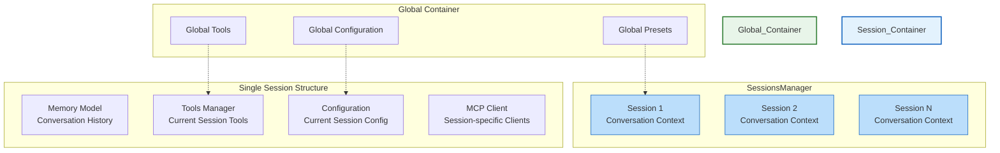
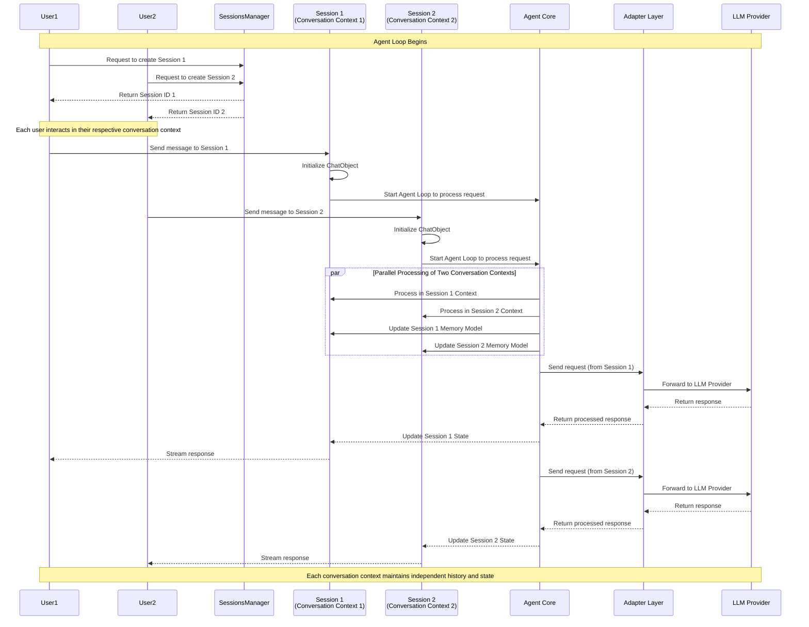

# 2.4 Project Architecture Understanding

## 2.4.1 Architecture Diagram

### Core Architecture

### Session and Global Data Container Architecture

#### Global Container and Session Conversation Context

## 2.4.2 Core Component Relationships

- **ChatObject**: The main interaction point that manages a single conversation and serves as the Agent Core execution unit
- **Configuration**: Controls how the core behaves (context usage, tool calling, security settings, etc.) through `AmritaConfig`
- **Events System**: Allows for hooks into the processing pipeline using decorators like `@on_precompletion` and `@on_completion`, with runtime dependency injection support
- **Tools Manager**: Extends the agent's capabilities with external functions through `MultiToolsManager`, supporting dynamic tool registration
- **Memory Model**: Maintains conversation context and history, stored within each Session's `SessionData`
- **Agent Core**: The central processing logic implemented within `ChatObject`, coordinating all components during the agent loop
- **SessionsManager**: Manages multiple isolated sessions using singleton pattern, each session containing independent `SessionData`
- **Session (Conversation Context)**: Stores all relevant information for a specific user or specific conversation, including memory model, tools, configurations, MCP clients, and presets
- **Adapter Layer**: Abstracts LLM provider communication through adapter pattern, enabling vendor-independent integration
- **MCP Client**: Provides Model Context Protocol client support for external service integration

## 2.4.3 Agent Loop and Session Isolation Mechanism

1. **Session as Conversation Context**: Each Session represents an independent conversation context, storing all relevant information for a specific user or specific conversation within its `SessionData`
2. **Global Data Container**: SessionsManager manages all active conversation contexts, providing global resource sharing while maintaining session isolation
3. **Agent Loop**: Inside each conversation context, the Agent Core (implemented in ChatObject) executes the complete processing loop including event handling, tool calling, and memory management
4. **Context Isolation**: Data between different conversation contexts is completely isolated through separate `SessionData` instances, ensuring conversation histories don't mix
5. **Global Resource Sharing**: Each conversation context can access resources from the Global container (global tools, presets, configuration), but maintains its own independent state including session-specific tools, memory, and MCP clients
6. **Adapter Abstraction**: The Adapter Layer provides vendor-independent LLM integration, allowing the same agent logic to work with different LLM providers without code changes