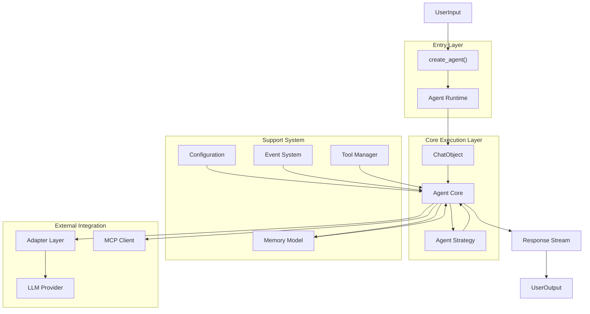
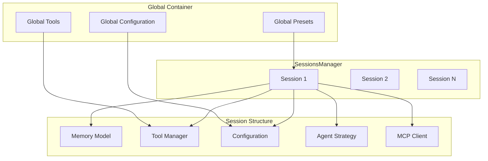
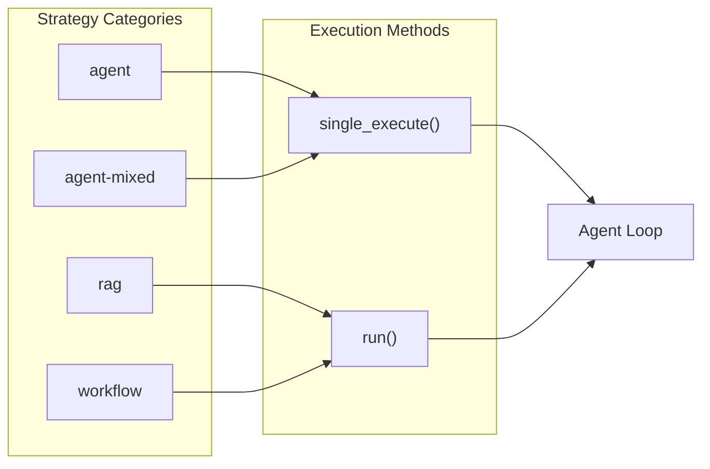
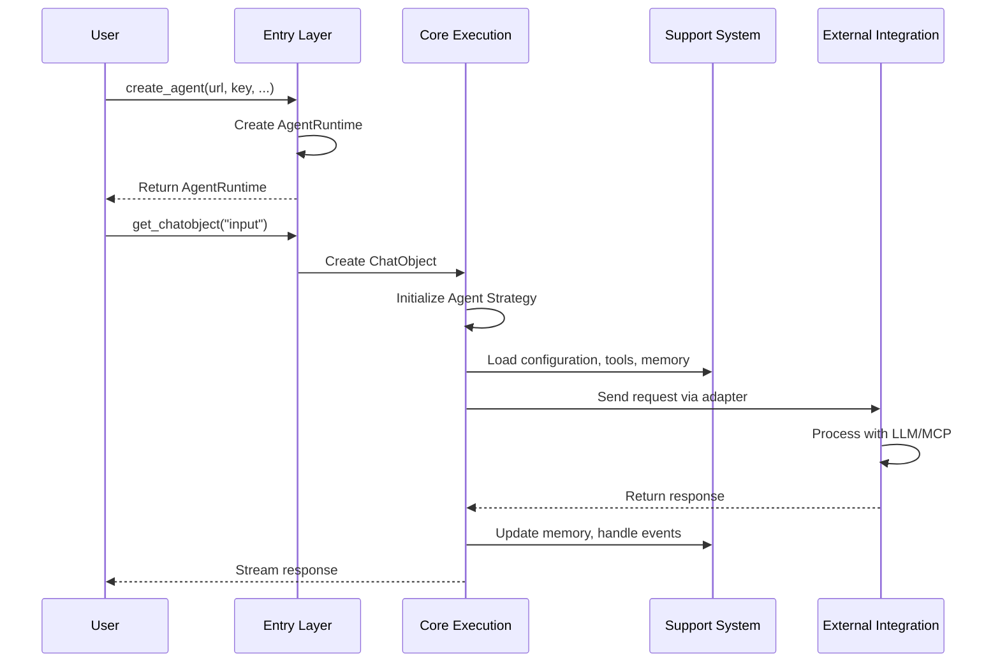

# 2.4 Project Architecture Understanding

## 2.4.1 Architecture Diagram

### Core Architecture

```mermaid
graph TB
    subgraph "Entry Layer"
        H[Agent Runtime]
        Factory["create_agent()"]
    end

    subgraph "Core Execution Layer"
        A[ChatObject]
        F[Agent Core]
        G[Agent Strategy]
    end

    subgraph "Support System"
        B[Configuration]
        C[Event System]
        D[Tool Manager]
        E[Memory Model]
    end

    subgraph "External Integration"
        Adapter[Adapter Layer]
        LLM[LLM Provider]
        MCP[MCP Client]
    end

    UserInput --> Factory
    Factory --> H
    H --> A
    A --> F
    F --> G
    G --> F
    F --> Adapter
    Adapter --> LLM
    F --> MCP

    B --> F
    C --> F
    D --> F
    E --> F

    F --> ResponseStream[Response Stream]
    ResponseStream --> UserOutput
    F --> E
```

### Session and Global Data Container Architecture

#### Global Container and Session Dialogue Context

```mermaid
graph TB
    subgraph "Global Container"
        G_Tools[Global Tools]
        G_Presets[Global Presets]
        G_Config[Global Configuration]
    end

    subgraph "SessionsManager"
        S1[Session 1]
        S2[Session 2]
        SN[Session N]
    end

    subgraph "Session Structure"
        Mem[Memory Model]
        Tools[Tool Manager]
        Conf[Configuration]
        Strat[Agent Strategy]
        MCP_Client[MCP Client]
    end

    G_Tools --> Tools
    G_Presets --> S1
    G_Config --> Conf

    S1 --> Mem
    S1 --> Tools
    S1 --> Conf
    S1 --> Strat
    S1 --> MCP_Client
```

### Strategy-Based Execution Flow

```mermaid
graph LR
    subgraph "Strategy Categories"
        AgentMode[agent]
        RAGMode[rag]
        WorkflowMode[workflow]
        MixedMode[agent-mixed]
    end

    subgraph "Execution Methods"
        SingleExecute["single_execute()"]
        RunMethod["run()"]
    end

    AgentMode --> SingleExecute
    MixedMode --> SingleExecute
    RAGMode --> RunMethod
    WorkflowMode --> RunMethod

    SingleExecute --> AgentLoop[Agent Loop]
    RunMethod --> AgentLoop
```

## 2.4.2 Core Component Relationships

- **Entry Layer**: Provides a simplified interaction interface for users
  - `create_agent()`: Factory function that creates an `AgentRuntime` with minimal parameters
  - `AgentRuntime`: High-level wrapper that encapsulates complexity and provides reusable agent operations

- **Core Execution Layer**: Handles the main processing logic
  - `ChatObject`: Manages the primary interaction point for a single conversation, coordinating all components
  - `Agent Core`: The central processing logic inside `ChatObject` that executes the complete agent loop
  - `Agent Strategy`: Abstract base class defining execution modes, supporting four strategy categories

- **Support System**: Provides essential services and data management
  - `Configuration`: Controls system behavior via `AmritaConfig`
  - `Event System`: Enables hooks in the processing pipeline through decorators and dependency injection
  - `Tool Manager`: Extends functionality via dynamic registration of external functions
  - `Memory Model`: Maintains conversation context and history within session data

- **External Integration**: Handles communication with external systems
  - `Adapter Layer`: Abstracts LLM provider communication, enabling vendor‑neutral integration
  - `MCP Client`: Provides Model Context Protocol support for external service integration

- **Data Containers**: Manage data isolation and sharing
  - `Global Container`: Stores shared resources accessible to all sessions
  - `Session Context`: Maintains isolated conversation contexts with independent state

## 2.4.3 Agent Loop and Session Isolation Mechanism

```mermaid
sequenceDiagram
    participant User as User
    participant Entry as Entry Layer
    participant Core as Core Execution
    participant Support as Support System
    participant External as External Integration

    User->>Entry: create_agent(url, key, ...)
    Entry->>Entry: Create AgentRuntime
    Entry-->>User: Return AgentRuntime

    User->>Entry: get_chatobject("input")
    Entry->>Core: Create ChatObject
    Core->>Core: Initialize Agent Strategy
    Core->>Support: Load configuration, tools, memory
    Core->>External: Send request via adapter
    External->>External: Process with LLM/MCP
    External-->>Core: Return response
    Core->>Support: Update memory, handle events
    Core-->>User: Stream response
```

### Strategy-Based Execution Modes

1. **Layered Architecture**: The system follows a clear hierarchical structure with well‑defined layers:
   - Entry Layer: Simplified user interface
   - Core Execution Layer: Main processing logic
   - Support System: Essential services
   - External Integration: Third‑party communication
   - Data Containers: State management

2. **Strategy Pattern Implementation**: Four execution strategies provide flexible behavior:
   - **'agent'**: Uses `single_execute()` for iterative tool calling and step‑by‑step execution
   - **'rag'**: Uses `run()` for retrieval‑augmented generation with minimal context
   - **'workflow'**: Uses `run()` for full manual control over tool calls and context management
   - **'agent-mixed'**: Uses `single_execute()` for dynamic mode switching between RAG and agent modes

3. **Session Isolation**: Each conversation remains completely isolated through independent session contexts, while shared global resources are accessible when needed.

4. **Event‑Driven Design**: The system uses decorators and event handlers to allow behavior extension without modifying core logic.

5. **Vendor Neutrality**: The adapter layer ensures that the same agent logic can work with different LLM providers without code changes.

6. **Template Support**: [Jinja2 templates](/guide/concepts/jinja2-templates.md) enable dynamic prompt construction based on context, memory, and configuration.
